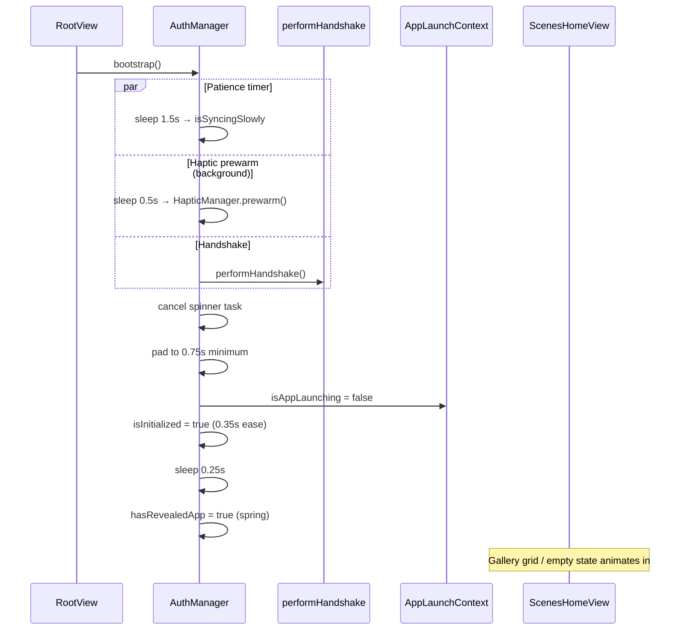

# App Launch & Boot-up Architecture

This document describes how Yondo moves from process start to an interactive gallery: SDK setup, the splash overlay, the `AuthManager` handshake, and the cold-start optimizations that keep the main thread responsive.

For Firebase identity and Firestore sync details, see [firebase-architecture.md](firebase-architecture.md). For disk layout and thumbnail loading, see [image-pipeline.md](image-pipeline.md). For the broader module map, see [architecture.md](architecture.md).

---

## 1. Overview

Launch is deliberately **layered**: infrastructure and SDKs configure first, the gallery mounts immediately (hidden behind a splash), and a single `bootstrap()` task hydrates identity and local stores before revealing the UI.

```
Process start
    │
    ├─ AppDelegate.didFinishLaunching     Firebase + RevenueCat
    │
    ├─ YondoApp.init                      SwiftData container, SceneBuilderManager, UIKit styles
    │
    └─ RootView (WindowGroup)
           ├─ ScenesHomeView              mounted permanently (background)
           ├─ SplashView                  while !authManager.isInitialized
           └─ .task → AuthManager.bootstrap()
                  ├─ performHandshake()   identity + silos
                  ├─ minimum splash pad   0.75s floor
                  └─ reveal animations    isInitialized → hasRevealedApp
```

### Key files

| File | Role |
|------|------|
| `Yondo/AppEntry/YondoApp.swift` | `@main` entry, SwiftData container, global UIKit styling, `SceneBuilderManager.setup` |
| `Yondo/AppEntry/AppDelegate.swift` | Firebase App Check + Core, RevenueCat configure + delegate |
| `Yondo/AppEntry/RootView.swift` | Permanent gallery + transient splash; triggers `bootstrap()` |
| `Yondo/AppEntry/SplashView.swift` | Branded pulse icon; optional `YondoSpinner` when sync is slow |
| `Yondo/AppEntry/AppLaunchContext.swift` | Process-wide cold-start flag and timing constants |
| `Yondo/Services/Auth/AuthManager.swift` | Bootstrap handshake, identity sync, logout |
| `Yondo/Views/Gallery/ScenesHomeView.swift` | Gallery reveal orchestration, VIP batch, watchdog safety net |
| `Yondo/Views/Gallery/ScenesHomeView+Utils.swift` | Snap-window handler, launch performance logging |
| `Yondo/Views/Gallery/AsyncThumbnailView.swift` | Staggered thumbnail loads during cold start |

### Timing constants

| Constant | Value | Where | Purpose |
|----------|-------|-------|---------|
| Spinner patience | **1.5 s** | `AuthManager.bootstrap` | Shows `YondoSpinner` if handshake exceeds this |
| Splash floor | **0.75 s** | `AuthManager.bootstrap` | Minimum splash duration to avoid UI flash |
| Cross-dissolve | **0.35 s** | `AuthManager.bootstrap` | Splash removal animation |
| Hero reveal delay | **0.25 s** | `AuthManager.bootstrap` | Gap before `hasRevealedApp` spring |
| Snap window | **0.5 s** | `AppLaunchContext.snapWindow` | "Instant-on" period with animations disabled |
| Gallery safety net | **2.0 s** | `snapWindow + safetyFallbackTimeout` | Force grid reveal if priority thumbnails stall |
| Haptic prewarm delay | **0.5 s** | `AuthManager.bootstrap` | Background haptic warm-up (not awaited) |
| VIP batch deferral | **0.3 s** | `ScenesHomeView.updateSnapshottedImages` | Delay before loading full library after VIP rows |

---

## 2. Pre-UI Boot & Infrastructure

Before SwiftUI renders `RootView`, two entry points run in parallel during app initialization.

### `AppDelegate` — external SDKs

`UIApplicationDelegateAdaptor` wires `AppDelegate` into `YondoApp`. In `didFinishLaunchingWithOptions`:

1. **Firebase** — Attaches `AppCheckDebugProviderFactory`, then calls `FirebaseApp.configure()` only if `GoogleService-Info.plist` exists in the bundle. Missing plist logs an error; the handshake will fail network steps but local hydration still runs.
2. **RevenueCat** — Reads `REVENUECAT_API_KEY` from `Info.plist` (populated via `Secrets.xcconfig`), sets `Purchases.logLevel = .debug`, calls `Purchases.configure(withAPIKey:)`, and assigns `IAPManager.shared` as `PurchasesDelegate`.

### `YondoApp` — persistence, DI, styling

| Step | Detail |
|------|--------|
| **SwiftData** | Eager `ModelContainer` for `RemoteGeneration` schema. A detached background task performs a harmless fetch to warm the persistent store without blocking the main thread. |
| **SceneBuilderManager** | `SceneBuilderManager.shared.setup(with: sharedModelContainer)` in `init()`. Generation flows fatally guard if this was never called. |
| **Global UIKit styles** | `UISegmentedControl` rounded fonts and brand tint; `UINavigationBar` transparent "liquid glass" appearance via `UINavigationBarAppearance`. |

```swift
// YondoApp.swift — container warm-up runs off the main actor
Task.detached {
    let warmupContext = ModelContext(container)
    warmupContext.autosaveEnabled = false
    _ = try warmupContext.fetch(FetchDescriptor<RemoteGeneration>())
}
```

---

## 3. Root Structure & Splash Overlay

`RootView` uses a `ZStack` so the gallery survives auth state changes and presented covers are not torn down when the splash dismisses.

```
ZStack
├── ScenesHomeView          @State — permanent home; .id("main-gallery")
├── SplashView              if !authManager.isInitialized; zIndex(1)
└── Color.clear             safe-area measurement → Environment(\.safeAreaInsets)
```

### `AuthManager` published state

| Property | Initial | Set when | Effect |
|----------|---------|----------|--------|
| `isInitialized` | `false` | End of `bootstrap()` | Removes `SplashView` |
| `isSyncingSlowly` | `false` | Handshake > 1.5 s | Fades in `YondoSpinner` on splash |
| `hasRevealedApp` | `false` | ~0.25 s after splash dismiss | Enables empty-state hero animations |
| `sessionID` | cached UID or `nil` | Handshake / identity sync | Drives per-user silo routing |

`RootView` calls `await authManager.bootstrap()` from a `.task` modifier. The gallery receives `authManager` via `.environmentObject`.

### `SplashView` behavior

- Always shows `PulseIcon` centered above the safe area.
- When `showsSpinner` (`authManager.isSyncingSlowly`) becomes true, the icon fades out and `YondoSpinner` fades in (with a 0.4 s delay to avoid layout jump).
- Removal uses an asymmetric transition: opacity + slight scale-up on dismiss.

---

## 4. `AuthManager.bootstrap()` Sequence

`bootstrap()` is `@MainActor` and runs once from `RootView`. The full sequence:



### Phase A — Patience & pre-warming

- A **1.5 s** timer sets `isSyncingSlowly = true` with animation if the handshake is still running. Cancelled when handshake finishes first.
- Haptic hardware prewarming runs in a detached background task (0.5 s delay, not awaited) so it does not consume the handshake budget.

### Phase B — `performHandshake()`

The handshake runs in **strict order** for online steps, then **always** hydrates local silos even when auth fails.

#### Online resolution (Phases 1–2)

1. **Identity** — Use cached Firebase UID from `FirebaseAuthService.currentUID`, or call `ensureAuthenticated()` (anonymous sign-in).
2. **Firestore shell** — `ensureUserDocumentExists(userId:)` creates the `users/{uid}` document before RevenueCat login (so RC delegate callbacks find a ready doc).
3. **RevenueCat link** — `Purchases.shared.logIn(userId)`. Errors are logged; boot continues.
4. **Real-time sync** — `FirebaseSyncService.startSync(for:)` attaches Firestore listeners (e.g. welcome-credit provisioning).

If Phase 1 throws, the catch block logs the error and the app boots into an **offline/local** state rather than crashing.

#### Local hydration (Phase 3 — always runs)

| Silo | Call | Notes |
|------|------|-------|
| IAP | `IAPManager.shared.start(userId:)` | Falls back safely when `userId` is nil |
| Selfie cache | `LastSelfieStore.shared.initialize(with:)` | Per-user last selfie path |
| Gallery | `ImageStore.shared.initialize()` + `waitForReady()` | Indexes disk, prewarms thumbnail cache |
| Session pointer | `sessionID = authService.currentUID` | Published to SwiftUI observers |

### Phase C — Reveal

1. Pad elapsed time to **0.75 s** minimum.
2. Set `AppLaunchContext.isAppLaunching = false`.
3. Animate `isInitialized = true` (0.35 s ease-in-out) — splash cross-dissolve.
4. After **0.25 s**, animate `hasRevealedApp = true` (spring) — triggers gallery empty-state and hero entrance.

---

## 5. Cold Start & Gallery Reveal (`AppLaunchContext`)

`AppLaunchContext.isAppLaunching` starts `true` at process launch and is a **one-way flag** — it is never reset to `true` during the process lifetime. Multiple subsystems read it to choose between "instant snap" and "graceful fade" behavior.

### Who clears the flag?

| Component | When |
|-----------|------|
| `AuthManager.bootstrap` | After handshake padding, before splash dismiss |
| `ScenesHomeView.handleAppLaunching` | After `snapWindow` (0.5 s) from gallery `onAppear` |
| `ScenesHomeView.updateSnapshottedImages` | After deferred full-library load completes |
| Gallery safety fallback | After 2.0 s if priority thumbnails never report ready |

The flag may be cleared by whichever path finishes first; later clears are no-ops.

### Gallery "Physical Swap" strategy

While the splash is visible, `ScenesHomeView` is already mounted behind it. On appear it:

1. Starts the **snap window** timer (`handleAppLaunching`).
2. Arms a **2.0 s watchdog** — if priority images fail to load, force `isGridFullyRendered = true` and clear `isAppLaunching`.

Grid reveal uses a skeleton overlay that physically destroys itself once `showsGrid` becomes true, avoiding layout thrashing:

```
ZStack (mainStackContent)
├── scrollableContent     opacity 0 → 1 when showsGrid
├── skeletonGridView      destroyed when showsGrid (zIndex 1)
├── emptyStateView        requires hasRevealedApp + empty entries
├── heroOverlay
└── glassHeaderOverlay
```

Animations on the stack use `.none` while `isAppLaunching`, then `.easeInOut(duration: 0.4)`.

### VIP batch loading

When `ImageStore` publishes entries during cold start, `updateSnapshottedImages` uses a two-phase strategy to avoid watchdog (0x8BADF00D) kills:

1. **VIP batch** — Inject only the first `priorityCount` entries immediately (~16 ms). Sets `isProcessingInitialBatch = true`.
2. **Deferred full library** — After 0.3 s, animate in remaining entries; unlock the gate 0.4 s later.

During normal (non-launch) updates, the full list syncs with a spring animation.

### Thumbnail stagger (`AsyncThumbnailView`)

While `isAppLaunching`, each grid cell delays its load by `(index / 3) * 5 ms` per row. Loaded thumbnails snap in without animation; post-launch loads use a 0.25 s ease-in.

---

## 6. Late Identity Shifts

Post-launch authentication (e.g. before AI generation or IAP) goes through `ensureGlobalAuthentication()`, which deduplicates concurrent callers via `activeAuthTask`.

When the resolved UID differs from `sessionID`, `performIdentitySync()` runs **five silos in parallel** via `withThrowingTaskGroup`:

| Silo | Task |
|------|------|
| Firestore | `ensureUserDocumentExists` |
| RevenueCat | `Purchases.shared.logIn` |
| ImageStore | `updateIdentity` — disk migration, cache clear, re-index |
| CreditStore + IAP | `creditStore.updateIdentity` + `IAPManager.start` |
| LastSelfieStore | `updateIdentity` |

`group.waitForAll()` ensures filesystem and Keychain work completes before publishing success. If RevenueCat throws, the entire shift fails upward — preventing partial state. On success:

1. `sessionID = resolvedUID`
2. `FirebaseSyncService.startSync(for:)` restarts listeners

Call sites include `SceneGenerationService`, `FirebaseAIResultGenerator`, and `IAPManager+Auth`.

---

## 7. Logout (Reverse Boot)

`AuthManager.logout()` reuses the splash pattern:

1. Animate `isInitialized = false` and `hasRevealedApp = false` — splash returns immediately.
2. Stop `FirebaseSyncService` listeners.
3. Sign out Firebase Auth and RevenueCat.
4. Reset silos to anonymous/local: `creditStore.updateIdentity("anonymous")`, `ImageStore.updateIdentity("local")`, `LastSelfieStore.updateIdentity("local")`.

Unlike bootstrap, logout does not automatically re-run `bootstrap()`. The caller is responsible for triggering a fresh boot sequence if needed.

---

## 8. Failure Modes & Debugging

| Symptom | Likely cause | Where to look |
|---------|--------------|---------------|
| Splash spinner after 1.5 s | Slow network auth, Firestore, or `ImageStore.waitForReady` | Console `🎬 [BOOT]` / `🤝 Handshake` logs |
| Blank gallery after splash | Empty library or `hasRevealedApp` still false | `imageStore.entries`, `authManager.hasRevealedApp` |
| Grid forced visible at 2 s | Priority thumbnails timed out | `Safety fallback triggered` warning, watchdog report |
| Handshake succeeds but no cloud sync | Missing `GoogleService-Info.plist` | `AppDelegate` Firebase configure log |
| RevenueCat purchases fail at launch | Missing `REVENUECAT_API_KEY` in Info.plist | `AppDelegate` RevenueCat logs |

Search the Xcode console for emoji-prefixed boot tags: `🚀 AppDelegate`, `🎬 [BOOT]`, `🤝 Handshake`, `📁 ImageStore`, `📊 [LAUNCH]`.

---

## 9. Related Documentation

| Topic | Document |
|-------|----------|
| Firebase auth, Firestore, sync listeners | [firebase-architecture.md](firebase-architecture.md) |
| Image disk layout, thumbnails, cache | [image-pipeline.md](image-pipeline.md) |
| SwiftData `RemoteGeneration` persistence | [persistence-swiftdata.md](persistence-swiftdata.md) |
| IAP / credits at boot | [iap-architecture.md](iap-architecture.md) |
| System-wide module map | [architecture.md](architecture.md#8-app-launch--bootstrap) |
| UI/UX (splash, grid reveal) | [ui-ux-design.md](ui-ux-design.md#101-launch--splash) |
