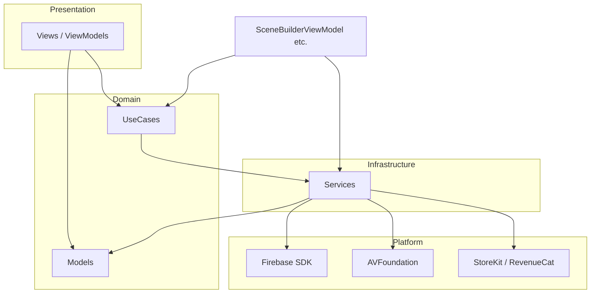
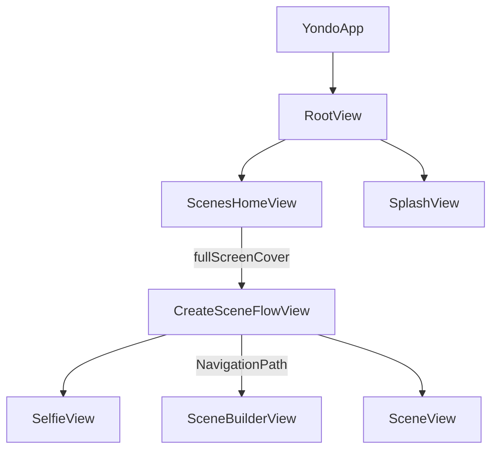
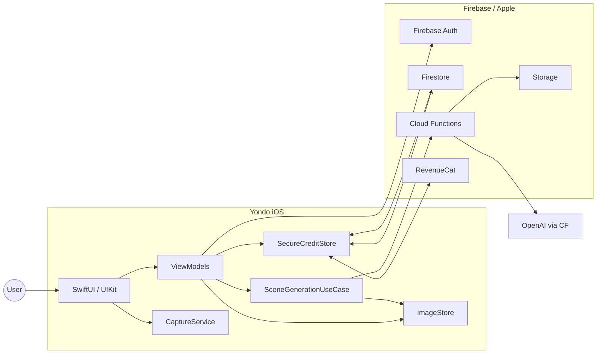
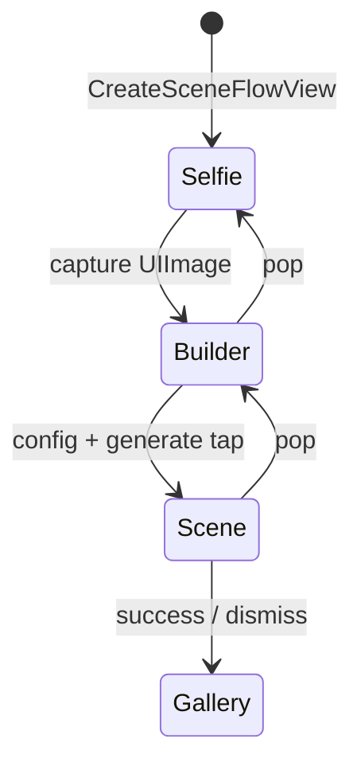
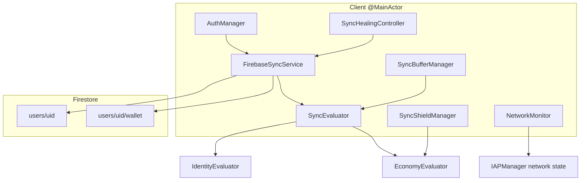
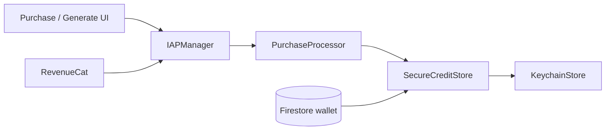

# Yondo iOS — Architecture

> Take a selfie. Pick a destination. Arrive.

Yondo is an AI-powered scene generation app for iOS. Users capture a selfie, configure destination / environment / mood / lighting / camera, and receive a photorealistic composite image placed in that world. The codebase is a **single-target Swift application** organized as **MVVM + use cases + protocol-oriented services**, with **structured concurrency**, a **hybrid SwiftUI + UIKit** presentation layer, and **Firebase + RevenueCat** backends.

This document is the **canonical consolidated reference** for layering, major flows, persistence, sync, economy, and UI systems. Topic-specific deep-dives live alongside it in `Docs/`.

---

## Table of Contents

1. [Technology Stack](#1-technology-stack)
2. [Repository Layout](#2-repository-layout)
3. [Layered Architecture](#3-layered-architecture)
4. [Dependency Injection](#4-dependency-injection)
5. [Navigation & Routing](#5-navigation--routing)
6. [State Management](#6-state-management)
7. [High-Level System Diagram](#7-high-level-system-diagram)
8. [App Launch & Bootstrap](#8-app-launch--bootstrap)
9. [Authentication & Identity](#9-authentication--identity)
10. [Scene Creation Flow](#10-scene-creation-flow)
11. [AI Generation Pipeline](#11-ai-generation-pipeline)
12. [Networking & Real-Time Sync](#12-networking--real-time-sync)
13. [Economy, Credits & IAP](#13-economy-credits--iap)
14. [Persistence & Media](#14-persistence--media)
15. [Camera Pipeline](#15-camera-pipeline)
16. [Gallery, Hero & Share UI](#16-gallery-hero--share-ui)
17. [Protocol Boundaries](#17-protocol-boundaries)
18. [Build & Configuration](#18-build--configuration)
19. [Debug & Testing](#19-debug--testing)
20. [Related Documentation](#20-related-documentation)

---

## 1. Technology Stack

| Domain | Technology |
| --- | --- |
| UI | SwiftUI (layout, navigation, state) + UIKit (camera preview, gallery hero, share sheet) |
| Concurrency | `async`/`await`, `Actor`, `Task` / `TaskGroup`, `@MainActor` |
| Backend | Firebase Auth, Firestore, Cloud Functions, Storage, App Check |
| AI | OpenAI image API proxied via Cloud Function `generateAIScene` |
| Payments | RevenueCat + StoreKit 2 (`IAPManager`, `YondoProduct`) |
| Local persistence | Keychain (`SecureCreditStore`), SwiftData (`RemoteGeneration`), FileManager (`ImageStore`) |
| Camera | AVFoundation via actor `CaptureService` |
| Minimum OS | iOS 26.2 (`IPHONEOS_DEPLOYMENT_TARGET` in `Yondo.xcodeproj`) |
| Language | Swift 5 |

### Third-party dependencies (SPM)

| Package | Resolved version | Used for |
| --- | --- | --- |
| [firebase-ios-sdk](https://github.com/firebase/firebase-ios-sdk) | 12.10.0 | Auth, Firestore, Functions, Storage, Analytics, App Check |
| [purchases-ios](https://github.com/RevenueCat/purchases-ios) | 5.66.0 | Subscriptions and credit packs via `IAPManager` |

Apple frameworks used directly: SwiftUI, UIKit, SwiftData, AVFoundation, StoreKit 2, Security (Keychain), Combine.

There is **no local `Package.swift`** — dependencies are linked through the Xcode project target. The project uses **file-system-synchronized groups**: folders on disk map directly to the `Yondo` target.

---

## 2. Repository Layout

```
yondo-ios/
├── Yondo/                    ← Main application target (179 Swift sources)
│   ├── AppEntry/             Lifecycle, root UI, create-scene router
│   ├── Models/               Pure value types (SceneConfig, GeneratedImage, …)
│   ├── UseCases/             Business contracts (SceneGenerationUseCase)
│   ├── Services/             Concrete backends (AI, Auth, Sync, IAP, …)
│   ├── Views/                SwiftUI + UIKit bridges
│   ├── Utils/                Extensions, logging, NetworkMonitor, stores
│   ├── Debug/                `#if DEBUG` tooling and mocks
│   ├── Assets/               Images, colors, destination art
│   └── Resources/            Info.plist, secrets templates, Firebase plist example
├── YondoTests/               Unit test target (minimal today)
├── YondoUITests/             UI test scaffold
├── Yondo.xcodeproj/
└── Docs/                     Focused architecture deep-dives (this file + 14 others)
```

### `Yondo/` module breakdown

| Folder | Files | Role |
| --- | ---: | --- |
| `Views/` | 89 | Screens, ViewModels, UIKit hero/gallery, paywall, design system |
| `Services/` | 59 | AI, auth, sync, IAP, camera, images, persistence, share |
| `Utils/` | 15 | `Log`, extensions, `NetworkMonitor`, `LastSelfieStore` |
| `AppEntry/` | 7 | `@main`, delegate, `RootView`, flow router, launch context |
| `Models/` | 6 | `SceneConfig`, viewpoints, purchase types, generation DTOs |
| `UseCases/` | 1 | `SceneGenerationUseCase` protocol + stages |
| `Debug/` | 2 | `DebugManager`, `_MockSyncService` |

### `Services/` subdomains

```
Services/
├── AI/              SceneGenerationService, AIImageGenerator, Firebase client
│   └── Firebase/    Auth, sync, preprocess, callable RPC, error mapping
├── Auth/            AuthManager, FirebaseAuthService
├── Sync/            Evaluators, shields, healing, buffer
├── IAP/             IAPManager, SecureCreditStore, Keychain, RevenueCat
├── Images/          ImageStore, ImageFileService, thumbnails, cache
├── Camera/          CaptureService, HapticManager
├── Persistence/     RemoteGeneration (SwiftData), persistence protocol
└── Share/           ImageShareProvider, ImageMetadataProvider
```

### `Views/` subdomains

```
Views/
├── Gallery/         ScenesHomeView, AsyncThumbnailView, hero UIKit bridge (29 files)
├── Selfie/          SelfieView, CameraModel, CameraPreview
├── SceneBuilder/    SceneBuilderView, SceneBuilderViewModel, SceneBuilderManager
├── SceneView/       Generation lifecycle UI, loading, result
├── Purchase/        PurchaseModalView, paywall components
├── Share/           ShareSheetHost, ShareSheetModifier
├── MoreDestinations/ Extended destination picker sheet
└── (root)           Liquid Glass design system, shared button styles
```

There is **no separate `Repository/` layer** — persistence and remote access live in `Services/` (`ImageStore`, `SceneGenerationPersistenceService`, `FirebaseSyncService`, etc.).

---

## 3. Layered Architecture

Yondo enforces **strict dependency direction**: outer layers depend on inner abstractions, never the reverse.



### Architecture patterns

| Pattern | Where it appears |
| --- | --- |
| **MVVM** | `SceneBuilderViewModel` drives `SceneBuilderView` / `SceneView`; gallery uses `ImageStore` + local `@State` |
| **Use case layer** | `SceneGenerationUseCase` → `SceneGenerationService` orchestrates credits, AI, persistence |
| **Protocol-oriented services** | Swappable AI, sync, credits, images, persistence (see [Protocol Boundaries](#17-protocol-boundaries)) |
| **Facade** | `FirebaseSyncService` dispatches Firestore listeners to evaluators |
| **Singleton coordinators** | `AuthManager`, `IAPManager`, `ImageStore`, `SceneBuilderManager`, `SyncShieldManager` |
| **Actor isolation** | `CaptureService`, `KeychainStore`, `ImageFileService` serialize I/O off the main thread |
| **UIKit coordinators** | `UIViewRepresentable` types use nested `Coordinator` classes — **not** app-wide navigation coordinators |

**Not used:** TCA/Composable Architecture, VIPER, dedicated app-wide Coordinator router, DI frameworks (Swinject, Factory, etc.).

### Design principles

1. **Protocol-first** — Swappable backends (`AIImageGenerator`, `SyncService`, `CreditProvider`, `ImageStoring`) keep Views and ViewModels free of Firebase/Keychain details.
2. **Actor-isolated I/O** — Disk (`ImageFileService`), camera (`CaptureService`), and Keychain (`KeychainStore`) serialize mutation off the main thread.
3. **MainActor UI coordinators** — `AuthManager`, `IAPManager`, `ImageStore`, `SceneBuilderManager` publish observable state for SwiftUI.
4. **Optimistic economy + defensive sync** — Credits deduct locally first; Firestore snapshots are evaluated through shields and projected balances to avoid UI flicker.
5. **Lifecycle guardians** — Paid AI work survives navigation dismiss via `SceneBuilderManager` retention rules.

---

## 4. Dependency Injection

Composition is **manual** — no DI container. Dependencies are wired at three levels:

| Mechanism | Example |
| --- | --- |
| **Singleton `.shared`** | `IAPManager.shared`, `ImageStore.shared`, `AuthManager.shared`, `FirebaseSyncService.shared` |
| **Constructor injection with defaults** | `SceneBuilderViewModel(useCase:…, iapProvider: iapProvider ?? IAPManager.shared, …)` |
| **Factory at flow start** | `SceneBuilderManager.startFlow()` builds `SceneGenerationService` + `SceneBuilderViewModel` |
| **SwiftUI environment** | `RootView` → `.environmentObject(authManager)` |
| **SwiftData container** | `YondoApp` creates `ModelContainer` → `.modelContainer(sharedModelContainer)` |

`SceneBuilderManager.setup(with: ModelContainer)` **must** run in `YondoApp.init` before any create flow; `startFlow()` fatals if setup was skipped.

Production wiring in `SceneBuilderManager.startFlow()`:

```
SceneGenerationService(
    aiGenerator: FirebaseAIResultGenerator(...),
    imageStore: ImageStore.shared,
    creditProvider: IAPManager.shared,
    persistence: SceneGenerationPersistenceService(container: ...)
)
→ SceneBuilderViewModel(useCase: service, ...)
```

---

## 5. Navigation & Routing

There is **no global `Router` type**. Routing is local: enum steps + `NavigationPath` + modal presentation.



| Mechanism | Where | Detail |
| --- | --- | --- |
| **Root shell** | `RootView` | `ZStack`: permanent `ScenesHomeView` + transient `SplashView` |
| **Modal create flow** | `ScenesHomeView` | `fullScreenCover` → `CreateSceneFlowView(viewModel: SceneBuilderManager.shared.startFlow())` |
| **In-flow stack** | `CreateSceneFlowView` | `NavigationStack(path:)` + `enum CreateSceneStep` (`.builder`, `.scene`) |
| **Sheets** | Builder / Scene views | Purchase modals, `MoreDestinationsView` |
| **Hero viewer** | `ScenesHomeView+Hero` | Custom UIKit overlay — not `NavigationLink` |
| **Back detection** | `NavigationPopObserver` | `onNavigationPop` via `path.count` + `Notification.Name.didPopNavigationStep` |
| **Flow dismiss** | `CreateSceneFlowView` | `@Environment(\.dismiss)`; calls `SceneBuilderManager.endFlowIfIdle()` |

**No `SceneDelegate`.** Lifecycle is SwiftUI `@main` + `UIApplicationDelegateAdaptor(AppDelegate.self)`.

→ See [create-scene-flow.md](create-scene-flow.md), [ui-ux-design.md](ui-ux-design.md) §11

---

## 6. State Management

| Layer | Mechanism |
| --- | --- |
| **SwiftUI views** | `@State`, `@StateObject`, `@ObservedObject`, `@EnvironmentObject`, custom environment keys (`safeAreaInsets` in `YondoApp`) |
| **ViewModels / managers** | `ObservableObject` + `@Published` (`SceneBuilderViewModel`, `AuthManager`, `IAPManager`, `ImageStore`) |
| **Observation framework** | Mixed into `IAPManager` (`import Observation`, `@ObservationIgnored` on some fields) |
| **Combine** | `ImageStore.didAddNewImage` (`PassthroughSubject`); cancellable sets in ViewModels |
| **SwiftData** | `@Model RemoteGeneration`; `SceneGenerationPersistenceService` |
| **Keychain economy** | `SecureCreditStore` + actor `KeychainStore` |
| **Sync shields** | `SyncShieldManager` transaction locks; evaluators buffer snapshots |
| **Cold start** | `AppLaunchContext.isAppLaunching`, `AuthManager.hasRevealedApp` |

Gallery index (`ImageStore.entries`) and credit balance (`SecureCreditStore`) are the two most user-visible reactive stores. Both hydrate during `AuthManager.bootstrap()`.

---

## 7. High-Level System Diagram



**Typical user journey**

1. Launch → `AuthManager.bootstrap()` handshake (identity, Firestore shell, RevenueCat login, sync listeners).
2. Gallery (`ScenesHomeView`) shows local generations via `ImageStore`.
3. Create flow → selfie → builder → scene view → `SceneGenerationService.generateScene`.
4. Credit consumed locally → Cloud Function → image downloaded → SwiftData + disk updated.
5. Purchase / premium state reconciled via `FirebaseSyncService` + evaluators.

---

## 8. App Launch & Bootstrap

**Entry:** `YondoApp` (`@main`) → `WindowGroup` → `RootView`.

| Phase | Component | Responsibility |
| --- | --- | --- |
| Pre-UI | `YondoApp` | SwiftData `ModelContainer` for `RemoteGeneration`; background warm-up fetch |
| SDK | `AppDelegate` | Firebase, App Check debug provider, RevenueCat from `Info.plist` |
| Styling | `YondoApp.init` | Global UIKit: segmented control, Liquid Glass navigation bar |
| DI | `SceneBuilderManager.setup` | Attaches SwiftData container to generation manager |
| UI shell | `RootView` | Permanent `ScenesHomeView` + transient `SplashView` |
| Boot task | `AuthManager.bootstrap` | Handshake, minimum splash padding, reveal animations |

### `RootView` structure

```
ZStack
├── ScenesHomeView          (permanent; survives auth state)
├── SplashView              (while !authManager.isInitialized)
└── Safe-area measurement overlay
```

`AppLaunchContext.isAppLaunching` gates cold-start optimizations (e.g. gallery VIP batch, instant snap). A **1.5 s** patience timer sets `isSyncingSlowly` for spinner UX; a **~0.75 s** minimum handshake padding reduces splash flash.

### AuthManager handshake (ordered)

1. Resolve Firebase UID (cached or anonymous `signInAnonymously`).
2. `ensureUserDocumentExists` — Firestore `users/{uid}` shell.
3. RevenueCat `logIn` with Firebase UID.
4. `FirebaseSyncService` attach listeners; hydrate `IAPManager`, `ImageStore`, `LastSelfieStore`.

Late identity changes run `performIdentitySync()` via `TaskGroup` (Keychain, IAP, image directories, selfie cache) before publishing the new `sessionID`.

→ See [app-launch.md](app-launch.md)

---

## 9. Authentication & Identity

| Type | Location | Notes |
| --- | --- | --- |
| Orchestrator | `Services/Auth/AuthManager.swift` | `@MainActor`, `ObservableObject`, bootstrap + global auth guard |
| Firebase wrapper | `Services/AI/Firebase/FirebaseAuthService.swift` | Session ensure, UID, document shell |
| Global guard | `AuthManager.ensureGlobalAuthentication()` | Required before paid generation / purchases |

**Anonymous-first:** Users get a Firebase anonymous session; Firestore user doc may include `hasGrantedFreeCredits` to trigger welcome wallet provisioning via backend.

**Identity migration:** On UID change, `ImageStore` migrates `GeneratedImages/{uid}` folders; `SecureCreditStore.updateIdentity` clears cross-user leakage before loading the new Keychain blob.

→ See [firebase-architecture.md](firebase-architecture.md) §2–4

---

## 10. Scene Creation Flow

Navigation is **decoupled** from generation lifecycle so dismiss does not cancel in-flight paid work.



| Piece | File | Role |
| --- | --- | --- |
| Router | `AppEntry/CreateSceneFlowView.swift` | `NavigationStack` + `CreateSceneStep` enum |
| Pop observer | `AppEntry/NavigationPopObserver.swift` | Detects stack pops for lifecycle hooks |
| Guardian | `Views/SceneBuilder/SceneBuilderManager.swift` | Retains `SceneBuilderViewModel`, wires dependencies |
| State engine | `Views/SceneBuilder/SceneBuilderViewModel.swift` | UI state, generation, sync healing UI |
| Screens | `Views/Selfie/`, `SceneBuilder/`, `SceneView/` | Capture, configuration, loading/result |

### `endFlowIfIdle` retention

When the flow dismisses, `SceneBuilderManager.endFlowIfIdle()` nils the ViewModel **only if** `vm.isActive == false`. Active generation keeps the ViewModel alive until the background pipeline completes.

`forceEndFlow()` cancels generation then releases memory.

→ See [create-scene-flow.md](create-scene-flow.md)

---

## 11. AI Generation Pipeline

**Contract:** `UseCases/SceneGenerationUseCase.swift`  
**Implementation:** `Services/AI/SceneGenerationService.swift`  
**Remote:** `Services/AI/Firebase/FirebaseAIResultGenerator.swift`, `FirebaseAIClient.swift`

The generate-AI-scene path covers grace period → sync shield → credit consumption → `generateAIScene` callable → Storage download → staged UI delivery → optional disk persistence, with refund and sync-healing rules on failure.

A legacy direct-OpenAI path (`OpenAIDALLEResultGenerator`, `APIClient`) exists for development but is **not** wired in production `SceneBuilderManager` setup.

→ **Full architecture:** [generate-ai-scene-architecture.md](generate-ai-scene-architecture.md)  
→ Firebase RPC & errors: [firebase-architecture.md](firebase-architecture.md) §8–12

---

## 12. Networking & Real-Time Sync

Two transport styles: **Firestore snapshot streams** (economy/identity) and **HTTPS callable RPC** (AI, subscription verify).



### Sync rules (summary)

| Mechanism | Purpose |
| --- | --- |
| Cache rejection | Ignore `metadata.isFromCache` for authoritative UI updates |
| `SyncShieldManager` | Transaction lock during generation; anti-dip after IAP |
| `SyncBufferManager` | Hold snapshots during shield; reconcile with token |
| Projected credits | `max(serverCredits - activeLocks, 0)` |
| Sticky Success | `IdentityEvaluator` ignores passive premium downgrades |
| Sync healing 3-4-1 | Wait → force server refresh → buffer → resolve on credit/premium mismatch |
| `forceRefreshFromCloud` | Parallel server `getDocument` to bypass stale cache |

In `#if DEBUG`, an alternate `_FirebaseSyncService` supports mock scenarios via `DebugManager`.

→ See [local-economy-and-sync-healing.md](local-economy-and-sync-healing.md), [firebase-architecture.md](firebase-architecture.md) §5–7

---

## 13. Economy, Credits & IAP



| Concern | Implementation |
| --- | --- |
| Local truth | `SecureCreditStore` (@Observable), JSON in Keychain |
| Consumption | `CreditProvider.consumeCredit()` at generation start |
| Idempotency | `PurchaseProcessor` + `processedTransactionIDs` |
| Rollback | Relative delta rollback on Keychain write failure |
| Ghost purchases | Scan `Transaction.currentEntitlements` after failed `purchase()` |
| Offline | `IAPManager+Network`, `NetworkMonitor` AsyncStream |
| Paywall UI | `Views/Purchase/PurchaseModalView` (+ extensions) |

**Post-purchase:** Short sync safety lock; `SyncShieldManager` anti-dip window (~90 s) prevents stale Firestore from lowering credits below local optimism.

→ See [iap-architecture.md](iap-architecture.md), [iap-transaction-processing.md](iap-transaction-processing.md), [iap-to-local-economy-evolution.md](iap-to-local-economy-evolution.md)

---

## 14. Persistence & Media

### Three storage tiers

| Tier | Technology | Contents |
| --- | --- | --- |
| Generation metadata | SwiftData `RemoteGeneration` | `localID`, `userID`, `status`, `firebaseID`, `storagePath` |
| Economy | Keychain via `KeychainStore` | Credits, premium flags, processed transactions |
| Images | FileManager per-user dirs | Full JPEGs + downsampled thumbnails |

### Image pipeline

```
AsyncThumbnailView
    → ImageStore (@MainActor, ImageStoring)
        → ConcurrentImageCache (unfair lock + NSCache) — sync fast path
        → ImageFileService (Actor) — serialized disk I/O
            → ThumbnailGenerator (ImageIO max pixel size)
```

- **VIP prewarm:** First ~12 thumbnails parallel; remainder throttled (`maxConcurrentTasks = 4`).
- **Identity migration:** `migrateDirectory` on auth UID change with yields on collision.

→ See [persistence-swiftdata.md](persistence-swiftdata.md), [image-pipeline.md](image-pipeline.md)

---

## 15. Camera Pipeline

```
SelfieView / CameraModel (@MainActor)
        ↓ async
CaptureService (actor) — session state
        ↓ sessionQueue
AVCaptureSession / PhotoOutput / VideoDataOutput
```

- **Preview bridge:** `CameraPreview` + `PreviewSource` / `PreviewTarget` — no AVFoundation types in SwiftUI layout code.
- **Frame stream:** `AsyncStream` of lightweight `CIImage` from pixel buffers (no eager bitmap copy).
- **Capture:** Phase 1 frozen preview frame; Phase 2 high-res `AVCapturePhotoOutput`.
- **Recovery:** `LastSelfieStore` + `ImageFileService` persist last capture for fast return.

→ See [camera-pipeline.md](camera-pipeline.md)

---

## 16. Gallery, Hero & Share UI

### Gallery (`Views/Gallery/`)

- `ScenesHomeView` — grid, toolbar, create entry, launch optimizations.
- Cold start: skeleton vs grid swap; staggered thumbnail loads; `AppLaunchContext` snap window.
- `AsyncThumbnailView` — cache sync read, async disk fallback.

### Hero (`Views/Gallery/Hero/`)

UIKit engine bridged into SwiftUI:

- `InteractiveImageView` — flyer + `UIZoomableImageView`, gesture hijacking, 3-slot texture window.
- `UUIDFramePreferenceKey` — hero transition from grid frame.
- Haptics at dismiss threshold, scale crossings.

→ See [gallery-hero-swiftui-uikit-bridge.md](gallery-hero-swiftui-uikit-bridge.md)

### Share (`Views/Share/`, `Services/Share/`)

Staged detent flow to mask `UIActivityViewController` main-thread hitch; Combine streams into UIKit host.

→ See [share-sheet-swiftui-uikit-bridge.md](share-sheet-swiftui-uikit-bridge.md)

### Visual language

Shared **Liquid Glass** components: `LiquidGlassTray`, blur fades, `HapticManager`, asymmetric springs — used in builder, gallery chrome, and paywall.

→ See [ui-ux-design.md](ui-ux-design.md)

---

## 17. Protocol Boundaries

Dependencies should cross these interfaces (not concrete Firebase/Keychain types):

| Protocol | File | Consumers |
| --- | --- | --- |
| `SceneGenerationUseCase` | `UseCases/SceneGenerationUseCase.swift` | `SceneBuilderViewModel`, `SceneGenerationService` |
| `AIImageGenerator` | `Services/AI/AIImageGenerator.swift` | Generation service, manager DI |
| `ImagePreprocessing` | `Services/AI/ImagePreprocessing.swift` | Firebase preprocessor |
| `APIClientProtocol` | `Services/AI/APIClientProtocol.swift` | Callable clients (legacy OpenAI path) |
| `ImageStoring` | `Services/Images/ImageStoring.swift` | Gallery, generation service |
| `SceneGenerationPersistence` | `Services/Persistence/SceneGenerationPersistence.swift` | Generation service |
| `CreditProvider` | `Services/IAP/CreditProvider.swift` | Generation, ViewModel |
| `CreditStore` | `Services/IAP/CreditStore.swift` | IAP layer |
| `SyncService` | `Services/Sync/SyncService.swift` | Auth, healing, evaluators |
| `SyncShielding` | `Services/Sync/SyncShielding.swift` | Economy evaluator |
| `SyncEvaluator` | `Services/Sync/SyncEvaluator.swift` | Firebase sync service |
| `YondoProduct` | `Services/IAP/YondoProduct.swift` | Paywall (StoreKit / RevenueCat) |
| `PreviewSource` / `PreviewTarget` | `Views/Selfie/CameraPreview.swift` | Camera preview bridge |

**Important concrete coordinators (non-protocol):** `AuthManager`, `SceneBuilderManager`, `SyncHealingController`, `GenerationHistoryManager`, `DebugManager` (#if DEBUG).

---

## 18. Build & Configuration

| Mechanism | Path / detail |
| --- | --- |
| **Build configs** | Debug / Release in `Yondo.xcodeproj/project.pbxproj` |
| **Secrets** | `Yondo/Resources/Secrets/Secrets.xcconfig` (gitignored; template `Secrets.example.xcconfig`) |
| **Info.plist** | `Yondo/Resources/Info.plist` — exposes `REVENUECAT_API_KEY` from xcconfig |
| **Firebase** | `GoogleService-Info.plist` (not in repo); example `GoogleService-Info-Example.plist` |
| **Pre-build scripts** | **Run Script - Check Secrets** (fails if `Secrets.xcconfig` missing); **Check GoogleService** |
| **Marketing version** | 1.0 |
| **App Check** | `AppCheckDebugProviderFactory` in current `AppDelegate` build |

There is **no multi-environment xcconfig split** in the repo — a single secrets file drives local development.

→ See [README.md](../README.md) for local setup steps

---

## 19. Debug & Testing

### Debug (`#if DEBUG`)

- `Debug/DebugManager.swift` — scenarios: slow webhooks, ghost credits, store errors, keychain failure, etc.
- `FirebaseAIClient+Debug.swift` — artificial latency / errors without spending credits.
- `_FirebaseSyncService` + `_FirebaseSyncService+Debug.swift` — alternate sync backend for scenarios.
- Toolbar debug menus on Scene Builder / Scene View.

### Tests

| Target | Status |
| --- | --- |
| `YondoTests/` | `Mocks/MockAIImageGenerator.swift` only — **no XCTest cases yet** |
| `YondoUITests/` | Scaffold launch/performance tests — **no real UI coverage** |

Expand tests by mocking `SceneGenerationUseCase`, `SyncService`, and `CreditProvider` — the protocol boundaries are designed for this.

---

## 20. Related Documentation

| Topic | Document |
| --- | --- |
| App launch & cold start | [app-launch.md](app-launch.md) |
| Create scene flow | [create-scene-flow.md](create-scene-flow.md) |
| Generate AI scene (full pipeline) | [generate-ai-scene-architecture.md](generate-ai-scene-architecture.md) |
| Firebase (Auth, Functions, Storage, sync) | [firebase-architecture.md](firebase-architecture.md) |
| IAP system | [iap-architecture.md](iap-architecture.md) |
| IAP transaction processing | [iap-transaction-processing.md](iap-transaction-processing.md) |
| IAP → local economy evolution | [iap-to-local-economy-evolution.md](iap-to-local-economy-evolution.md) |
| Local economy & sync healing | [local-economy-and-sync-healing.md](local-economy-and-sync-healing.md) |
| SwiftData persistence | [persistence-swiftdata.md](persistence-swiftdata.md) |
| Image pipeline & thumbnails | [image-pipeline.md](image-pipeline.md) |
| Camera capture | [camera-pipeline.md](camera-pipeline.md) |
| Gallery hero (SwiftUI ↔ UIKit) | [gallery-hero-swiftui-uikit-bridge.md](gallery-hero-swiftui-uikit-bridge.md) |
| Share sheet (SwiftUI ↔ UIKit) | [share-sheet-swiftui-uikit-bridge.md](share-sheet-swiftui-uikit-bridge.md) |
| UI/UX design system | [ui-ux-design.md](ui-ux-design.md) |
| Local setup | [README.md](../README.md) |

---

## Architectural commitments

1. **Paid work completes off-screen** — Generation continues after flow dismiss when `isActive`.
2. **Optimistic credits with reconciled sync** — Local deduct immediately; server catches up without visible post-purchase dips.
3. **Main thread stays responsive** — Actors, background SwiftData warm-up, ImageIO thumbnails, VIP gallery batching.
4. **Replaceable infrastructure** — Protocols at service boundaries enable mocks and backend swaps without rewriting Views.
