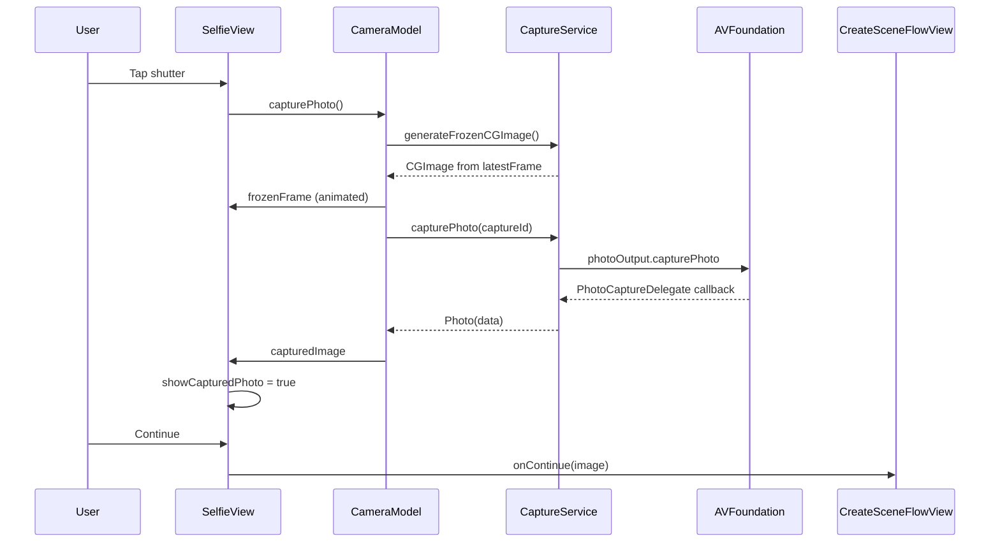

# Selfie Camera Pipeline

This document describes the end-to-end camera pipeline used by `SelfieView` — from hardware capture through UI presentation, shutter interaction, and handoff to the create-scene flow.

The pipeline is built on AVFoundation, bridged into SwiftUI via UIKit, and coordinated with Swift Concurrency (`@MainActor`, `actor`, `AsyncStream`) to keep the main thread responsive during live preview and capture.

### Capture Flow State Reference

<p align="center">
  
  
</p>

---

## 1. Key Files

| File | Role |
|------|------|
| `Yondo/Views/Selfie/SelfieView.swift` | SwiftUI screen: preview stack, overlays, capture/review UI, lifecycle |
| `Yondo/Views/Selfie/CameraModel.swift` | `@MainActor` state machine: authorization, capture orchestration, image state |
| `Yondo/Views/Selfie/CameraPreview.swift` | `UIViewRepresentable` bridge; `PreviewSource` / `PreviewTarget` protocols |
| `Yondo/Services/Camera/CaptureService.swift` | Background `actor`: session config, frame stream, photo capture |
| `Yondo/Utils/Extensions/UIImage+Extensions.swift` | Front-camera mirroring via `.leftMirrored` orientation |
| `Yondo/Utils/Storage/LastSelfieStore.swift` | Persists last selfie; powers the "last selfie" thumbnail button |
| `Yondo/AppEntry/CreateSceneFlowView.swift` | Owns a long-lived `CameraModel`; routes captured image to `SceneBuilderView` |
| `Yondo/Models/DataTypes.swift` | `Photo`, `CameraError` types |

---

## 2. High-Level Flow

```
CreateSceneFlowView
    └── SelfieView (camera: CameraModel)
            │
            ├── .task → camera.start()
            ├── CameraPreview ← previewSource
            ├── Capture button → camera.capturePhoto()
            └── onContinue(image) → SceneBuilderView
```

### Lifecycle on appear

When `SelfieView` appears, its `.task` block:

1. Loads a thumbnail from `LastSelfieStore` (if one exists) for the "last selfie" button.
2. Calls `await camera.start()` to authorize, configure, and start the capture session.
3. If returning from a later screen with a captured photo still showing, fades back to live preview after a short warm-up delay.
4. Fades in the face-guide ellipse overlay.

On disappear, `await camera.stop()` tears down the frame consumer and stops `AVCaptureSession` on a background queue.

### Capture → review → continue

1. User taps the shutter → `SelfieView` calls `await camera.capturePhoto()`.
2. On success, `showCapturedPhoto = true` switches the bottom bar from capture mode to retake/continue.
3. **Continue** passes the `UIImage` to `CreateSceneFlowView`, which navigates to `SceneBuilderView`. Fresh captures are saved to disk in the background via `LastSelfieStore`.
4. **Retake** fades out the captured image and clears `capturedImage` / `frozenFrame` without destroying the live preview layer.

---

## 3. Architecture & Threading

Three execution contexts isolate hardware work from UI:

```
┌─────────────────────────────────────────────────────────┐
│  SelfieView & CameraModel (@MainActor)                  │
│  • SwiftUI layout, animations, haptics                │
│  • capturedImage / frozenFrame / previewSource state    │
└───────────────────────────┬─────────────────────────────┘
                            │ async calls
                            ▼
┌─────────────────────────────────────────────────────────┐
│  CaptureService (actor)                                 │
│  • Session configuration state                          │
│  • latestFrame buffer, frame stream consumer            │
│  • Photo delegate retention                             │
└───────────────────────────┬─────────────────────────────┘
                            │ sessionQueue.async
                            ▼
┌─────────────────────────────────────────────────────────┐
│  sessionQueue (serial DispatchQueue)                    │
│  • startRunning() / stopRunning()                       │
└─────────────────────────────────────────────────────────┘

Parallel path for video frames:

  frameQueue (userInteractive)
    → VideoOutputDelegate.captureOutput(_:didOutput:from:)
    → AsyncStream<CIImage>.Continuation.yield
    → frameTask consumer → updateLatestFrame
```

| Layer | Isolation | Responsibility |
|-------|-----------|----------------|
| `SelfieView` / `CameraModel` | `@MainActor` | UI, user actions, published image state |
| `CaptureService` | `actor` | AVFoundation session, frame pool, photo capture |
| `sessionQueue` | Serial GCD queue | Blocking session start/stop |
| `frameQueue` | Serial GCD queue (`userInteractive`) | Sample-buffer delegate callbacks |

`CameraModel` is created once in `CreateSceneFlowView` as `@State` and passed into `SelfieView`, so the same `CaptureService` and `PreviewSource` can be reused across navigation without re-binding the preview layer.

---

## 4. CaptureService — Hardware Layer

### Session setup

`CaptureService.make()` creates an `AVCaptureSession` and wraps it in `DefaultPreviewSource` on the main actor.

On first `start()`, `configureSession()` runs once (guarded by `session.inputs.isEmpty`):

| Step | Detail |
|------|--------|
| Device | Front wide-angle camera only |
| Preset | `.photo` |
| Inputs | Single `AVCaptureDeviceInput` |
| Outputs | `AVCapturePhotoOutput` (high-res stills) + `AVCaptureVideoDataOutput` (live frames) |
| Pixel format | `kCVPixelFormatType_32BGRA` |
| Orientation | Portrait (rotation angle `0` on iOS 17+, `.portrait` on earlier) |

Authorization is checked via `AVCaptureDevice.authorizationStatus(for: .video)`; if `.notDetermined`, access is requested before configuration proceeds.

### Why two outputs?

- **`AVCaptureVideoPreviewLayer`** (via `CameraPreview`) shows the live feed with minimal latency.
- **`AVCaptureVideoDataOutput`** maintains a rolling `latestFrame` used for the instant "freeze" at shutter time.
- **`AVCapturePhotoOutput`** produces the final high-resolution JPEG/HEIC used for AI scene generation.

### Session start/stop

`startRunning()` and `stopRunning()` are never called on the main thread. Both are dispatched through `sessionQueue` and awaited via `withCheckedContinuation`, avoiding main-thread hangs and watchdog risk (`0x8BADF00D`).

`stop()` additionally cancels `frameTask`, clears `latestFrame`, finishes the `AsyncStream` continuation, and stops the session on the same serial queue used for start.

---

## 5. Frame Processing — AsyncStream Pipeline

Instead of pushing frames through nested delegate callbacks into the UI, frames flow through a pull-based async stream.

```swift
// CaptureService.setupFrameProcessing()
let (stream, continuation) = AsyncStream<CIImage>.makeStream()
videoDelegate.continuation = continuation

frameTask = Task {
    for await image in stream {
        if Task.isCancelled { break }
        await self?.updateLatestFrame(image)
    }
}
```

```swift
// VideoOutputDelegate — runs on frameQueue
func captureOutput(_ output: AVCaptureOutput,
                   didOutput sampleBuffer: CMSampleBuffer,
                   from connection: AVCaptureConnection) {
    guard let buffer = CMSampleBufferGetImageBuffer(sampleBuffer) else { return }
    let ciImage = CIImage(cvImageBuffer: buffer)  // lightweight pointer wrap, no pixel copy
    continuation?.yield(ciImage)
}
```

**Design choice:** `CIImage(cvImageBuffer:)` is created on the delegate thread but not rendered there. Expensive GPU work (`CIContext.createCGImage`) is deferred until the user taps capture, via `generateFrozenCGImage()`. This keeps the video callback path fast and reduces dropped frames.

---

## 6. Dual-Phase Capture

Photo output from AVFoundation can take hundreds of milliseconds while the ISP adjusts exposure and encodes the file. To avoid a blank or frozen UI during that wait, capture is split into two phases.

### Phase 1 — Instant freeze (video stream)

```swift
// CameraModel.capturePhoto()
try? await Task.sleep(nanoseconds: 50_000_000)  // 50 ms buffer refresh
if let rawFrame = await service.generateFrozenCGImage() {
    withAnimation(.snappy(duration: 0.15)) {
        self.frozenFrame = UIImage.fromCapturedCGImage(rawFrame, mirrorSelfie: true)
    }
}
```

`generateFrozenCGImage()` reads `latestFrame` and renders it once through a hardware-accelerated `CIContext`. The result is mirrored to match the front-camera preview.

### Phase 2 — High-res photo (photo output)

```swift
let photo = try await service.capturePhoto(captureId: captureId)
if let uiImage = UIImage(data: photo.data), let cgImage = uiImage.cgImage {
    capturedImage = UIImage.fromCapturedCGImage(cgImage, mirrorSelfie: true)
}
```

`capturePhoto` uses `withCheckedThrowingContinuation` and a retained `PhotoCaptureDelegate`. The delegate resumes exactly once from `photoOutput(_:didFinishProcessingPhoto:error:)` and is removed from an actor-held array when finished.

On failure, `frozenFrame` is cleared so the UI does not show a stale freeze over the live feed.

**Important:** `frozenFrame` is intentionally kept alive through the success path until `SelfieView` transitions to review mode, preventing a flash of the live camera between freeze and final image.

---

## 7. SelfieView — UI Layer Stack

The view uses a fixed Z-order so retake never tears down AVFoundation bindings (~200 ms main-thread cost if the preview were recreated).

```
ZStack (bottom → top)
├── Black background
├── CameraPreview (always alive when previewSource exists)
├── frozenFrame overlay (during capture processing)
├── FaceGuideOverlay (fades out when frozenFrame is set)
├── capturedImage layer (review mode; blur/scale animation on entry)
├── LetterboxOverlay
└── Bottom toolbar (capture vs retake/continue)
```

| State | What the user sees |
|-------|-------------------|
| Live | Preview + face guide + shutter + optional last-selfie thumbnail |
| Capturing | Spinner on shutter; face guide hidden; freeze frame may appear |
| Review | Full-res image over preview; RETAKE / CONTINUE buttons |
| Retake | Fade out captured image; live preview immediately visible again |

`showCapturedPhoto` gates review-mode chrome. It is set only after `capturePhoto()` completes successfully, so SwiftUI batches `capturedImage` assignment and the mode switch in one frame update.

The capture button is disabled while `camera.isCapturing` is true. A `WormSpinner` replaces the shutter icon during capture.

---

## 8. Preview Bridge (UIKit ↔ SwiftUI)

`AVCaptureVideoPreviewLayer` is UIKit-only. `CameraPreview` bridges it without exposing session types to SwiftUI:

```swift
struct CameraPreview: UIViewRepresentable {
    func makeUIView(context: Context) -> PreviewView {
        let preview = PreviewView()
        source.connect(to: preview)   // PreviewSource → PreviewTarget
        return preview
    }
}

class PreviewView: UIView, PreviewTarget {
    override class var layerClass: AnyClass { AVCaptureVideoPreviewLayer.self }

    func setSession(_ session: AVCaptureSession) {
        Task { @MainActor in
            previewLayer.session = session
            previewLayer.videoGravity = .resizeAspectFill
        }
    }
}
```

`DefaultPreviewSource` holds the session reference and calls `target.setSession(session)` on connect. This keeps `SelfieView` dependent only on the `PreviewSource` protocol, which is `Sendable` and mockable.

On Simulator, `PreviewView` shows a static placeholder image because capture APIs require a physical device.

---

## 9. Front-Camera Mirroring

Hardware buffers from the front camera do not match what the user sees in the mirrored preview. All displayed and persisted selfie images go through:

```swift
UIImage.fromCapturedCGImage(_ cgImage, mirrorSelfie: true)
// → UIImage(cgImage:scale:orientation: .leftMirrored)
```

This applies to both the freeze frame and the final photo so the captured result aligns with the on-screen preview.

---

## 10. Last Selfie Integration

`LastSelfieStore` (actor) caches thumbnail and full-size images on disk via `ImageFileService`.

| Action | Behavior |
|--------|----------|
| View appear | `loadThumbnail()` populates the circular last-selfie button |
| Last selfie tap | `loadSelfie()` → `camera.setCapturedImage()` → review mode (`usingStoredSelfie = true`) |
| Continue (stored) | Passes disk-loaded full image; no re-save |
| Continue (fresh) | Clears store, saves in background, passes in-memory image immediately |

Stored selfies bypass the camera pipeline entirely — no capture session involvement.

---

## 11. End-to-End Capture Sequence



---

## 12. Error & Edge Cases

| Condition | Handling |
|-----------|----------|
| Camera unauthorized | `CameraModel.status = .unauthorized`; preview not shown |
| Session start failure | `status = .failed` |
| Photo data corrupt | `frozenFrame` cleared; failure haptic; stays in live mode |
| Capture while already capturing | Ignored (`isCapturing` guard) |
| Session interrupted | `AVCaptureSession.wasInterruptedNotification` logged; interruption-ended logged |
| Navigate away | `camera.stop()` on disappear; `frozenFrame` cleared, `capturedImage` retained for back navigation |
| Retake | UI fade first, then `resetCapturedPhoto()` / `resetFrozenFrame()` — preview layer never destroyed |

---

## 13. Design Rationale (Summary)

| Decision | Why |
|----------|-----|
| Keep `CameraPreview` always mounted | Avoids ~200 ms re-bind cost on retake |
| `CaptureService` as `actor` | Serializes mutable session state safely |
| `AsyncStream` for frames | Clean cancellation; no callback chains into UI |
| Lazy `CIImage` → render on capture only | Delegate thread stays fast |
| Dual-phase capture | Instant visual feedback; high-res follows asynchronously |
| `PreviewSource` protocol | Decouples SwiftUI from AVFoundation session types |
| Long-lived `CameraModel` in flow root | Reuses service + preview source across stack navigation |
| `.leftMirrored` orientation | Captured image matches mirrored front-camera preview |

---

## Related Docs

- [architecture.md](architecture.md#15-camera-pipeline) — Camera Pipeline summary
- [create-scene-flow.md](create-scene-flow.md) — SelfieView as Phase 1 of create flow
- [image-pipeline.md](image-pipeline.md) — disk storage and thumbnail generation (used by `LastSelfieStore`)
