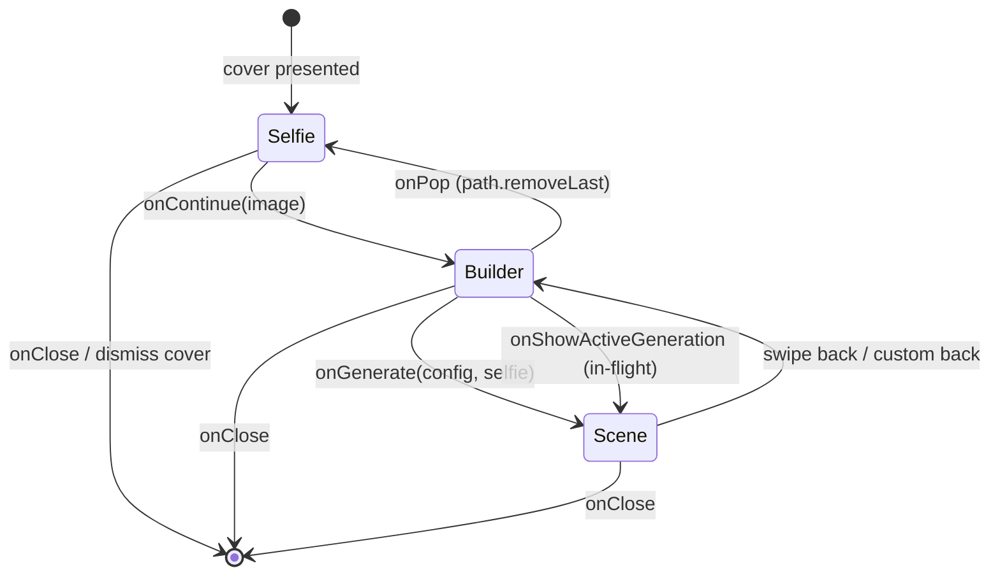

# Create Scene Flow

This document describes how Yondo routes the primary user journey: capture a selfie, configure a scene, and land on the generation screen. It focuses on **navigation**, **ViewModel lifetime**, and **decoupling UI dismissal from paid AI work**.

For credits, Firebase callables, persistence, refunds, and sync healing, see [generate-ai-scene-architecture.md](generate-ai-scene-architecture.md). For the camera stack on Phase 1, see [camera-pipeline.md](camera-pipeline.md).

---

## 1. Design Goals

| Goal | Mechanism |
|------|-----------|
| Dismiss flow without killing a paid generation | `SceneBuilderManager` retains `SceneBuilderViewModel` while `isActive` |
| Type-safe, programmatic routing | `NavigationStack(path:)` + `CreateSceneStep` |
| One shared builder state across screens | Single `SceneBuilderViewModel` injected into builder and scene views |
| Defer heavy AI setup until needed | Lazy `FirebaseAIResultGenerator` inside `SceneBuilderManager` |

---

## 2. Key Files

| File | Role |
|------|------|
| `Yondo/AppEntry/CreateSceneFlowView.swift` | Root router: `NavigationStack`, `CreateSceneStep`, flow lifecycle hooks |
| `Yondo/AppEntry/NavigationPopObserver.swift` | `onNavigationPop` — detects stack pops via `path.count` |
| `Yondo/Views/SceneBuilder/SceneBuilderManager.swift` | Singleton factory/guardian for `SceneBuilderViewModel` |
| `Yondo/Views/SceneBuilder/SceneBuilderViewModel.swift` | Shared state engine; `isActive` drives retention |
| `Yondo/Views/Gallery/ScenesHomeView.swift` | Presents flow via `fullScreenCover` |
| `Yondo/AppEntry/YondoApp.swift` | `SceneBuilderManager.shared.setup(with:)` at launch |
| `Yondo/Views/Selfie/SelfieView.swift` | Phase 1 — capture / review |
| `Yondo/Views/SceneBuilder/SceneBuilderView.swift` | Phase 2 — destination, mood, lighting, generate |
| `Yondo/Views/SceneView/SceneView.swift` | Phase 3 — loading, result, errors |

---

## 3. Entry & Bootstrap

### App launch

`YondoApp` attaches the manager to SwiftData before any flow can start:

```swift
SceneBuilderManager.shared.setup(with: sharedModelContainer)
```

`startFlow()` fatals if `setup` was never called.

### Opening the flow

`ScenesHomeView` presents the journey as a **full-screen cover** (not a nested push on the gallery stack):

```swift
.fullScreenCover(isPresented: $showCreateFlow) {
    CreateSceneFlowView(viewModel: SceneBuilderManager.shared.startFlow())
}
```

`showCreateFlow` is set from the toolbar, empty gallery, and related gallery actions.

### `startFlow()` dependency wiring

On first open (or after idle teardown), `SceneBuilderManager`:

1. Returns an existing `viewModel` if one is still retained.
2. Builds `SceneGenerationPersistenceService` + `SceneGenerationService` (generator, `IAPManager`, persistence, `ImageStore`).
3. Constructs `SceneBuilderViewModel` and stores it in `private(set) var viewModel`.

The Firebase-backed `AIImageGenerator` is created lazily on first access to `generator`, so app launch does not pay for AI client setup.

---

## 4. Architectural Topology

```text
┌─────────────────────────────────────────────────────────────┐
│  ScenesHomeView                                             │
│  • fullScreenCover → CreateSceneFlowView                    │
│  • startFlow() on present                                   │
└──────────────────────────┬──────────────────────────────────┘
                           │
┌──────────────────────────▼──────────────────────────────────┐
│  CreateSceneFlowView (router)                               │
│  • NavigationStack(path: CreateSceneStep)                   │
│  • @State CameraModel (lives for whole cover session)       │
│  • @ObservedObject SceneBuilderViewModel (from manager)     │
│  • onDisappear → endFlowIfIdle()                            │
└──────────────────────────┬──────────────────────────────────┘
                           │ observes / routes
┌──────────────────────────▼──────────────────────────────────┐
│  SceneBuilderManager (@MainActor singleton)                 │
│  • setup(modelContainer)                                    │
│  • startFlow() / endFlowIfIdle() / forceEndFlow()           │
│  • Retains ViewModel while generation task is active        │
└──────────────────────────┬──────────────────────────────────┘
                           │ owns (optional)
┌──────────────────────────▼──────────────────────────────────┐
│  SceneBuilderViewModel                                      │
│  • UI selections, generation task, gallery handoff          │
└─────────────────────────────────────────────────────────────┘
```

**Important:** `CreateSceneFlowView` does **not** own the ViewModel. The manager does. The flow view only receives it in `init(viewModel:)` so all steps share one instance.

---

## 5. Navigation Model

### `CreateSceneStep`

Hashable enum carried in `NavigationPath`:

| Case | Screen | Payload |
|------|--------|---------|
| *(root)* | `SelfieView` | — |
| `.builder(image:)` | `SceneBuilderView` | Captured `UIImage` |
| `.scene(config, selfie:)` | `SceneView` | `SceneConfig` + selfie |

```swift
enum CreateSceneStep: Hashable {
    case builder(image: UIImage)
    case scene(config: SceneConfig, selfie: UIImage)
}
```

### State diagram



### Routing callbacks (`CreateSceneFlowView`)

| Callback | Action |
|----------|--------|
| `SelfieView.onContinue` | `path.append(.builder(image:))` |
| `SelfieView.onClose` | `dismiss()` entire cover |
| `SceneBuilderView.onGenerate` | `path.append(.scene(config:config, selfie:))` |
| `SceneBuilderView.onShowActiveGeneration` | Re-push `.scene` with `lastGenerationConfig ?? lastConfig` |
| `SceneBuilderView.onPop` | `path.removeLast()` (custom back; bar back hidden) |
| `SceneBuilderView.onClose` / `SceneView.onClose` | `dismiss()` cover |

`SceneBuilderView.generateImage()` cancels any non-matching in-flight work (`cancelGeneration(force:)`, `prepareForNewGeneration()`) before calling `onGenerate`, unless the user is resuming the same config/selfie while `isActive`.

### Generation start (boundary with AI doc)

Navigation to `SceneView` does **not** start Firebase by itself. `SceneView.onAppear` sets `isSceneViewVisible = true` and calls `viewModel.generateScene(selfie:config:)` unless the same config/selfie pair is already active.

`SceneView.onDisappear` sets `isSceneViewVisible = false`, calls `cancelGeneration()`, and `teardownWaitingState()`. That affects UI/task coordination when popping the scene screen; it is separate from manager retention when the **whole cover** is dismissed mid-generation.

→ Stage-by-stage AI pipeline: [generate-ai-scene-architecture.md](generate-ai-scene-architecture.md) §4

---

## 6. Core Components

### `CreateSceneFlowView`

- Root of the cover’s `NavigationStack`; `SelfieView` is the stack root (not pushed).
- Holds `@State private var camera = CameraModel()` so preview/capture state survives pushes to builder/scene.
- Uses `@Environment(\.dismiss)` to slide the full cover down on close actions.

### `SceneBuilderManager`

| API | Behavior |
|-----|----------|
| `setup(with:)` | Stores `ModelContainer` for persistence wiring |
| `startFlow()` | Reuse or create `SceneBuilderViewModel` + use case stack |
| `endFlowIfIdle()` | `viewModel = nil` only when `!vm.isActive` |
| `forceEndFlow()` | `cancelGeneration(force:userInitiated: false)` then nil VM |

`forceEndFlow()` is the escape hatch for session teardown (e.g. sign-out). It is defined on the manager; call sites should use it when the app must stop generation and release memory immediately.

### `NavigationPopObserver` / `onNavigationPop`

SwiftUI does not expose a reliable “user swiped back” callback on `NavigationStack`. The modifier compares `path.count` to a stored `lastPathCount`; when count **decreases**, it runs `onPop`.

`CreateSceneFlowView` uses this to post `Notification.Name.didPopNavigationStep`. Nothing in the app subscribes yet; it is available for analytics or builder-side cleanup.

Custom back on `SceneBuilderView` uses `onPop` → `path.removeLast()` instead of relying on the system back button (`navigationBarBackButtonHidden(true)`).

---

## 7. Memory Management & Lifecycle

Paid generation must survive UI teardown. The manager implements **conditional release** on cover dismiss.

### `isActive` vs `isGenerating`

| Property | Meaning | Used for |
|----------|---------|----------|
| `isActive` | `generationTask` exists and is not cancelled | `endFlowIfIdle()` retention |
| `isGenerating` | `@Published` UI loading flag | `SceneView` overlays, logging |

A user can dismiss the cover while `isActive` is still `true`; the manager keeps the ViewModel until the task finishes, persists via the use case, and updates `ImageStore`.

### `endFlowIfIdle` (cover dismiss)

`CreateSceneFlowView.onDisappear`:

```swift
SceneBuilderManager.shared.endFlowIfIdle()
```

```swift
func endFlowIfIdle() {
    guard let vm = viewModel else { return }
    if vm.isActive == false {
        viewModel = nil
    }
}
```

| Scenario | `isActive` | Manager |
|----------|------------|---------|
| User browses selfie/builder and dismisses | `false` | Releases VM |
| User dismisses during generation | `true` | Keeps VM until task completes |
| User reopens flow after idle release | — | `startFlow()` creates fresh VM |

### `forceEndFlow`

Unconditionally cancels generation and nils the ViewModel. Use when the app must not leave background work attached to a stale session.

---

## 8. Screen Responsibilities (summary)

### Phase 1 — `SelfieView`

- Owned `CameraModel` from the flow view; see [camera-pipeline.md](camera-pipeline.md).
- **Continue** → builder step with `UIImage`.
- **Close** → dismiss cover.

### Phase 2 — `SceneBuilderView`

- Reads/writes `SceneBuilderViewModel` selections (destination, environment, mood, lighting, camera).
- **Generate** → navigate to scene step (generation starts in `SceneView`).
- Toolbar can jump to an active generation via `onShowActiveGeneration` when a token is in flight.

### Phase 3 — `SceneView`

- Observes the same `SceneBuilderViewModel` for progress, result image, errors, regenerate.
- **Close** → dismiss cover (manager may still retain VM if generation active).

---

## 9. Related Documentation

| Topic | Document |
|-------|----------|
| AI generation (credits, Firebase, persistence, errors) | [generate-ai-scene-architecture.md](generate-ai-scene-architecture.md) |
| Selfie camera & capture | [camera-pipeline.md](camera-pipeline.md) |
| Scene builder UI controls | [ui-ux-design.md](ui-ux-design.md#103-create-flow) |
| Firebase callables & Storage | [firebase-architecture.md](firebase-architecture.md) |
| Gallery after save | [image-pipeline.md](image-pipeline.md) |
| App-wide map | [architecture.md](architecture.md#10-scene-creation-flow) |
