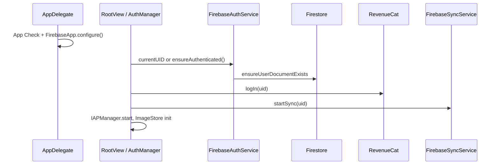
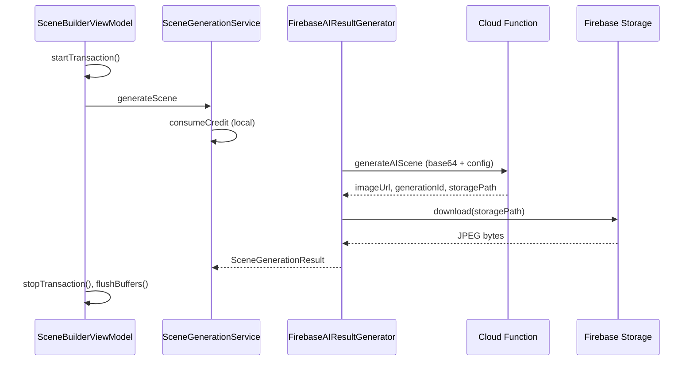

# Firebase Networking Layer

This document describes how Yondo uses Firebase on iOS: SDK setup, authentication, Firestore sync, Cloud Functions, Storage, App Check, and how those pieces connect to scene generation, credits, and premium state.

For adjacent topics, see also:

- [app-launch.md](app-launch.md) — boot handshake, splash, and network monitoring during cold start
- [generate-ai-scene-architecture.md](generate-ai-scene-architecture.md) §6 — AI callable client, preprocessing, and Storage download
- [local-economy-and-sync-healing.md](local-economy-and-sync-healing.md) — optimistic credits, projected balances, and sync healing
- [iap-architecture.md](iap-architecture.md) — RevenueCat identity alignment with Firebase UID
- [architecture.md](architecture.md) — system-wide module map and Firebase summary (§9, §12)

---

## 1. Overview

Yondo’s backend surface on the client is almost entirely Firebase plus RevenueCat:

| Firebase product | Role in Yondo |
|------------------|---------------|
| **Firebase Core** | SDK bootstrap via `GoogleService-Info.plist` |
| **Firebase App Check** | Attestation on callable Functions (debug provider in current build) |
| **Firebase Auth** | Persistent **anonymous** sessions; UID is the app-wide identity |
| **Cloud Firestore** | Real-time user identity + wallet documents |
| **Cloud Functions** | `generateAIScene`, `checkSubscriptionStatus` (region `us-central1`) |
| **Firebase Storage** | Download generated images by `storagePath` (10 MB cap) |
| **Firebase Analytics** | Linked in Xcode; not central to app logic |

The client does **not** call OpenAI directly. AI work runs in Cloud Functions; the app sends a preprocessed selfie and `SceneConfig`, then downloads the result from Storage.

```
┌─────────────────────────────────────────────────────────────────┐
│  UI (SwiftUI) — no Firebase imports                             │
│  SceneBuilderViewModel, IAP UI, Gallery                         │
└────────────┬───────────────────────────────┬────────────────────┘
             │ protocols                     │
┌────────────▼──────────────┐   ┌───────────▼────────────────────┐
│  AuthManager              │   │  SceneGenerationService        │
│  FirebaseAuthService      │   │  FirebaseAIResultGenerator       │
│  FirebaseSyncService      │   │  FirebaseAIClient                │
│  IdentityEvaluator        │   │  FirebaseImagePreprocessor       │
│  EconomyEvaluator         │   └───────────┬────────────────────┘
│  SyncShieldManager        │               │ httpsCallable + Storage
└────────────┬──────────────┘               │
             │ Firestore listeners          │
┌────────────▼──────────────────────────────▼────────────────────┐
│  Firebase (Auth, Firestore, Functions, Storage, App Check)      │
│  + RevenueCat (purchases; webhooks update Firestore server-side) │
└─────────────────────────────────────────────────────────────────┘
```

---

## 2. Dependencies and project setup

### 2.1 Swift Package Manager

Firebase is pulled from [firebase-ios-sdk](https://github.com/firebase/firebase-ios-sdk) (resolved at **12.10.0** in `Package.resolved`). Xcode links these products:

- `FirebaseCore`
- `FirebaseAuth`
- `FirebaseFirestore`
- `FirebaseFunctions`
- `FirebaseStorage`
- `FirebaseAppCheck`
- `FirebaseAnalytics`

### 2.2 `GoogleService-Info.plist`

Production config is **not** committed. Developers:

1. Copy `Yondo/Resources/GoogleService-Info-Example.plist` → `GoogleService-Info.plist`
2. Fill in project keys from the Firebase console
3. Ensure the plist is copied into the app bundle

`AppDelegate` only calls `FirebaseApp.configure()` if the file exists in the bundle; otherwise it logs an error and Firebase-dependent calls will fail.

Example placeholder keys in the template: `API_KEY`, `GCM_SENDER_ID`, `PROJECT_ID`, `STORAGE_BUCKET`, `GOOGLE_APP_ID`, `BUNDLE_ID`.

### 2.3 RevenueCat (paired, not Firebase)

RevenueCat is configured in the same `AppDelegate` boot path using `REVENUECAT_API_KEY` from `Secrets.xcconfig` → `Info.plist`. Firebase UID is the canonical `appUserID` for RevenueCat (`Purchases.shared.logIn(userId)`).

See [README.md](../README.md) for `Secrets.example.xcconfig` and plist duplication steps.

### 2.4 Build script warning

The Xcode project includes a build phase that warns if `GoogleService-Info.plist` is missing (see `project.pbxproj`).

---

## 3. SDK initialization (`AppDelegate`)

Initialization runs in `application(_:didFinishLaunchingWithOptions:)` **before** SwiftUI’s root view performs the auth handshake.

**Order:**

1. **App Check** — `AppCheckDebugProviderFactory` is registered, then `AppCheck.setAppCheckProviderFactory(...)`. This is the development/debug attestation path; production would typically use Device Check or App Attest.
2. **Firebase Core** — `FirebaseApp.configure()` if `GoogleService-Info.plist` is present.
3. **RevenueCat** — `Purchases.configure`, delegate to `IAPManager.shared`.

Relevant code: `Yondo/AppEntry/AppDelegate.swift`.

App Check tokens are attached automatically to callable Functions requests by the Firebase SDK when App Check is enabled on the backend.

---

## 4. Authentication

### 4.1 Model: anonymous Firebase Auth

Yondo uses **Firebase Anonymous Auth** only (no email/password or Sign in with Apple in the current client).

- First launch: `Auth.auth().signInAnonymously()` creates a UID persisted on device by the SDK.
- Subsequent launches: `Auth.auth().currentUser` returns the cached session without a network round-trip when possible.

`FirebaseAuthService` (`Yondo/Services/AI/Firebase/FirebaseAuthService.swift`) is the low-level wrapper:

| API | Behavior |
|-----|----------|
| `ensureAuthenticated()` | Returns existing UID or signs in anonymously |
| `currentUID` | Optional cached UID |
| `ensureUserDocumentExists(userId:)` | Firestore “shell forgery” (see §5) |

### 4.2 `AuthManager` — orchestration

`AuthManager` (`Yondo/Services/Auth/AuthManager.swift`) is the **only** place that sequences Auth + Firestore + RevenueCat + sync listeners at boot.

**Published state:**

- `isInitialized` — splash dismissed after handshake
- `sessionID` — current Firebase UID (mirrors `FirebaseAuthService.currentUID`)
- `isSyncingSlowly` — spinner if boot exceeds ~1.5s

**Boot handshake** (`performHandshake`, called from `bootstrap()` via `RootView`):

1. Resolve UID (cached or `ensureAuthenticated()`).
2. `ensureUserDocumentExists` on `users/{uid}`.
3. `Purchases.shared.logIn(userId)` for RevenueCat.
4. `FirebaseSyncService.shared.startSync(for: userId)`.
5. Always run local hydration: `IAPManager.start`, `LastSelfieStore`, `ImageStore` (works offline if Auth fails).

If Auth fails, the app still boots with `userId == nil` / local-only silos; networking features degrade gracefully.

### 4.3 Late identity sync

`ensureGlobalAuthentication()` / `performIdentitySync()` handle a **UID change** after boot (e.g. first anonymous sign-in while UI was already up). A `Task` deduplicates concurrent calls. On shift, a `ThrowingTaskGroup` updates in parallel:

- Firestore shell
- RevenueCat `logIn`
- `ImageStore.updateIdentity`
- `SecureCreditStore.updateIdentity` + `IAPManager.start`
- `LastSelfieStore.updateIdentity`
- Restart `FirebaseSyncService.startSync`

### 4.4 Logout

`AuthManager.logout()`:

1. Shows splash (`isInitialized = false`).
2. `FirebaseSyncService.stopSync()` — removes listeners, clears evaluator buffers.
3. `Auth.auth().signOut()`.
4. `Purchases.shared.logOut()`.
5. Resets local stores to `"anonymous"` / `"local"`.

`SyncShieldManager.resetAll()` should be invoked on teardown paths that clear in-flight generation shields (logout flow coordinates via sync stop).

### 4.5 IAP guard

`IAPManager+Auth.ensureAuthenticated()` calls `AuthManager.ensureGlobalAuthentication()` and defensively re-runs `Purchases.shared.logIn` if `appUserID` drifts from the Firebase UID before paywall or purchase.

---

## 5. Firestore data model (client expectations)

The iOS app assumes a **split document model**: identity at the user root, economy in a subcollection.

### 5.1 Identity — `users/{uid}`

Created client-side when missing (“shell forgery”):

```swift
[
  "isPremium": false,
  "hasGrantedFreeCredits": false,  // triggers backend welcome gift when false
  "createdAt": FieldValue.serverTimestamp()
]
```

**Client-read fields** (via `IdentityEvaluator`):

| Field | Purpose |
|-------|---------|
| `isPremium` | Premium destinations unlocked |
| `hasGrantedFreeCredits` | Welcome / gift flag (synced to Keychain store) |

Credits are **not** written on the root user doc anymore; the wallet subdocument is authoritative for balance.

Backend Cloud Functions (not in this repo) are expected to:

- React to new user shells (`handleWelcomeGift` — referenced in comments).
- Update `isPremium` from RevenueCat webhooks.
- Deduct credits on successful `generateAIScene`.

### 5.2 Economy — `users/{uid}/wallet/status`

**Client-read fields** (via `EconomyEvaluator`):

| Field | Purpose |
|-------|---------|
| `credits` | Server credit balance |
| `hasPurchasedCredits` | Ever purchased credits (sticky `true` locally once set) |

### 5.3 Local bridge — `SecureCreditStore.syncFromServer`

Firestore snapshots ultimately call `SecureCreditStore.syncFromServer(credits:premiumUnlocked:hasGrantedFreeCredits:hasPurchasedCredits:)` with `nil` for fields outside each evaluator’s domain. Identity and economy evaluators never write each other’s fields in a single call.

---

## 6. Real-time sync — `FirebaseSyncService`

`FirebaseSyncService` (`Yondo/Services/AI/Firebase/FirebaseSyncService.swift`) is a **facade** over two snapshot listeners and two evaluators.

### 6.1 Lifecycle

```swift
startSync(for userId)  // tear down previous, attach listeners
stopSync()             // remove listeners, clear buffers
```

Listeners:

1. `users/{userId}` → `IdentityEvaluator`
2. `users/{userId}/wallet/status` → `EconomyEvaluator`

### 6.2 Cache rejection

Handlers ignore snapshots where `snapshot.metadata.isFromCache == true`. The UI only reacts to **server-confirmed** writes, avoiding optimistic local Firestore cache flicker.

### 6.3 Domain evaluators

| Class | Document | Writes to store |
|-------|----------|-----------------|
| `IdentityEvaluator` | Root user | `premiumUnlocked`, `hasGrantedFreeCredits` |
| `EconomyEvaluator` | Wallet status | `credits`, `hasPurchasedCredits` |

**Sticky Success (identity):** Passive snapshots may set `isPremium` to `true` immediately. A passive `false` is **ignored** unless `force == true` (manual heal / forced refresh). This prevents premium UI flicker when webhooks are slow.

**Projected credits (economy):**

```text
projectedCredits = max(serverCredits - activeTransactionLocks, 0)
```

`SyncShieldManager.activeTransactionCount` counts in-flight AI generations so stale server balances do not visually “refund” a credit mid-generation.

**Anti-dip shield (economy):** If projected credits drop below local balance within 90s of a purchase or while economy UI is active, the update is buffered (`SyncBufferManager`) or rejected on forced heal. See [local-economy-and-sync-healing.md](local-economy-and-sync-healing.md).

### 6.4 Forced refresh (“Exorcist”)

`forceRefreshFromCloud()` fetches both documents with `getDocument(source: .server)` in parallel and evaluates with `force: true`. Used when the UI suspects ghost credits after `INSUFFICIENT_CREDITS` or during credit healing.

### 6.5 Server premium verification (“Healer”)

`verifyPremiumWithServer(allowDowngrade:)` calls callable **`checkSubscriptionStatus`** in `us-central1`.

| Response | Client behavior |
|----------|-----------------|
| `isPremium` bool | Routed through `IdentityEvaluator` with `force: allowDowngrade` |
| Missing / null | Preserves local premium flag |
| Network error | Throws to caller (e.g. refresh flow logs warning) |

`IAPManager.refreshEntitlements(force:)` uses this after RevenueCat SDK refresh to align Firestore and local store.

### 6.6 Legacy debug implementation

`_FirebaseSyncService.swift` is compiled only under `#if DEBUG`. It is an **older monolithic listener** on `users/{uid}` (credits + premium in one document) with inline shields. Production code uses `FirebaseSyncService` + evaluators; the underscore-prefixed type is kept for reference and debug extensions, not wired as `shared` in release paths.

---

## 7. Sync shields (`SyncShieldManager`)

Separate from Firestore but essential to Firebase networking **semantics**:

| Mechanism | When | Effect |
|-----------|------|--------|
| **Transaction shield** | `startTransaction()` at generation commit | Increments lock count; economy projection subtracts locks |
| **Anti-dip shield** | Within 90s of IAP or economy UI open | Blocks lower projected balance |
| **Bypass** | Server `INSUFFICIENT_CREDITS` | Next dip allowed through (`forceBypass` / consumed in evaluator) |

`SceneBuilderViewModel` calls `shieldManager.startTransaction()` before `consumeCredit()` and `stopTransaction` on success, cancel, or error.

Auto-release: 60s timeout per transaction ID if not stopped.

Protocol: `SyncShielding` — implemented by `SyncShieldManager` (production) and `_FirebaseSyncService` (DEBUG legacy).

---

## 8. Cloud Functions (callable)

All callables use:

```swift
Functions.functions(region: "us-central1")
```

### 8.1 `generateAIScene`

**Client:** `FirebaseAIClient.generateScene(request:)`

| Setting | Value |
|---------|--------|
| Callable name | `"generateAIScene"` |
| Timeout | 310 seconds (server ~300s) |
| Payload | `GenerateAISceneRequest` encoded to `[String: Any]` |
| Background task | `UIApplication.beginBackgroundTask` for entire call |

**Request** (`Yondo/Services/AI/Firebase/Models.swift`):

```swift
struct GenerateAISceneRequest: Encodable {
    let config: SceneConfig
    let base64Selfie: String
    let includeSecret: Bool
}
```

- `includeSecret` is `false` when the user is on free credits (`SceneGenerationService`); premium viewpoints require server-side entitlement checks.

**Response:**

```swift
struct GenerateAISceneResponse: Decodable {
    let imageUrl: String
    let generationId: String
    let storagePath: String
}
```

The client downloads bytes via **Storage** using `storagePath`, not the URL alone (commented alternative: `reference(forURL:)`).

### 8.2 `checkSubscriptionStatus`

**Client:** `FirebaseSyncService.verifyPremiumWithServer`

- No arguments in the Swift call; server uses Auth context.
- Returns `[ "isPremium": Bool ]` when definitive.

---

## 9. Firebase Storage

After a successful callable:

```swift
let storageRef = Storage.storage().reference().child(firebaseResponse.storagePath)
let imageData = try await storageRef.data(maxSize: 10 * 1024 * 1024)
```

Failure to decode JPEG data surfaces as `SceneGenerationError.unknown`.

`SceneGenerationResult` carries `remoteIdentifier`, `remoteURL`, and `storagePath` for SwiftData persistence (`RemoteGeneration`).

---

## 10. AI scene generation — end-to-end

> **Client-wide reference:** [generate-ai-scene-architecture.md](generate-ai-scene-architecture.md) (UI lifecycle, stages, tokens, refunds, prompting).

### 10.1 Wiring

`SceneBuilderManager` lazily constructs `FirebaseAIResultGenerator()` as the `AIImageGenerator` implementation when the create-scene flow starts (after Firebase configure at launch).

Stack:

```text
SceneBuilderViewModel
  → SceneGenerationService (use case)
      → FirebaseAIResultGenerator
          → FirebaseAuthService (via AuthManager.ensureGlobalAuthentication)
          → FirebaseImagePreprocessor
          → FirebaseAIClient
          → Firebase Storage download
```

### 10.2 Preprocessing (`FirebaseImagePreprocessor`)

- Center-crop to square, draw into **512×512**
- JPEG quality **0.8**
- Base64 in request body

### 10.3 Orchestration (`SceneGenerationService`)

1. `AuthManager.ensureGlobalAuthentication()` — UID for persistence.
2. SwiftData `savePendingState` (`RemoteGeneration`, status `processing`).
3. **Local** `consumeCredit()` (optimistic; not waiting for Firestore deduct).
4. `generator.generateScene` → callable + Storage.
5. On success: update SwiftData with `firebaseID`, `storagePath`, `completed`; save image via `ImageStore`.
6. On failure: mark `failed`; rethrow for ViewModel refund policy.

### 10.4 ViewModel timing

1. Grace period (~5s) — user can cancel without spending.
2. `startTransaction()` + `consumeCredit()` via use case.
3. On success: `stopTransaction`, `flushBuffers()`.
4. On `insufficientCredits`: **no** local refund (avoid ghost credits); credit healing UI.
5. On other errors: refund via `GenerationHistoryManager`.

### 10.5 Auth before every generation

`FirebaseAIResultGenerator` calls `AuthManager.shared.ensureGlobalAuthentication()` so Functions always run with a valid ID token even if boot handshake was skipped or delayed.

---

## 11. Error handling

### 11.1 Business errors (`FirebaseErrorParser`)

Cloud Functions should return HTTPS errors whose `userInfo["details"]` contains:

```json
{
  "code": "INSUFFICIENT_CREDITS",
  "message": "...",
  "destinationName": "..." 
}
```

Mapped enum `YondoRemoteError`:

| Code | Client mapping |
|------|----------------|
| `AUTH_REQUIRED` | `SceneGenerationError.unknown` |
| `USER_NOT_FOUND` | `SceneGenerationError.unknown` |
| `INVALID_CONFIG` | `SceneGenerationError.unknown` |
| `PREMIUM_REQUIRED` | `SceneGenerationError.requiresPremiumUnlock(destinationName:)` |
| `INSUFFICIENT_CREDITS` | `SceneGenerationError.insufficientCredits` |
| `AI_GEN_FAILED` | `SceneGenerationError.aiBusy` |

### 11.2 Functions transport errors

`Error.asFunctionsError` maps `FunctionsErrorDomain`:

| Code | Mapping |
|------|---------|
| `resourceExhausted` | `aiBusy` |
| `deadlineExceeded`, `unavailable` | `networkConnectionLost` |
| Other (e.g. `unauthenticated`) | `unknown` |

### 11.3 URL / offline

`NSURLErrorDomain` (e.g. `-1009`) → `networkConnectionLost`.

---

## 12. Sync healing after Firebase errors

When local state disagrees with the server response, `SyncHealingController` runs a **3–4–1** window:

| Phase | Duration | Action |
|-------|----------|--------|
| 1 | 3s | Wait for natural Firestore webhook |
| 2 | 4s (timeout) | Premium: `refreshEntitlements(force:)`; Credits: `forceRefreshFromCloud()` |
| 3 | 1s | Buffer |
| 4 | — | Resolve UI to hard error or clear syncing state |

Triggered from `SceneBuilderViewModel+ErrorHandling` for `.requiresPremiumUnlock` and `.insufficientCredits` when the user is still on the scene screen.

---

## 13. Persistence linked to Firebase

`RemoteGeneration` (SwiftData) stores:

- `localID` — ties to generation token / history
- `userID` — Firebase UID at start of generation
- `firebaseID`, `storagePath` — set on success
- `status` — `processing` / `completed` / `failed`

This is **local** bookkeeping; Firestore may hold its own generation records server-side (`generationId` in the callable response).

---

## 14. Debug and testing

### 14.1 `FirebaseAIClient+Debug`

When `DebugManager.shared.activeScenario` is set:

- Artificial 3s delay
- Throws forged `NSError` with `details` matching `FirebaseErrorParser`

Scenarios: `slowCreditWebhook`, `ghostCredit`, `slowPremiumWebhook`, `failedPremiumSync`.

### 14.2 Evaluator debug hooks

`DebugManager.applyIdentityScenario` / `applyEconomyScenario` mutate snapshot dictionaries before evaluation (DEBUG).

### 14.3 Mocks

- `MockAIImageGenerator` — unit tests without Firebase
- `_MockSyncService` — sync protocol testing

### 14.4 App Check

Current `AppDelegate` always registers **`AppCheckDebugProviderFactory`**. For TestFlight/production, the project would normally switch to a production provider and register debug tokens in the Firebase console for local development.

---

## 15. Source file map

| Path | Responsibility |
|------|----------------|
| `Yondo/AppEntry/AppDelegate.swift` | Firebase + App Check + RevenueCat configure |
| `Yondo/Services/Auth/AuthManager.swift` | Handshake, identity sync, logout |
| `Yondo/Services/AI/Firebase/FirebaseAuthService.swift` | Anonymous auth, user doc shell |
| `Yondo/Services/AI/Firebase/FirebaseSyncService.swift` | Firestore listeners, healers |
| `Yondo/Services/AI/Firebase/FirebaseAIClient.swift` | `generateAIScene` callable |
| `Yondo/Services/AI/Firebase/FirebaseAIResultGenerator.swift` | Full AI pipeline + Storage |
| `Yondo/Services/AI/Firebase/FirebaseImagePreprocessor.swift` | 512² JPEG encode |
| `Yondo/Services/AI/Firebase/FirebaseErrors.swift` | `YondoRemoteError`, parser |
| `Yondo/Services/AI/Firebase/Models.swift` | Request/response DTOs |
| `Yondo/Services/Sync/IdentityEvaluator.swift` | Premium / gift sync |
| `Yondo/Services/Sync/EconomyEvaluator.swift` | Credits sync + projection |
| `Yondo/Services/Sync/SyncShieldManager.swift` | Transaction + anti-dip shields |
| `Yondo/Services/Sync/SyncBufferManager.swift` | Delayed snapshot apply |
| `Yondo/Services/Sync/SyncHealingController.swift` | Post-error 3-4-1 healing |
| `Yondo/Services/AI/SceneGenerationService.swift` | Credits + AI + persistence orchestration |
| `Yondo/Services/IAP/SecureCreditStore.swift` | `syncFromServer` target |
| `Yondo/Services/IAP/IAPManager+Auth.swift` | Purchase-time auth bridge |
| `Yondo/Views/SceneBuilder/SceneBuilderManager.swift` | Wires `FirebaseAIResultGenerator` |
| `Yondo/Resources/GoogleService-Info-Example.plist` | Config template |

---

## 16. Operational checklist for developers

1. Add `GoogleService-Info.plist` and `Secrets.xcconfig` (RevenueCat).
2. Enable Anonymous Auth in Firebase console.
3. Deploy Functions `generateAIScene` and `checkSubscriptionStatus` to **us-central1**.
4. Configure App Check on Functions; use debug tokens while `AppCheckDebugProviderFactory` is active.
5. Ensure Firestore rules allow authenticated users to read their own `users/{uid}` and `wallet/status`; client only **creates** the initial shell (server owns wallet writes).
6. Confirm Storage rules allow authenticated download of generation paths returned by the callable.
7. Align RevenueCat webhooks with Firestore wallet and `isPremium` updates so listeners reflect purchases and subscriptions.

---

## 17. Sequence diagrams

### Boot handshake



### Generate scene



---

## Related Documentation

| Topic | Document |
|-------|----------|
| End-to-end AI pipeline (callable → Storage → UI) | [generate-ai-scene-architecture.md](generate-ai-scene-architecture.md) |
| Boot sequence & when sync starts | [app-launch.md](app-launch.md) |
| Credits, anti-dip shield, sync healing | [local-economy-and-sync-healing.md](local-economy-and-sync-healing.md) |
| IAP & RevenueCat `logIn(uid)` | [iap-architecture.md](iap-architecture.md) |
| SwiftData `RemoteGeneration` writes | [persistence-swiftdata.md](persistence-swiftdata.md) |
| System overview | [architecture.md](architecture.md#12-networking--real-time-sync) |

---

*This document reflects the iOS client as of the current codebase. Server Cloud Function implementations live in the Firebase/backend project, not in `yondo-ios`.*
