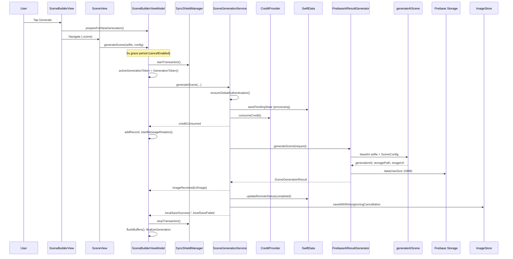
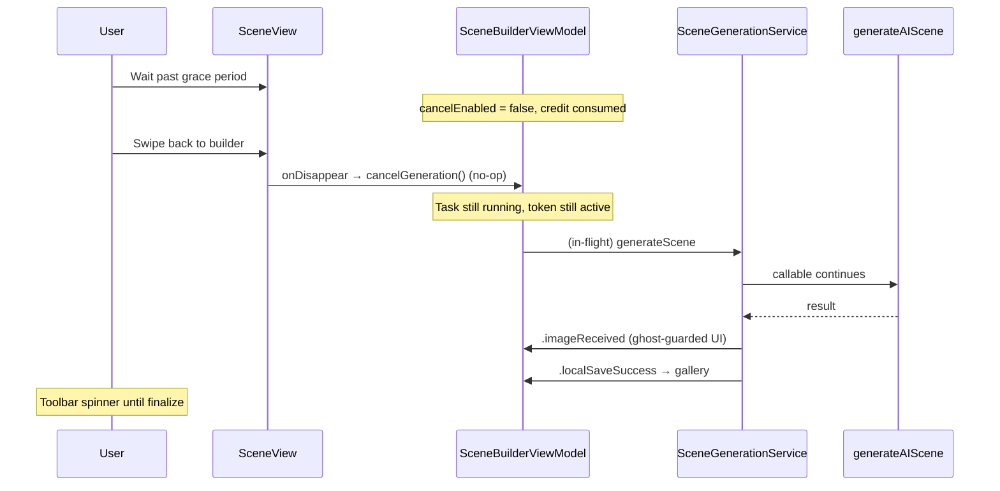

# Generate AI Scene — Architecture

How Yondo turns a selfie plus scene configuration into a photorealistic composite image. The pipeline spans UI lifecycle, local economy (credits), Firebase Cloud Functions, Storage download, SwiftData bookkeeping, and on-disk gallery persistence. The client never calls OpenAI directly; generation runs server-side via the `generateAIScene` callable.

<p align="center">
  
  
</p>

---

## Table of Contents

1. [Overview](#1-overview)
2. [Layer Topology](#2-layer-topology)
3. [End-to-End Sequence](#3-end-to-end-sequence)
4. [Presentation Layer](#4-presentation-layer)
5. [Domain Orchestration](#5-domain-orchestration)
6. [Remote AI Transport](#6-remote-ai-transport)
7. [Scene Configuration & Prompting](#7-scene-configuration--prompting)
8. [Economy, Credits & Sync Shields](#8-economy-credits--sync-shields)
9. [Persistence & History](#9-persistence--history)
10. [Stages, Tokens & UI Milestones](#10-stages-tokens--ui-milestones)
11. [Error Handling & Sync Healing](#11-error-handling--sync-healing)
12. [Lifecycle & Memory Retention](#12-lifecycle--memory-retention)
13. [Parallel & Overlapping Generations](#13-parallel--overlapping-generations)
14. [Alternate & Test Implementations](#14-alternate--test-implementations)
15. [Source File Index](#15-source-file-index)
16. [Related Documentation](#16-related-documentation)

---

## 1. Overview

| Concern | Design choice |
| --- | --- |
| **Entry** | User taps Generate on `SceneBuilderView` → navigates to `SceneView` → `generateScene` starts |
| **Contract** | `SceneGenerationUseCase` — UI depends on protocol, not Firebase |
| **Remote backend** | `FirebaseAIResultGenerator` → `generateAIScene` (us-central1) → Storage download |
| **Credit model** | Optimistic local deduct *before* network; refund on failure (except server `INSUFFICIENT_CREDITS`) |
| **Delivery vs persistence** | Image shown on `.imageReceived`; disk save is best-effort and non-fatal |
| **Paid work survives dismiss** | `SceneBuilderManager` retains ViewModel while generation work is active |
| **Concurrency** | Multiple generations can run in parallel (one Swift `Task` per attempt); `activeGenerationToken` identifies the **most recent** job for create-flow UI; gallery will surface all in-flight jobs via SwiftData (see [§13](#13-parallel--overlapping-generations)) |
| **Gallery queue (planned)** | `ScenesHomeView` shows every `processing` attempt as a shimmering placeholder until the image lands in `ImageStore` |

**Identity (transitioning):** `GenerationToken` and SwiftData `localID` still diverge in code today. The [SwiftData cutover](persistence-swiftdata.md#10-ongoing-refactoring-generationhistorymanager--swiftdata) converges on a single `localID` per attempt; that id becomes the key for the generation queue, gallery placeholders, refunds, and ghost-task guards.

---

## 2. Layer Topology

```text
┌─────────────────────────────────────────────────────────────────────────┐
│  ScenesHomeView (gallery — planned queue for all processing rows)       │
│  CreateSceneFlowView (NavigationStack)                                  │
│    SelfieView → SceneBuilderView → SceneView                            │
└───────────────────────────────┬─────────────────────────────────────────┘
                                │ observes
┌───────────────────────────────▼─────────────────────────────────────────┐
│  SceneBuilderManager (@MainActor singleton)                             │
│    • Lazy FirebaseAIResultGenerator                                     │
│    • Wires SceneGenerationService + SceneBuilderViewModel               │
│    • endFlowIfIdle() / forceEndFlow()                                   │
└───────────────────────────────┬─────────────────────────────────────────┘
                                │ owns
┌───────────────────────────────▼─────────────────────────────────────────┐
│  SceneBuilderViewModel (@MainActor)                                     │
│    • Grace period, sync shield, generation queue (head = active token)  │
│    • SceneGenerationStage → @Published UI state                         │
└───────────────────────────────┬─────────────────────────────────────────┘
                                │ calls
┌───────────────────────────────▼─────────────────────────────────────────┐
│  SceneGenerationService (SceneGenerationUseCase)                        │
│    Auth → SwiftData pending → consumeCredit → AI → update → ImageStore  │
└───────┬─────────────────┬─────────────────┬─────────────────────────────┘
        │                 │                 │
        ▼                 ▼                 ▼
┌───────────────┐ ┌───────────────┐ ┌─────────────────────────────────────┐
│ CreditProvider│ │ AIImageGenerator│ │ SceneGenerationPersistence        │
│ (IAPManager)  │ │ FirebaseAI…   │ │ RemoteGeneration (SwiftData)        │
└───────────────┘ └───────┬───────┘ └─────────────────────────────────────┘
                          │
        ┌─────────────────┼─────────────────┐
        ▼                 ▼                 ▼
 FirebaseImagePreprocessor  FirebaseAIClient   Firebase Storage
 (512² JPEG base64)        (callable RPC)     (result download)
```

Protocol boundaries (swap without touching Views):

| Protocol | Production type |
| --- | --- |
| `SceneGenerationUseCase` | `SceneGenerationService` |
| `AIImageGenerator` | `FirebaseAIResultGenerator` |
| `CreditProvider` | `IAPManager` |
| `SceneGenerationPersistence` | `SceneGenerationPersistenceService` |
| `ImageStoring` | `ImageStore` |
| `SyncShielding` | `SyncShieldManager` |

---

## 3. End-to-End Sequence

### 3.1 Happy path (with timing gates)



### 3.2 Commitment points

| Point | When | Reversible? |
| --- | --- | --- |
| **Grace period** | First 5s on `SceneView`; `cancelEnabled == true` | Yes — cancel task, no credit |
| **Credit consumed** | `SceneGenerationService` calls `consumeCredit()` | No — refund only via error path |
| **Image received** | Callable + Storage download succeed | Domain success; disk save may still fail |
| **Local save** | `ImageStore` persists JPEG + thumbnail | Non-fatal; user may see “temporary” alert |

---

## 4. Presentation Layer

### 4.1 Navigation (`CreateSceneFlowView`)

Type-safe routing via `CreateSceneStep`:

- `.builder(image:)` — `SceneBuilderView` (destination, environment, mood, lighting, camera)
- `.scene(config, selfie:)` — `SceneView` (loading, result, errors, regenerate)

On flow dismiss, `SceneBuilderManager.shared.endFlowIfIdle()` runs — it **does not** release the ViewModel if a generation task is still active.

→ Full flow lifecycle: [create-scene-flow.md](create-scene-flow.md)

### 4.2 Starting generation

**Primary path** — `SceneBuilderView.generateImage()`:

1. `buildConfig()` from current `@Published` selections
2. If not same active generation: `cancelGeneration(force: true, userInitiated: false)` + `prepareForNewGeneration()` — clears head-job UI **without** cancelling the in-flight network task (see [§13.4](#134-replacement-without-task-cancellation))
3. `onGenerate(config, selfie)` appends `.scene` to `NavigationPath`

**Execution path** — `SceneView.onAppear`:

- Sets `isSceneViewVisible = true`
- Skips duplicate start if same config/selfie and `isActive`
- Otherwise calls `viewModel.generateScene(selfie:config:)`

**Resume path (target behavior, partially live today)** — When the user returns to `SceneView` for the **active** generation (same config/selfie while `isActive`, or via `onShowActiveGeneration` from the builder toolbar):

- No second credit is consumed; the existing Swift `Task` continues.
- Loading UI resumes: spinner, shimmering status copy, and message rotation tied to `activeGenerationToken`.
- On `.imageReceived`, the result image animates in **only** when `token == activeGenerationToken && isSceneViewVisible`.

Older jobs in the queue do not drive `SceneView`; they appear in the gallery as in-progress placeholders ([§13.8](#138-gallery-queue-planned)).

**Teardown** — `SceneView.onDisappear`:

- `isSceneViewVisible = false`
- `cancelGeneration()` + `teardownWaitingState()` (stops sync healing timers)

After the grace period (`cancelEnabled == false`), `cancelGeneration()` without `force` is a **no-op** — the underlying `generationTask` keeps running. The user can return to `SceneBuilderView` while the callable is still in flight; the toolbar shows **Processing…** and a spinner that re-opens `SceneView` via `onShowActiveGeneration`. See [§13](#13-parallel--overlapping-generations).

### 4.3 `SceneBuilderViewModel.generateScene`

Runs inside a `Task { @MainActor }`:

1. **`runGracePeriodTimer()`** — 5→1 countdown; cancellation returns before shield/credit
2. **`shieldManager.startTransaction()`** — blocks optimistic sync dips during generation
3. **`GenerationToken()`** — binds UI updates and refund eligibility
4. **`useCase.generateScene`** — stage callback → `handleSceneGenerationStage`
5. **Success** — `stopTransaction`, `flushBuffers`, `finalizeGeneration(for:)` (token-gated)
6. **Cancellation** — detached refund if `generationManager.hasCommittedRecord(for:)`
7. **Error** — `handleGenerationError` (refund policy + sync healing)

`isActive` is `true` while the head generation's `generationTask` exists and is not cancelled — used by `SceneBuilderManager` for retention. (Target: `isActive` or equivalent true whenever **any** queue task is running.)

---

## 5. Domain Orchestration

### 5.1 `SceneGenerationUseCase`

Defined in `Yondo/UseCases/SceneGenerationUseCase.swift`.

- **Input:** `UIImage` selfie, `SceneConfig`
- **Output:** throws on hard failure; success means AI delivered even if disk save failed
- **Callback:** `onStageChange` on `@MainActor` — see [§10](#10-stages-tokens--ui-milestones)

### 5.2 `SceneGenerationService`

Single orchestrator in `Yondo/Services/AI/SceneGenerationService.swift`.

**Order of operations:**

1. `localID = UUID()` — SwiftData key for this attempt
2. `shouldIncludeSecret = !iapProvider.creditStore.isRunningOnFreeCredits` — premium viewpoints gated for free-credit users
3. `AuthManager.shared.ensureGlobalAuthentication()` — UID for persistence
4. `persistence.savePendingState(localID, userID, config)` — `RemoteGeneration` status `processing`
5. **`iapProvider.consumeCredit()`** — point of no return
6. `onStageChange(.creditConsumed)`
7. Build `SceneGenerationRequest` → `generator.generateScene(request:)`
8. `onStageChange(.imageReceived)`
9. `persistence.updateRemoteStatus(..., completed, firebaseID, storagePath)`
10. Nested `do/catch` around `imageStore.saveWithRetryIgnoringCancellation` — failures emit `.localSaveFailed` only
11. On any earlier failure: `updateRemoteStatus(..., failed)` and rethrow

### 5.3 Request / result models

`Yondo/Models/RequestModel.swift`:

```swift
struct SceneGenerationRequest {
    let selfieImage: UIImage
    let config: SceneConfig
    let includeSecret: Bool
}

struct SceneGenerationResult {
    let generatedImage: UIImage
    let remoteIdentifier: String?  // Firestore generationId
    let remoteURL: URL?
    let storagePath: String?
}
```

---

## 6. Remote AI Transport

Production path: `FirebaseAIResultGenerator` (`Yondo/Services/AI/Firebase/`).

### 6.1 Preprocessing (`FirebaseImagePreprocessor`)

| Step | Detail |
| --- | --- |
| Crop | Center square from source aspect ratio |
| Resize | 512×512 via `UIGraphicsImageRenderer` |
| Encode | JPEG quality **0.8** |
| Wire format | Base64 string in callable payload |

Implements `ImagePreprocessing` (shared concept with legacy `OpenAIDALLEResultGenerator`).

### 6.2 Callable (`FirebaseAIClient`)

| Setting | Value |
| --- | --- |
| Region | `us-central1` |
| Name | `"generateAIScene"` |
| Timeout | **310s** (server ~300s) |
| Background | `UIApplication.beginBackgroundTask` for entire call |
| Encoding | `GenerateAISceneRequest.asDictionary()` via `JSONEncoder` |

**Request** (`Models.swift`):

```swift
struct GenerateAISceneRequest: Encodable {
    let config: SceneConfig      // Codable — sent to server for prompt/validation
    let base64Selfie: String
    let includeSecret: Bool
}
```

**Response:**

```swift
struct GenerateAISceneResponse: Decodable {
    let imageUrl: String
    let generationId: String
    let storagePath: String
}
```

The client downloads bytes with **Storage SDK** using `storagePath` (not URL-only), max **10 MB**.

### 6.3 Server-side prompt (client note)

`SceneConfig.makePrompt(includeSecretViewpoints:)` exists on the client for the legacy direct-OpenAI path (`OpenAIDALLEResultGenerator`). In production, **`SceneConfig` is serialized to the callable**; the Cloud Function builds or forwards the prompt server-side. Client-side prompt logic still matters for:

- Viewpoint catalog and `includeSecret` gating
- Destination/environment validation semantics mirrored on server
- Debug and unit reasoning about scene semantics

→ Callable contract and error codes: [firebase-architecture.md](firebase-architecture.md) §8–11

### 6.4 Authentication

`ensureGlobalAuthentication()` is called in both `SceneGenerationService` and `FirebaseAIResultGenerator` so Functions always receive a valid ID token even if launch handshake was delayed.

---

## 7. Scene Configuration & Prompting

### 7.1 `SceneConfig`

`Yondo/Models/SceneConfig.swift` — `Codable`, `Sendable`, `Hashable`.

| Field | Type | Role |
| --- | --- | --- |
| `environment` | `SceneEnvironment` | beach, city, nature, studio, luxuryInterior |
| `mood` | `SceneMood` | cinematic, relaxed, confident, mysterious, playful |
| `lighting` | `SceneLighting` | daylight, goldenHour, night, neon |
| `camera` | `CameraStyle` | portrait, wide, closeUp, dramatic |
| `destination` | `SceneDestination?` | Optional landmark; drives viewpoint catalog |

`SceneBuilderViewModel.buildConfig()` assembles config from `@Published` UI state. Destination taps run `applyPresets(for:)` (allowed environments, recommended mood/lighting/camera).

### 7.2 Viewpoints (`SceneViewpoints`)

`Yondo/Models/SceneViewpoints.swift` — weighted catalog:

```text
SceneDestination → SceneEnvironment → [SceneViewpoint]
```

Each `SceneViewpoint` has `description`, `weight`, and optional `isSecret`.

`randomViewpoint(destination:environment:includeSecretViewpoints:)`:

- Returns `nil` for non-destination scenes
- Filters `isSecret` when `includeSecretViewpoints == false` (free credits)
- Picks via weighted random over `weight`

Secret viewpoints add rare compositions; paid users get them when `includeSecret` is true in the request.

### 7.3 Prompt structure (destination scenes)

`makeDestinationPrompt` assembles sections: Identity, Pose, Location, Environment, Viewpoint (cleaned), Mood, Lighting, Camera, realism constraints, destination-specific boost, random seed.

`cleanContextualText` strips words that conflict with selected environment, lighting, or mood to reduce contradictory instructions.

Non-destination scenes use `makeNonDestinationPrompt` (no viewpoint block).

---

## 8. Economy, Credits & Sync Shields

### 8.1 Credit consumption

- **Who deducts:** `SceneGenerationService` via `CreditProvider.consumeCredit()` → `SecureCreditStore` (optimistic local)
- **When:** After SwiftData pending row, **before** Firebase call
- **Free credits:** `isRunningOnFreeCredits` disables secret viewpoints (`includeSecret: false`)

### 8.2 Sync shield (`SyncShieldManager`)

Started in ViewModel **before** use case runs (after grace period). Each generation receives its own transaction UUID via `startTransaction()`:

- Prevents Firestore snapshot from showing a post-purchase credit dip during in-flight generation
- Stopped on success, cancel (with refund path), or error via `stopTransaction(id:)`
- `clearBypass()` in `finalizeGeneration`
- **`activeTransactionCount`** — a `Set<UUID>`; multiple overlapping generations each hold a lock until their task completes. `EconomyEvaluator` subtracts this count from server credits when projecting balance (see [§13.5](#135-economy--sync-shield-under-overlap))

Auto-release: 60s per transaction ID if not stopped (see [firebase-architecture.md](firebase-architecture.md)).

### 8.3 Refund policy (`GenerationHistoryManager`)

| Condition | Refund? |
| --- | --- |
| Failure before `.creditConsumed` (no history record) | No |
| Failure after credit, image never delivered | Yes — `refundIfUndelivered` |
| Server `INSUFFICIENT_CREDITS` | **No** — avoids ghost-credit loop |
| User cancel after commit | Detached refund task |
| Success | No |

`isDelivered` = `image != nil || isSaved`.

→ Economy deep-dive: [iap-architecture.md](iap-architecture.md), [local-economy-and-sync-healing.md](local-economy-and-sync-healing.md)

---

## 9. Persistence & History

→ Deep dive (SwiftData bootstrap, dual-store model, `GenerationHistoryManager` migration): [persistence-swiftdata.md](persistence-swiftdata.md)

### 9.1 SwiftData — `RemoteGeneration`

`Yondo/Services/Persistence/RemoteGeneration.swift`

| Field | Purpose |
| --- | --- |
| `localID` | Unique UUID per orchestration (not the UI `GenerationToken`) |
| `userID` | Firebase UID at generation start |
| `status` | `processing` → `completed` or `failed` |
| `firebaseID`, `storagePath` | Set on success from callable response |
| `destinationName` | Denormalized for debugging / support |

Written by `SceneGenerationPersistenceService` on `@MainActor`.

### 9.2 Disk — `ImageStore`

After successful AI response, `saveWithRetryIgnoringCancellation`:

- Full JPEG in Documents
- Thumbnail in Caches
- Gallery index update

Failure does **not** fail the use case; ViewModel may show `saveFailedButDeliveredAlert`.

→ [image-pipeline.md](image-pipeline.md)

### 9.3 In-memory history — `GenerationHistoryManager` (deprecating)

Tracks per-`GenerationToken` records for refund eligibility and toolbar “active generation” UX. Cleaned in `defer { cleanupIfFinalized(token) }` after the generation task completes.

**Migration:** This layer is being replaced by SwiftData as the **durable generation queue** — one row per attempt, read by `ScenesHomeView` for shimmering in-progress tiles and by the ViewModel for refunds. Phases and cutover checklist → [persistence-swiftdata.md §10](persistence-swiftdata.md#10-ongoing-refactoring-generationhistorymanager--swiftdata). See also [§13.8](#138-gallery-queue-planned).

---

## 10. Stages, Tokens & UI Milestones

### `activeGenerationToken` and the generation queue

Conceptually, Yondo maintains a **queue of in-flight AI generations**. Each committed attempt gets its own Swift `Task` running `SceneGenerationService.generateScene` and (after SwiftData cutover) its own `RemoteGeneration` row with `status == "processing"`.

| Concept | Meaning |
| --- | --- |
| **Queue** | All attempts that have passed the grace period and consumed a credit, until they complete, fail, or refund |
| **`activeGenerationToken`** | The **most recent** attempt — the head of the queue for create-flow UI (`SceneBuilderView` spinner, `SceneView` progress, sync healing) |
| **Older attempts** | Keep running in the background; do not update `SceneView` when stale; will surface in `ScenesHomeView` as shimmering tiles ([§13.8](#138-gallery-queue-planned)) |

Today the ViewModel still stores a single `generationTask` reference and overwrites it when starting a new attempt; the queue semantics above are the **target model** aligned with SwiftData and gallery work. See [§13.1](#131-target-vs-current-implementation).

### `SceneGenerationStage` (domain)

| Stage | Meaning | Typical UI action |
| --- | --- | --- |
| `.creditConsumed` | Credit deducted, pending DB row | Start loading copy rotation; `addRecord` |
| `.imageReceived(UIImage)` | AI + download OK | Show image if `token == activeGenerationToken && isSceneViewVisible` |
| `.localSaveSuccess(filename:)` | On disk | `markSaved` for history/gallery |
| `.localSaveFailed(Error)` | Disk failed | Alert if image already shown |

### Ghost-task prevention

**Head vs non-head:** Only the job matching `activeGenerationToken` may drive create-flow UI. Non-head jobs (superseded by a newer generation, or no longer on `SceneView`) must not update `generatedImage`, `generationError`, or sync-healing state — they log “Ghost Task Prevented” and skip visible mutations.

Guards apply to `.imageReceived`, error healing, and `finalizeGeneration(for:)` via `token == activeGenerationToken` (and often `isSceneViewVisible` for scene-specific UI).

Disk persistence (`ImageStore.saveWithRetryIgnoringCancellation`) and SwiftData status updates still run for **all** completions — only create-flow `@Published` state is gated. Non-head successes will appear in the gallery queue ([§13.8](#138-gallery-queue-planned)). Full overlap scenarios: [§13.4](#134-replacement-without-task-cancellation).

### Loading copy

After `.creditConsumed`, `startMessageRotation()` cycles seven messages every 7.5s plus an initial “Initializing synthesis engine…” string.

---

## 11. Error Handling & Sync Healing

### 11.1 `SceneGenerationError`

| Case | User-facing | Refund |
| --- | --- | --- |
| `requiresPremiumUnlock` | Premium destination locked | Yes (unless syncing) |
| `insufficientCredits` | Need more credits | **No** |
| `aiBusy` | Engine busy | Yes |
| `networkConnectionLost` | Offline / timeout | Yes |
| `syncingCredits` / `syncingPremiumUnlock` | Transient healing state | — |
| `unknown` | Generic retry | Yes |

### 11.2 Firebase error mapping (`FirebaseAIResultGenerator`)

**Priority 1** — `FirebaseErrorParser` on `userInfo["details"]`:

| `YondoRemoteError` | Maps to |
| --- | --- |
| `PREMIUM_REQUIRED` | `requiresPremiumUnlock` |
| `INSUFFICIENT_CREDITS` | `insufficientCredits` |
| `AI_GEN_FAILED` | `aiBusy` |
| `AUTH_REQUIRED`, `USER_NOT_FOUND`, `INVALID_CONFIG` | `unknown` |

**Priority 2** — `FunctionsErrorDomain` (`resourceExhausted` → `aiBusy`; `deadlineExceeded` / `unavailable` → `networkConnectionLost`)

**Priority 3** — `NSURLErrorDomain` (e.g. `-1009`) → `networkConnectionLost`

### 11.3 Sync healing (`SyncHealingController`)

When local economy disagrees with server (`INSUFFICIENT_CREDITS` or `PREMIUM_REQUIRED`) and the user is still on `SceneView`:

**3–4–1 window:** 3s wait → 4s forced refresh → 1s buffer → finalize UI

Implemented in `SceneBuilderViewModel+ErrorHandling.swift`.

### 11.4 DEBUG simulation

`FirebaseAIClient+Debug.swift` — `DebugManager.activeScenario` can throw synthetic `INSUFFICIENT_CREDITS` or `PREMIUM_REQUIRED` before the real callable runs (sync healing QA).

---

## 12. Lifecycle & Memory Retention

```text
User dismisses CreateSceneFlowView
        │
        ▼
endFlowIfIdle()
        │
        ├─ vm.isActive == false  →  viewModel = nil  (memory freed)
        │
        └─ vm.isActive == true   →  retain ViewModel
                                      generation continues
                                      ImageStore + SwiftData update
                                      no SceneView (isSceneViewVisible false)
                                      → image may not animate in UI until return
```

`forceEndFlow()` — `cancelGeneration(force: true, userInitiated: false)` then nil ViewModel (logout / fatal teardown). Clears VM bindings without cancelling in-flight network work; orphaned tasks still wind down as ghosts (see [§13.4](#134-replacement-without-task-cancellation)).

`SceneBuilderManager` lazy-inits `FirebaseAIResultGenerator` on first `startFlow()` so Firebase is configured at launch before any callable.

---

## 13. Parallel & Overlapping Generations

Multiple AI scene generations are designed to run **in parallel**: one Swift `Task` and one Firebase callable per attempt, each with its own SwiftData row and credit deduction. The user sees them in two places:

1. **Create flow** — `activeGenerationToken` points at the **most recent** job. `SceneBuilderView` shows a toolbar spinner while that job is in flight; `SceneView` shows full progress UI when the user is watching that attempt, and **resumes** that UI if they navigate away and return ([§4.2](#42-starting-generation)).
2. **Gallery (planned, straightforward)** — `ScenesHomeView` lists **every** in-flight attempt as a grid cell with a **shimmering placeholder** until the finished image is saved to `ImageStore`. This is enabled by replacing `GenerationHistoryManager` with SwiftData as the durable queue ([§13.8](#138-gallery-queue-planned), [persistence-swiftdata.md §10](persistence-swiftdata.md#10-ongoing-refactoring-generationhistorymanager--swiftdata)).

The domain and infrastructure layers already support overlapping lifetimes today; the remaining work is mostly **UI and ViewModel task bookkeeping** so the create flow and gallery both reflect the full queue.

### 13.1 Target vs current implementation

| Area | Target (product model) | Current code (transition) |
| --- | --- | --- |
| **Parallel network work** | N concurrent `generateAIScene` calls | Yes — ghost/replacement paths already allow overlap ([§13.4](#134-replacement-without-task-cancellation)) |
| **Task per generation** | One `Task` retained per attempt until completion | Single `generationTask` property; overwritten on new `generateScene` (old task may still run) |
| **`activeGenerationToken`** | Head of queue — most recent attempt | Same intent; only one token published at a time |
| **`SceneBuilderView`** | Spinner while head job is `processing` | Live — **Processing…** + toolbar spinner → `onShowActiveGeneration` |
| **`SceneView`** | Resume progress for head job when user returns | Live — skip re-start when same config/selfie && `isActive`; ghost-guarded `.imageReceived` |
| **`ScenesHomeView`** | Shimmer tile per `processing` `RemoteGeneration` | Not wired — grid shows completed `ImageStore` entries only |
| **Attempt registry** | SwiftData `@Query` on `status == "processing"` | Writes only; refunds/history still use `GenerationHistoryManager` |
| **Identity** | One `localID` per attempt everywhere | `GenerationToken` ≠ `localID` until Phase 1–4 of persistence migration |

### 13.2 Concurrency by layer (summary)

| Layer | Parallel? | Mechanism |
| --- | --- | --- |
| **SceneView UI** | One **attended** job | Only `token == activeGenerationToken && isSceneViewVisible` updates progress/result |
| **SceneBuilder toolbar** | One **head** job | Spinner reflects `activeGenerationToken != nil` (will align with `@Query` head) |
| **ScenesHomeView (planned)** | All in-flight jobs | `@Query` / merge: `processing` rows → shimmer cells; completed → `AsyncThumbnailView` |
| **ViewModel tasks** | N (target) | Today: one stored `generationTask`; migration: map `localID` → `Task` |
| **Firebase / OpenAI** | Yes | Stateless client; no app-side serialization |
| **Credits** | Yes | Each committed attempt calls `consumeCredit()` |
| **SwiftData** | Yes | One `RemoteGeneration` row per attempt (`localID`) |
| **Gallery disk** | Yes | Each success saves via `ImageStore` independently |
| **Sync shield** | Yes | `SyncShieldManager.activeTransactionCount` subtracts all active locks in `EconomyEvaluator` |
| **In-memory history** | Transitional | `GenerationHistoryManager.records` keyed by `GenerationToken` — retiring |

### 13.3 Background continuation (builder while head job runs)

After the 5s grace period, credit is committed and `cancelEnabled` becomes `false`.

When the user pops `SceneView` back to `SceneBuilderView`:

1. `SceneView.onDisappear` sets `isSceneViewVisible = false` and calls `cancelGeneration()` (no `force`).
2. The guard in `cancelGeneration` fails (`cancelEnabled == false`) → **returns early without cancelling** the `Task`.
3. `activeGenerationToken` and `generationTask` remain live; `isActive == true`.
4. `SceneBuilderToolbar` shows **Processing…** and a spinner; tapping it calls `onShowActiveGeneration` to re-push `.scene`.
5. On success, the ghost-guarded path skips animating `generatedImage` if the user is still on the builder, but **`ImageStore` and SwiftData still update**. A success haptic fires when `activeGenerationToken` clears (`SceneBuilderView.onChange`).

This is the primary **create-flow** parallel behavior today: the head job keeps running on the network while the user edits the builder; only `SceneView` offers the full progress UI when re-opened for that attempt. Sibling jobs (if any) will appear in the gallery queue once [§13.8](#138-gallery-queue-planned) lands.



### 13.4 Replacement without task cancellation

Starting a **new** generation while one is already committed uses `cancelGeneration(force: true, userInitiated: false)` before `generateScene`. This path is used from:

- `SceneBuilderView.generateImage()` (different config/selfie than the active attempt)
- `SceneView` Recreate and Try Again actions

Behavior:

1. **`generationTask?.cancel()` is skipped** when `userInitiated == false` — the old Swift `Task` keeps executing the Firebase call.
2. VM bindings are cleared: `generationTask = nil`, `activeGenerationToken = nil`, `isGenerating` reset via `prepareForNewGeneration()`.
3. A **new** `Task` starts, allocates a new `GenerationToken`, calls `startTransaction()` (second shield lock), and consumes **another** credit.
4. The old task becomes a **non-head** job: it keeps its original token and `transactionID`, but no longer matches `activeGenerationToken`. Its progress will surface in the gallery queue ([§13.8](#138-gallery-queue-planned)) rather than on `SceneView`.

Both callables can be in flight simultaneously. Each ghost completion still writes to SwiftData and `ImageStore`; refunds and shield release use the **original token and transaction ID** captured in the task closure.

```text
User on SceneView (Gen A committed, Firebase in flight)
        │
        ▼
Tap Recreate / Generate different scene
        │
        ├─ cancelGeneration(force: true, userInitiated: false)
        │     → VM UI cleared, Gen A Task NOT cancelled
        │
        └─ generateScene() → Gen B (new token = new head, new credit, new callable)
                │
                ├─ Gen A completes → gallery save + shimmer → thumbnail; no SceneView update
                └─ Gen B completes → drives SceneView while active head token
```

### 13.5 Economy & sync shield under overlap

`EconomyEvaluator` computes **projected credits** as:

```text
projectedCredits = max(serverCredits - activeTransactionCount, 0)
```

When two generations overlap (each called `startTransaction()` and has not yet `stopTransaction`), both locks subtract from the server snapshot. This prevents the credit label from jumping up when Firestore has not yet recorded either deduction.

Each task releases its own lock on success, error, or `CancellationError` (with detached refund when a credit was committed). The 60s per-ID failsafe in `SyncShieldManager` prevents leaks if a ghost task hangs.

### 13.6 Ghost lifecycle & refunds

| Event | UI | Credit | Disk / SwiftData |
| --- | --- | --- | --- |
| Ghost success (stale token) | Skipped (`finalizeGeneration` guard) | Kept (paid delivery) | Saved |
| Ghost error (stale token) | Silent finalize or background `forceRefreshFromCloud` | Refunded via `refundIfUndelivered` unless `INSUFFICIENT_CREDITS` | Row → `failed` |
| User cancel during grace | Task cancelled | Not consumed | No row / no commit |
| `CancellationError` after commit (`userInitiated: true`) | Reset | Detached `refundIfUndelivered` | Refund path |
| Replacement (`userInitiated: false`) | New gen owns UI | **Both** credits consumed if both pass commit | Both rows if both commit |

`GenerationHistoryManager` tracks each token independently, so ghost refunds do not depend on `activeGenerationToken`.

### 13.7 Cover dismiss & flow reuse

When the user dismisses the create-scene cover mid-generation:

- `CreateSceneFlowView.onDisappear` → `endFlowIfIdle()`
- If `vm.isActive`, the ViewModel is **retained** (not nilled); all in-flight tasks continue off-screen
- `startFlow()` returns the **same** ViewModel if still held — no second parallel flow instance

Re-opening the cover while the head job is in flight reattaches create-flow UI to the existing VM; the toolbar spinner reflects `activeGenerationToken`. Other in-flight jobs remain visible from the home gallery once [§13.8](#138-gallery-queue-planned) is implemented.

### 13.8 Gallery queue (planned)

The multi-job queue becomes fully visible on **`ScenesHomeView`**, which stays mounted under `RootView` while the user creates new scenes. This is the natural read surface once SwiftData replaces `GenerationHistoryManager`:

```text
ScenesHomeView grid
├── Completed entries     → ImageStore index + AsyncThumbnailView (today)
└── processing rows       → RemoteGeneration @Query (planned)
         └── Shimmer cell  → RefractionShimmerView / in-progress placeholder
              until .localSaveSuccess → swap to real thumbnail
```

**Data source:** `@Query` (or equivalent fetch) on `RemoteGeneration` where `status == "processing"` and `userID == currentUID`, merged with `ImageStore.entries` for completed gallery items. Each row already exists from `savePendingState` at generation start ([persistence-swiftdata.md §3–4](persistence-swiftdata.md#3-data-model-remotegeneration)).

**UX:**

- Starting a second generation while one is in flight adds another `processing` row; the first keeps shimmering until its image lands.
- No need to stay on `SceneView` to “watch” older jobs — the gallery is the queue.
- When a row transitions to `completed` and `ImageStore` saves the JPEG, the cell cross-fades from shimmer to thumbnail (same grid slot or insert-at-top, depending on sort policy).

**Create flow vs gallery:**

| Surface | Shows |
| --- | --- |
| `SceneBuilderView` toolbar | Head job only (`activeGenerationToken`) — spinner + **Processing…** |
| `SceneView` | Full progress UI for head job when user is watching; **resumes** on return ([§4.2](#42-starting-generation)) |
| `ScenesHomeView` | **All** in-flight and completed generations |

**Migration hooks** (from [persistence-swiftdata.md §10](persistence-swiftdata.md#10-ongoing-refactoring-generationhistorymanager--swiftdata)):

- Phase 1 — unify `localID` with `activeGenerationToken` (drop duplicate `GenerationToken`)
- Phase 3–4 — read/refund APIs; ViewModel cutover off `GenerationHistoryManager`
- Phase 5 — cold-start reconcile for orphaned `processing` rows after app kill

Shimmer infrastructure already exists for slow thumbnail loads (`RefractionShimmerView` in `AsyncThumbnailView`); gallery queue cells will reuse the same visual language for AI-in-progress tiles. → [image-pipeline.md](image-pipeline.md)

### 13.9 Remaining implementation gaps

| Gap | Notes |
| --- | --- |
| **Gallery `@Query` wiring** | `ScenesHomeView` does not yet render `processing` SwiftData rows |
| **Task map in ViewModel** | Still one `generationTask` property; target is retain `Task` per `localID` |
| **Dual identity** | `GenerationToken` ≠ `localID` until persistence Phase 1–4 |
| **Request pooling** | No explicit client cap on concurrent Firebase calls |

Ghost-task guards, per-attempt SwiftData writes, parallel shields, and parallel refunds already behave correctly for N overlapping jobs; the gaps above are UI and ViewModel bookkeeping.

---

## 14. Alternate & Test Implementations

| Implementation | Role |
| --- | --- |
| `FirebaseAIResultGenerator` | **Production** — callable + Storage |
| `OpenAIDALLEResultGenerator` | Legacy direct OpenAI image edit API; builds prompt locally; not wired in `SceneBuilderManager` |
| `MockAIImageGenerator` | Tests — configurable delay / success |

To swap backends, change the generator passed into `SceneGenerationService` in `SceneBuilderManager.startFlow()`.

---

## 15. Source File Index

| Area | Path |
| --- | --- |
| Use case contract | `Yondo/UseCases/SceneGenerationUseCase.swift` |
| Orchestrator | `Yondo/Services/AI/SceneGenerationService.swift` |
| Generator protocol | `Yondo/Services/AI/AIImageGenerator.swift` |
| Firebase generator | `Yondo/Services/AI/Firebase/FirebaseAIResultGenerator.swift` |
| Callable client | `Yondo/Services/AI/Firebase/FirebaseAIClient.swift` |
| Request/response DTOs | `Yondo/Services/AI/Firebase/Models.swift` |
| Preprocessor | `Yondo/Services/AI/Firebase/FirebaseImagePreprocessor.swift` |
| Error parser | `Yondo/Services/AI/Firebase/FirebaseErrors.swift` |
| Config & prompts | `Yondo/Models/SceneConfig.swift` |
| Viewpoints | `Yondo/Models/SceneViewpoints.swift` |
| Request/result | `Yondo/Models/RequestModel.swift` |
| ViewModel | `Yondo/Views/SceneBuilder/SceneBuilderViewModel.swift` |
| Error handling | `Yondo/Views/SceneBuilder/SceneBuilderViewModel+ErrorHandling.swift` |
| Errors enum | `Yondo/Views/SceneBuilder/SceneGenerationError.swift` |
| Manager / DI | `Yondo/Views/SceneBuilder/SceneBuilderManager.swift` |
| Flow router | `Yondo/AppEntry/CreateSceneFlowView.swift` |
| Result UI | `Yondo/Views/SceneView/SceneView.swift` |
| Gallery (queue surface, planned) | `Yondo/Views/Gallery/ScenesHomeView.swift`, `ScenesHomeView+Gallery.swift` |
| Shimmer placeholder | `Yondo/Views/RefractionShimmerView.swift`, `AsyncThumbnailView.swift` |
| SwiftData | `Yondo/Services/Persistence/SceneGenerationPersistence.swift`, `RemoteGeneration.swift` |
| History / refunds | `Yondo/Services/IAP/GenerationHistoryManager.swift` |
| Mock | `YondoTests/Mocks/MockAIImageGenerator.swift` |

---

## 16. Related Documentation

| Topic | Document |
| --- | --- |
| Create-scene navigation & retention | [create-scene-flow.md](create-scene-flow.md) |
| Parallel / overlapping generation behavior | [§13](#13-parallel--overlapping-generations) (this doc) |
| SwiftData queue & `GenerationHistoryManager` migration | [persistence-swiftdata.md §10](persistence-swiftdata.md#10-ongoing-refactoring-generationhistorymanager--swiftdata) |
| Gallery grid & thumbnail shimmer | [image-pipeline.md](image-pipeline.md) |
| Firebase callables, Storage, errors | [firebase-architecture.md](firebase-architecture.md) |
| Credits, IAP, refunds | [iap-architecture.md](iap-architecture.md), [local-economy-and-sync-healing.md](local-economy-and-sync-healing.md) |
| SwiftData & generation history migration | [persistence-swiftdata.md](persistence-swiftdata.md) |
| Create-flow UI & design system | [ui-ux-design.md](ui-ux-design.md#103-create-flow) |
| Selfie capture input | [camera-pipeline.md](camera-pipeline.md) |
| System overview | [architecture.md](architecture.md) |

---

*This document reflects the iOS client in `yondo-ios`. The `generateAIScene` Cloud Function implementation lives in the Firebase/backend repository.*
