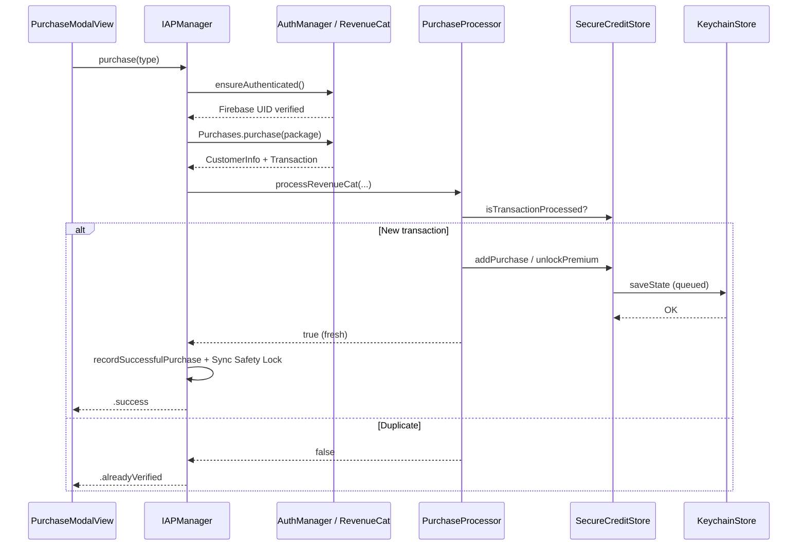

# In-App Purchase System

This document explains how Yondo's in-app purchase (IAP) system works end to end: product catalog, payment providers, local persistence, purchase/restore flows, and how IAP integrates with Firebase sync.

For the transaction ingestion pipeline (idempotency, actors, Keychain persistence, rollback), see [iap-transaction-processing.md](iap-transaction-processing.md). For paywall UI details, see [ui-ux-design.md](ui-ux-design.md#104-paywall-purchasemodalview) and [architecture.md](architecture.md#13-economy-credits--iap). For credit consumption and server reconciliation, see [local-economy-and-sync-healing.md](local-economy-and-sync-healing.md). For how this stack evolved from StoreKit-only processing to RevenueCat + Firebase authority while keeping the local wallet, see [iap-to-local-economy-evolution.md](iap-to-local-economy-evolution.md).

---

## Overview

Yondo sells two kinds of digital goods:

| Type | Products | Local effect |
|------|----------|--------------|
| **Consumable** | 3 / 10 / 25 image credit packs | Adds credits to the local wallet |
| **Non-consumable** | Premium destinations unlock | Sets `premiumDestinationsUnlocked = true` |

The system is built around three principles:

1. **Provider abstraction** — The same UI and persistence layer work with either StoreKit 2 or RevenueCat. Production uses RevenueCat (`IAPManager.serviceType = .revenueCat`).
2. **Local-first wallet** — Purchases are applied immediately to `SecureCreditStore` (Keychain-backed). The UI never waits for Firestore webhooks to show new credits.
3. **Idempotent processing** — Every Apple/RevenueCat transaction ID is recorded once. Duplicate deliveries are finished with the store but do not grant goods again.

---

## Architectural Topology

```text
┌─────────────────────────────────────────────────────────────┐
│ Client UI (PurchaseModalView, SceneBuilder, SceneView)      │
│ • Observes IAPManager.loadingState & SecureCreditStore      │
└──────────────────────────┬──────────────────────────────────┘
                           ▼ Purchase / Restore
┌─────────────────────────────────────────────────────────────┐
│ IAPManager (@MainActor, ObservableObject)                   │
│ • Provider routing (RevenueCat / StoreKit)                  │
│ • Product fetch cache (30 min)                              │
│ • Ghost-transaction recovery                                │
│ • Sync Safety Lock (3s post-purchase)                       │
└──────────────────────────┬──────────────────────────────────┘
                           ▼ Raw transaction / CustomerInfo
┌─────────────────────────────────────────────────────────────┐
│ PurchaseProcessor (Actor)                                   │
│ • Idempotency gate (processedTransactionIDs)                │
│ • Refund rejection                                          │
│ • Batch restore support                                     │
└──────────────────────────┬──────────────────────────────────┘
                           ▼ Validated credit / unlock
┌─────────────────────────────────────────────────────────────┐
│ SecureCreditStore (@MainActor, @Observable)                 │
│ • Per-user Keychain blob                                    │
│ • Relative rollback on persistence failure                  │
└──────────────────────────┬──────────────────────────────────┘
                           ▼ Serialized I/O
┌─────────────────────────────────────────────────────────────┐
│ KeychainStore (Actor)                                       │
└─────────────────────────────────────────────────────────────┘
```

**Upstream integrations:**

- **RevenueCat** — Configured in `AppDelegate`, delegate wired to `IAPManager`. Offerings fetched from the `main_store` offering (fallback: `current`).
- **Firebase Auth** — Purchases require a unified Firebase UID via `ensureAuthenticated()` before money changes hands.
- **Firebase Sync** — `EconomyEvaluator` and `verifyPremiumWithServer()` reconcile server snapshots with local wallet state.

---

## Product Catalog

Products are defined in `PurchaseType` (`Yondo/Models/Purchase.swift`):

| PurchaseType | Product ID | Credits | Consumable |
|--------------|------------|---------|------------|
| `imagePack3` | `com.andreimarincas.yondo.images.3` | 3 | Yes |
| `imagePack10` | `com.andreimarincas.yondo.images.10` | 10 | Yes |
| `imagePack25` | `com.andreimarincas.yondo.images.25` | 25 | Yes |
| `premiumDestinations` | `com.andreimarincas.yondo.premiumDestinations` | — | No |

Premium maps to RevenueCat entitlement `premium_destinations`.

The `YondoProduct` protocol abstracts StoreKit `Product`, RevenueCat `Package`, and `StoreProduct` so `IAPManager.products` is always `[PurchaseType: any YondoProduct]`.

---

## Bootstrap & Identity

### App launch

1. `AppDelegate` configures Firebase and RevenueCat, sets `Purchases.shared.delegate = IAPManager.shared`.
2. `IAPManager` starts a background `Transaction.updates` listener (StoreKit path) at init.
3. During auth handshake, `AuthManager` logs the Firebase UID into RevenueCat and calls `iapManager.start(userId:)`.

### `IAPManager.start(userId:)`

```text
1. Cancel any in-flight sync safety timer (user switch mid-purchase)
2. Normalize nil → "anonymous"
3. If userId changed → creditStore.updateIdentity(userId:)
   Else → creditStore.waitForInitialization()
4. Background task (fire-and-forget):
   - If cache stale (>30 min) or empty → fetchProducts() + refreshEntitlements()
   - Else skip network hydration
```

### Per-user Keychain isolation

`SecureCreditStore` stores state under key `yondo.state.blob.v2.{userId}`. On identity change:

1. Await pending saves to avoid corruption.
2. Wipe in-memory UI state immediately (prevents User A's balance flashing for User B).
3. Load the new user's blob from Keychain.

Persisted state (`CreditStoreState`):

```swift
struct CreditStoreState: Codable {
    var credits: Int
    var processedTransactionIDs: Set<String>
    var premiumDestinationsUnlocked: Bool
    var hasPurchasedCredits: Bool
    var hasGrantedFreeCredits: Bool
}
```

---

## Purchase Flow

### High-level sequence (RevenueCat — production path)

```text
User taps product (PurchaseModalView)
  → Pre-flight: device online?
  → IAPManager.purchase(type)
      → ensureAuthenticated()  // Firebase UID ↔ RevenueCat appUserID
      → Purchases.shared.purchase(package:)
      → PurchaseProcessor.processRevenueCat(customerInfo, transaction, type)
          → Idempotency check
          → store.addPurchase() or store.unlockPremiumDestinations()
      → On success: recordSuccessfulPurchase() + startSyncSafetyTimer()
  → UI: .success → celebration + dismiss
     or .alreadyVerified → silent dismiss
```

### StoreKit path (legacy, still implemented)

Same entry point via `purchaseViaStoreKit()`:

1. `product.purchase()` shows Apple's payment sheet.
2. Verified transaction handed to `PurchaseProcessor.process(transaction:)`.
3. `Transaction.updates` listener also processes background deliveries.

### Purchase lock

While `purchasingProductID != nil`:

- Product fetch is blocked (prevents UI flicker mid-transaction).
- Only one purchase can run at a time.

### Purchase results

```swift
enum PurchaseResult {
    case success          // New credits or first-time unlock → show celebration
    case alreadyVerified  // Duplicate transaction → silent dismiss
}
```

Non-consumables return `.success` even on idempotent re-processing (user already owns premium).

### Authentication gate

`IAPManager+Auth.ensureAuthenticated()`:

1. Resolves Firebase UID via `AuthManager.shared.ensureGlobalAuthentication()`.
2. Defensively re-logs into RevenueCat if `Purchases.shared.appUserID != firebaseUID`.

Purchases fail with `StoreError.missingUser` if auth cannot be established.

---

## PurchaseProcessor — The Idempotency Firewall

> **Deep dive:** [iap-transaction-processing.md](iap-transaction-processing.md) covers the full pipeline (entry points, concurrency, rollback, finish rules, ghost recovery) in detail. The summary below remains for orientation within this document.

All transactions — whether from a live purchase, restore, delegate callback, or background listener — pass through `PurchaseProcessor`.

### Single transaction (`process(transaction:)`)

1. **Idempotency** — If `transaction.id` is in `processedTransactionIDs`, finish with Apple and return `false`.
2. **Refund check** — Skip and throw if `revocationDate != nil`.
3. **Product validation** — Map `productID` → `PurchaseType`; unknown IDs throw.
4. **Persistence** — `addPurchase(credits:transactionID:)` or `unlockPremiumDestinations(transactionID:)`.
5. **Finish** — `await transaction.finish()` only after Keychain write succeeds. On persistence failure, the transaction stays unfinished so StoreKit retries on next launch.

### RevenueCat path (`processRevenueCat`)

1. Resolve a stable transaction ID from the StoreKit transaction, RC history, or (non-consumables only) a synthetic ID: `rc_synth_{appUserId}_{productID}_{requestDate}`.
2. Consumables without a transaction ID abort safely (cannot grant without proof).
3. For premium, verify the entitlement is active in `CustomerInfo` before unlocking.

### Batch restore (`processBatch`)

Collects all unprocessed entitlements, applies one atomic `store.applyBatch()`, then finishes all transactions in parallel.

---

## SecureCreditStore — Local Wallet

### Write pattern: optimistic memory + relative rollback

Every mutation updates in-memory state first, then persists:

```swift
self.credits += amount
do {
    try await saveState()
} catch {
    self.credits -= amount  // Only undo THIS call's delta
    throw error
}
```

This keeps the UI responsive and prevents one failed write from clobbering concurrent updates.

### Save queue

`saveState()` chains writes through `pendingSaveTask` so concurrent purchases serialize safely. State is captured just-in-time at execution, not at queue time.

### Credit consumption

`IAPManager.consumeCredit()` → `creditStore.consumeCredit()`:

- Decrements credits in memory.
- Persists to Keychain.
- Rolls back on failure.
- Throws `StoreError.insufficientFunds` when balance is zero.

Used by `SceneGenerationService` at the "point of no return" before AI generation starts.

### Server sync entry point

`syncFromServer(credits:premiumUnlocked:...)` applies Firestore snapshot fields with the same relative-rollback pattern. Called by `EconomyEvaluator` (credits) and identity evaluators (premium).

---

## Ghost Transaction Recovery

Network drops right after Apple charges are a common IAP failure mode. Both providers implement a post-error scrub:

### StoreKit

If `product.purchase()` throws:

1. Sleep 1.5s for the background listener.
2. Scan `Transaction.currentEntitlements` for a verified transaction matching the product ID within the last 30 seconds.
3. If found, process it and return `.success`.

### RevenueCat

If `Purchases.shared.purchase()` throws:

1. Sleep 1.5s.
2. Fetch fresh `CustomerInfo`.
3. Check active entitlement (premium) or recent non-subscription (consumable, <60s).
4. Re-run `processRevenueCat` with `transaction: nil` (recovery mode).

---

## Product Fetch & Caching

### Cache policy

- **Refresh interval:** 30 minutes (`refreshInterval = 1800`).
- **Retry backoff:** 5 minutes after a background fetch failure when stale cache exists.
- **Regional empty:** Retry at most once per 24 hours.

### Fetch lock

`fetchProducts()` is skipped when `loadingState` is neither `.idle` nor `.loaded`, or when a purchase is in progress.

---

## Network Monitoring & Resilience

The store does not rely purely on failed API calls to detect connectivity loss; it actively monitors the hardware socket via `NetworkMonitor` and reacts in `IAPManager+Network.swift`.

### AsyncStream monitor

`NetworkMonitor` wraps Apple's `NWPathMonitor` in an `AsyncStream<Bool>` using `.bufferingNewest(1)`. `IAPManager` iterates connection state changes without callback chains.

### Offline UX degradation

When `IAPManager+Network` detects a drop (`handleNetworkLoss`), it gracefully downgrades active states:

| State | Behavior |
|-------|----------|
| Offline + no cache | Show `StoreError.networkIssue` (or transition from `.emptyRegion` → `.networkIssue` for correct "No WiFi" iconography) |
| Offline + cached products | Keep showing stale prices; suppress the error so the UI stays populated — purchase/restore block only at tap time |

### Auto-recovery

When connectivity returns (`handleNetworkRecovery`), the manager evaluates `loadingState`. If the UI is blocked by `.networkIssue` or `.emptyRegion`, it automatically calls `retryFetch()` to clear the error and hydrate the store.

---

## Restore Purchases

```text
restorePurchases()
  → ensureAuthenticated() (+ minimum 1.5s UX delay)
  → SDK restore (RC: restorePurchases / SK: AppStore.sync + batch entitlements)
  → If SDK finds premium → processor → return true (celebration)
  → Else → verifyPremiumWithServer(allowDowngrade: false)
  → If server upgrades local state → return true
  → Else → return false ("already up to date")
```

**Important:** Consumable credits are not restored via StoreKit/RC restore. They live in the local Keychain and Firestore economy sync. Restore primarily recovers the premium non-consumable.

---

## Entitlement Refresh

`refreshEntitlements(force:)` runs on a 5-minute throttle:

1. Poll SDK (RevenueCat `customerInfo` or StoreKit batch).
2. Sleep 1.5s for RC REST API lag.
3. Call `syncService.verifyPremiumWithServer()` (Firebase Cloud Function `checkSubscriptionStatus`).
4. Record purchase timestamp only on false → true premium transition.

The "healer" path catches cases where the SDK missed premium but the server confirms it.

---

## Sync Integration

IAP and the broader economy sync are coordinated to prevent stale webhooks from undoing fresh purchases.

### Sync Safety Lock (3 seconds)

After a successful purchase or restore:

- `isSyncSafetyLockActive = true` for 3 seconds.
- Blocks aggressive Firestore flushes that might overwrite new local credits.
- On release, triggers `syncService.flushBuffers()`.

### 90-second purchase window

`wasPurchaseMadeRecently` is true for 90 seconds after purchase. `SyncShieldManager` uses this (plus `isEconomyUIActive`) to reject "stale dips" — Firestore snapshots reporting fewer credits than local during webhook delay.

See [local-economy-and-sync-healing.md](local-economy-and-sync-healing.md) for the full projection and anti-dip logic.

### RevenueCat delegate

`IAPManager` implements `PurchasesDelegate`:

- Chronological guard ignores stale `CustomerInfo` payloads.
- Active premium entitlements sync to Keychain immediately.
- Recent transactions/entitlements trigger `recordSuccessfulPurchase()`.

---

## UI Layer

`PurchaseModalView` is provider-agnostic. Key behaviors in `PurchaseModalView+Logic.swift`:

| Event | UI response |
|-------|-------------|
| `.success` | Haptic, 1.5s celebration animation, dismiss |
| `.alreadyVerified` | 0.6s pause, dismiss (no celebration) |
| `.cancelled` | Silent (user dismissed sheet) |
| `.pending` | Stop spinner (Ask to Buy) |
| Offline | Alert before attempting purchase/restore |

Entry points call `IAPManager.shared.prepareForModalPresentation()` before showing the sheet to reset loading state when appropriate.

Full UI architecture: [ui-ux-design.md §10.4](ui-ux-design.md#104-paywall-purchasemodalview).

---

## Error Types

### `PurchaseError`

| Case | Meaning |
|------|---------|
| `productNotFound` | Product not in local cache |
| `verificationFailed` | StoreKit JWS verification failed |
| `cancelled` | User dismissed payment sheet |
| `pending` | Ask to Buy / deferred payment |
| `invalidState` | Concurrent purchase attempt |
| `unknown` | Unhandled StoreKit result |

### `StoreError`

| Case | Meaning |
|------|---------|
| `emptyRegion` | Apple/RC returned no products for this storefront |
| `networkIssue` | Connectivity failure |
| `insufficientFunds` | Zero credits on consume |
| `busy` | Store mid-save |
| `persistenceFailure` | Keychain write failed |
| `missingUser` | Auth/RC identity not established |

### `ProcessError`

| Case | Meaning |
|------|---------|
| `previouslyRefunded` | Transaction was revoked/refunded |
| `unknownProduct` | Unrecognized product ID from Apple |

---

## Key Source Files

| File | Role |
|------|------|
| `Yondo/Services/IAP/IAPManager.swift` | Central coordinator, lifecycle, purchase/restore entry points |
| `Yondo/Services/IAP/IAPManager+RevenueCat.swift` | RC product fetch, purchase, restore, delegate |
| `Yondo/Services/IAP/IAPManager+StoreKit.swift` | SK2 product fetch, purchase, transaction listener |
| `Yondo/Services/IAP/IAPManager+Auth.swift` | Firebase ↔ RevenueCat identity gate |
| `Yondo/Services/IAP/IAPManager+Network.swift` | Online/offline recovery |
| `Yondo/Services/IAP/PurchaseProcessor.swift` | Idempotent transaction processing |
| `Yondo/Services/IAP/PurchaseProcessor+RevenueCat.swift` | RC-specific ID resolution and persistence |
| `Yondo/Services/IAP/SecureCreditStore.swift` | Keychain-backed wallet |
| `Yondo/Models/Purchase.swift` | Product catalog |
| `Yondo/Views/Purchase/PurchaseModalView+Logic.swift` | Paywall purchase/restore handlers |
| `Yondo/AppEntry/AppDelegate.swift` | RevenueCat SDK bootstrap |

---

## End-to-End Purchase Diagram



---

## Related Documentation

| Topic | Document |
|-------|----------|
| Transaction ingestion & idempotency | [iap-transaction-processing.md](iap-transaction-processing.md) |
| Local wallet, sync healing, anti-dip shield | [local-economy-and-sync-healing.md](local-economy-and-sync-healing.md) |
| StoreKit → RevenueCat evolution | [iap-to-local-economy-evolution.md](iap-to-local-economy-evolution.md) |
| Paywall UI (`PurchaseModalView`) | [ui-ux-design.md](ui-ux-design.md#104-paywall-purchasemodalview) |
| Firebase sync & Firestore wallet | [firebase-architecture.md](firebase-architecture.md) |
| Boot-time wallet load | [app-launch.md](app-launch.md) |
| System overview | [architecture.md](architecture.md#13-economy-credits--iap) |
