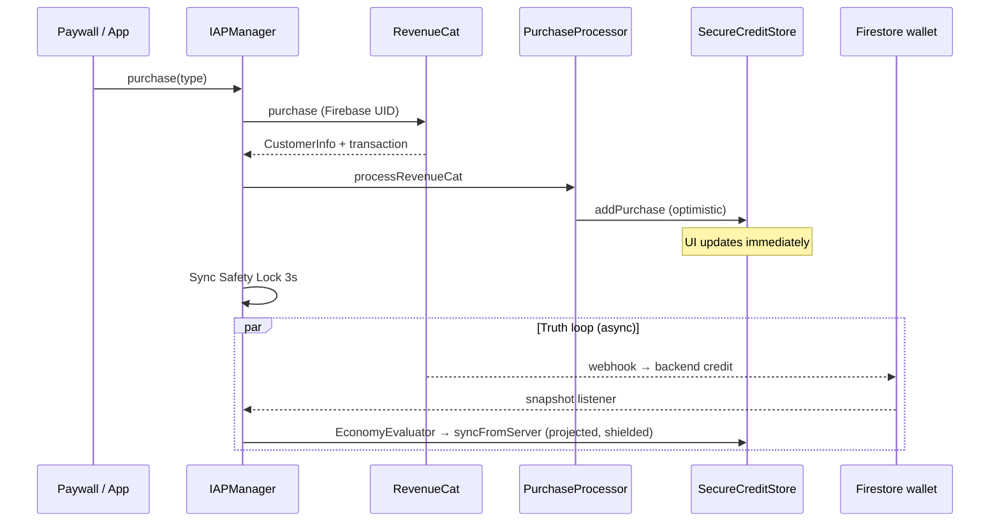

# IAP Local System → Optimistic Local-First Economy

This document explains how Yondo’s in-app purchase stack evolved: from a **StoreKit-centric** pipeline whose job was to process Apple transactions into a local wallet, to a **RevenueCat + Firebase** stack where the server is the long-term authority for credits and premium—while the **same local IAP layer** became the foundation of an optimistic, local-first economy.

For current behavior, see [iap-architecture.md](iap-architecture.md) and [local-economy-and-sync-healing.md](local-economy-and-sync-healing.md).

---

## Summary

| Era | Payment / entitlement source | Credit & premium authority | Client’s job |
|-----|------------------------------|----------------------------|--------------|
| **Original** | StoreKit 2 | Keychain (`SecureCreditStore`) | Process every Apple transaction; wallet lived entirely on device |
| **Current** | RevenueCat (production) | Firestore wallet + Cloud Functions; RC webhooks | Grant optimistically on purchase; reconcile via sync; shield races |

What did **not** get replaced: `SecureCreditStore`, `PurchaseProcessor`, idempotent transaction IDs, optimistic memory + Keychain persistence, and the `CreditProvider` boundary used by generation. Those pieces were designed for IAP and now underpin the whole credit economy.

---

## 1. Original Design: StoreKit as Processor and Wallet

The first version treated the IAP module as an **end-to-end transaction processor**:

```text
Apple (StoreKit 2)
    → Transaction.updates / product.purchase()
    → PurchaseProcessor (idempotency, refunds, product mapping)
    → SecureCreditStore (Keychain)
    → UI
```

### Responsibilities

1. **Listen and finish** — `IAPManager` still starts `Transaction.updates` at init. Verified transactions flow through `PurchaseProcessor`, which only calls `transaction.finish()` after a successful Keychain write so StoreKit can retry on failure.

2. **Idempotency** — `processedTransactionIDs` in `CreditStoreState` ensures duplicate deliveries (listener + manual purchase, restores, ghost recovery) never double-grant.

3. **Local wallet** — Credits and `premiumDestinationsUnlocked` lived in a per-user Keychain blob (`yondo.state.blob.v2.{userId}`). There was no separate “economy sync” document; **the Keychain was the system of record** for consumable balance.

4. **Immediate UI** — `addPurchase` / `unlockPremiumDestinations` updated memory first, then persisted with **relative rollback** on failure (undo only the delta from that call).

That design matched a **device-local economy**: buy credits on this phone, spend them on this phone, with Apple as the only external verifier.

The legacy path remains available via `IAPServiceType.storeKit` (`IAPTypes.swift`: “Local StoreKit 2 + Local Keychain”).

---

## 2. Why the Model Changed

Two product constraints outgrew a purely local wallet:

### A. Server-side credit enforcement

AI generation is billed on the backend (Cloud Function deducts against the user’s Firestore wallet). A Keychain-only balance could disagree with what the API allows—exploits, reinstalls, multi-device use, or failed webhooks.

**Credits needed a server ledger** while the UI still had to feel instant.

### B. RevenueCat + Firebase as operational authority

- **RevenueCat** — Unified purchase flow, sandbox tooling, `CustomerInfo`, webhooks into backend jobs, and stable identity via `appUserID` tied to Firebase UID.
- **Firebase** — `users/{uid}/wallet/status` holds authoritative `credits` (and related flags); RevenueCat webhooks (and backend logic) update that document; Firestore listeners push snapshots back to the client.

Production is pinned to the modern path:

```swift
// IAPManager.swift
let serviceType: IAPServiceType = .revenueCat
```

```swift
// IAPTypes.swift
case storeKit   // Legacy: Local StoreKit 2 + Local Keychain
case revenueCat // Modern: RevenueCat + Firebase + Local Keychain Cache
```

Non-consumable **premium** is similarly triangulated: RevenueCat entitlement `premium_destinations`, Firestore identity fields, and `verifyPremiumWithServer()` (`checkSubscriptionStatus`) when the SDK and server disagree.

---

## 3. What Stayed: The Local IAP Foundation

The migration **swapped payment and reconciliation providers**, not the optimistic wallet pattern.

### SecureCreditStore (unchanged role, expanded callers)

Still the **UX source of truth** for balance and premium flags:

| Operation | Who calls it | Purpose |
|-----------|--------------|---------|
| `addPurchase` / `consumeCredit` | `PurchaseProcessor`, generation | Optimistic grant / spend |
| `syncFromServer` | `EconomyEvaluator`, `IdentityEvaluator` | Apply Firestore snapshots |
| `processedTransactionIDs` | `PurchaseProcessor` | Idempotency across SK and RC |

Purchases still hit the Keychain **before** the user waits on webhooks. Generation still calls `CreditProvider.consumeCredit()` at the point of no return—implemented by `IAPManager` → `SecureCreditStore`, with no Firestore round-trip.

### PurchaseProcessor (still the idempotency firewall)

All paths converge here:

- StoreKit `Transaction`
- RevenueCat `CustomerInfo` + optional StoreKit transaction (`processRevenueCat`)
- Delegate callbacks, restore batches, ghost recovery

Consumables without a stable transaction ID are **not** granted on the RC path (proof required). Premium requires an active entitlement in `CustomerInfo` before unlock.

### Provider abstraction (payment swapped, wallet stable)

`YondoProduct` hides StoreKit `Product`, RevenueCat `Package`, and `StoreProduct`. The paywall (`PurchaseModalView`) required **no structural changes** during the RC migration—only the provider behind `IAPManager.purchase(type)` changed.

### CreditProvider (economy decoupled from payment SDK)

Generation and sync healing depend on:

```swift
protocol CreditProvider: AnyObject {
    var creditStore: SecureCreditStore { get }
    func consumeCredit() async throws
    func refreshEntitlements(force: Bool) async -> Bool
    var wasPurchaseMadeRecently: Bool { get }
}
```

`IAPManager` conforms; ViewModels and `SceneGenerationService` never import RevenueCat or StoreKit. That boundary is what let the **economy layer** grow around the IAP store instead of replacing it.

---

## 4. New Authority Model (Dual Loop)

Today two loops run in parallel:

```text
ACTION LOOP (fast, local)                    TRUTH LOOP (slow, server)
─────────────────────────                    ───────────────────────────
Purchase / Generate                          RC webhook → backend → Firestore
     │                                              │
     ▼                                              ▼
IAPManager → PurchaseProcessor                 wallet/status snapshot
     │                                              │
     ▼                                              ▼
SecureCreditStore (Keychain)  ◄── reconcile ── EconomyEvaluator
                                      + SyncShieldManager
```

| Concern | Authority | Client behavior |
|---------|-----------|-----------------|
| **Consumable credits (long-term)** | Firestore wallet (after RC webhook / backend) | Optimistic +`addPurchase` on purchase; `EconomyEvaluator` projects and applies server balance |
| **Consumable credits (immediate UX)** | `SecureCreditStore` | Show new balance instantly; anti-dip shield if stale snapshot arrives |
| **Spend at generation** | Local `consumeCredit` + server deduct on API | Local decrement first; server may lag; projection subtracts active generation locks |
| **Premium non-consumable** | RC entitlement + Firestore identity + `checkSubscriptionStatus` | Local unlock on verified purchase; restore/healing refresh SDK then server |
| **Restore (consumables)** | Not via StoreKit/RC restore | Credits live in Keychain + Firestore sync, not Apple “restore purchases” |

So: **Firebase (and backend jobs triggered by RevenueCat) own the ledger**; **the IAP local stack owns responsiveness and idempotent grant/spend on device**.

---

## 5. Sync Layer: Built on IAP Timing, Not Replacing It

Features added **after** the RC/Firebase move directly address races between local IAP grants and delayed server snapshots. They assume local-first purchases.

### Sync Safety Lock (3 seconds)

After a successful purchase or restore, `IAPManager` blocks aggressive Firestore flushes that could overwrite fresh local credits, then calls `flushBuffers()`.

### Anti-Dip Shield (~90 seconds)

`SyncShieldManager` uses `lastPurchaseDate` and `IAPManager.isEconomyUIActive`. If a snapshot would **lower** projected credits during that window, `EconomyEvaluator` buffers (passive) or rejects (forced healing)—the classic “bought 10, spent 1, webhook still says 10” bug.

### Projected credits

While generations are in flight, `projectedCredits = max(serverCredits - activeLocks, 0)` prevents the UI from jumping up when Firestore has not yet recorded the local deduct.

### Sync healing (3-4-1)

When the API returns `insufficientCredits` but local state disagrees, healing forces a server read (`forceRefreshFromCloud`) or entitlement refresh—without refunding the local credit on that error (avoids ghost-credit loops).

These mechanisms are documented in [local-economy-and-sync-healing.md](local-economy-and-sync-healing.md). They are **economy sync** concerns, but their triggers and windows are defined in terms of **IAP purchase timing** (`wasPurchaseMadeRecently`, sync safety lock).

---

## 6. End-to-End: Purchase Today



**Spend today** skips RevenueCat entirely: `SceneGenerationService` → `consumeCredit()` → later server deduct and snapshot reconciliation.

---

## 7. Mental Model for Contributors

1. **`Yondo/Services/IAP/` is not “just payments”** — It is the **local economy engine**: wallet, idempotency, purchase optimism, and the interface generation uses to spend.

2. **RevenueCat is the checkout lane**; **Firestore is the bank ledger**; **Keychain is the wallet in your pocket** that updates immediately and reconciles when the bank statement arrives.

3. **Do not wait on webhooks for UX** — Grant and spend locally; use evaluators and shields so server lag does not regress the user’s balance visually.

4. **Keep StoreKit paths correct** — `Transaction.updates` and `purchaseViaStoreKit()` remain for legacy/testing and as a fallback mental model; production uses `.revenueCat`.

5. **When adding economy features**, prefer extending `CreditProvider` / `SecureCreditStore` / evaluators rather than branching paywall or generation on payment SDK details.

---

## 8. Key Source Files

| Layer | Files |
|-------|--------|
| Service type & results | `Yondo/Services/IAP/IAPTypes.swift` |
| Coordinator | `Yondo/Services/IAP/IAPManager.swift`, `+RevenueCat.swift`, `+StoreKit.swift`, `+Auth.swift` |
| Idempotency | `Yondo/Services/IAP/PurchaseProcessor.swift`, `+RevenueCat.swift` |
| Local wallet | `Yondo/Services/IAP/SecureCreditStore.swift`, `KeychainStore` |
| Generation boundary | `Yondo/Services/IAP/CreditProvider.swift` |
| Server reconciliation | `Yondo/Services/Sync/EconomyEvaluator.swift`, `SyncShieldManager.swift`, `FirebaseSyncService.swift` |
| Bootstrap | `Yondo/AppEntry/AppDelegate.swift` (RevenueCat configure + delegate) |

---

## Related Documentation

| Topic | Document |
|-------|----------|
| Current IAP flows | [iap-architecture.md](iap-architecture.md) |
| Optimism, projection, healing | [local-economy-and-sync-healing.md](local-economy-and-sync-healing.md) |
| Economy topology | [architecture.md](architecture.md#13-economy-credits--iap), [local-economy-and-sync-healing.md](local-economy-and-sync-healing.md) |
| Paywall decoupling | [ui-ux-design.md](ui-ux-design.md#104-paywall-purchasemodalview) |
| Firestore listeners & boot sync | [firebase-architecture.md](firebase-architecture.md), [app-launch.md](app-launch.md) |
| App-wide overview | [architecture.md](architecture.md) |
