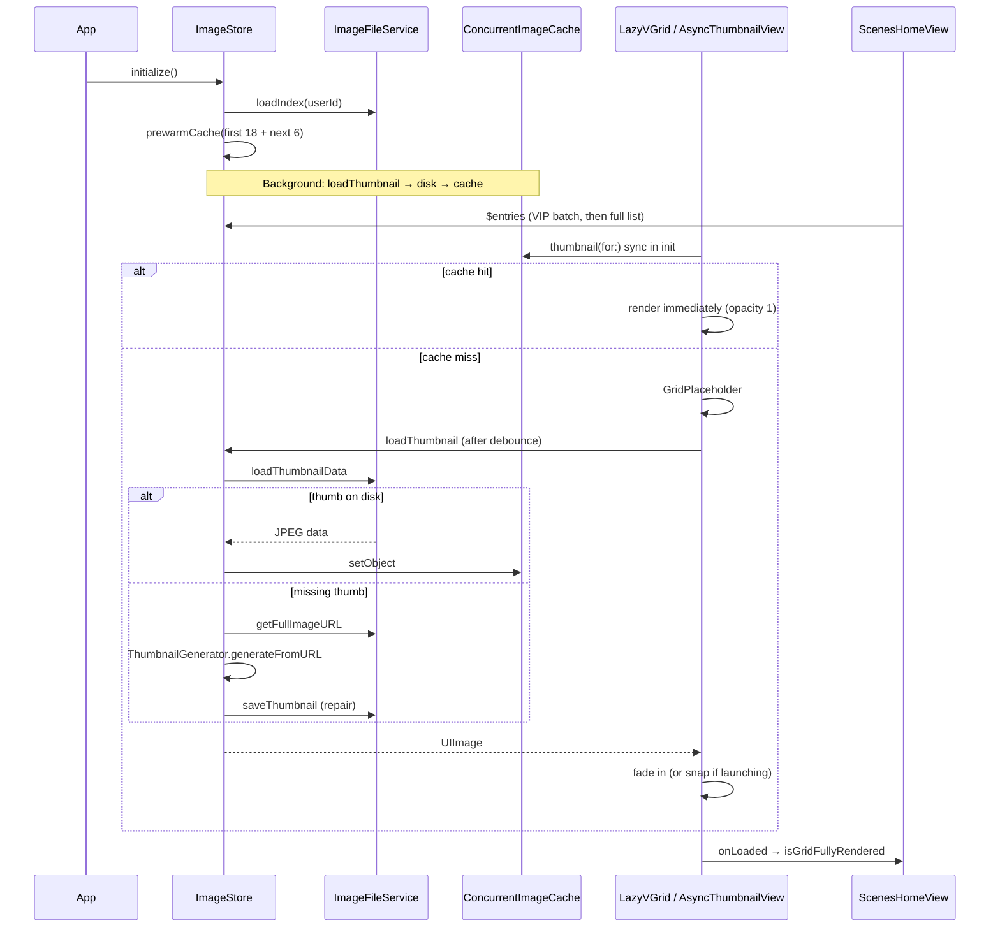

# Image & Gallery Thumbnail Pipeline

How Yondo stores, generates, caches, and displays AI-generated images — from disk layout and ImageIO downsampling through the home gallery grid (`ScenesHomeView`). Handling hundreds of high-resolution images locally presents significant memory (OOM) and I/O (main-thread hang) challenges; the pipeline addresses these with strict actor isolation, hardware-accelerated downsampling, an unfair-locked in-memory cache, and a fast-path / slow-path UI loading model.

<p align="center">
  
  
  
</p>

---

## Overview

| Layer | Role |
|-------|------|
| **Disk** | Full JPEGs in Documents; pre-generated thumbnail JPEGs in Caches |
| **`ImageFileService`** | Swift `actor` — serialized disk I/O, paths, index, migration |
| **`ConcurrentImageCache`** | Thread-safe `NSCache` with synchronous reads from any thread |
| **`ThumbnailGenerator`** | ImageIO downsampling without loading full bitmaps into RAM |
| **`ImageStore`** | Index, save/load orchestration, prewarm on launch, identity migration |
| **`AsyncThumbnailView`** | Per-cell SwiftUI loader (cache → disk → regenerate) |
| **`ScenesHomeView`** | Launch gating, skeleton swap, grid-ready signal |

The goal is instant paint when RAM is warm, no main-thread blocking on cache hits, and cancellable async work when cells scroll off-screen.

---

## 1. Architectural Topology

The system is decoupled across four distinct layers so UI, memory cache, and disk I/O never block one another.

```
┌──────────────────────────────────────────────────────────┐
│ SwiftUI Views (AsyncThumbnailView, GridItemContainer)    │
│ • Synchronous cache reads (instant render)               │
│ • Asynchronous disk/generation requests                  │
└──────────────────────────┬───────────────────────────────┘
                           ▼
┌──────────────────────────────────────────────────────────┐
│ ImageStore (@MainActor / ObservableObject)               │
│ • Implements ImageStoring protocol                       │
│ • Single source of truth for grid state (entries)      │
└────────┬──────────────────────────────────────┬──────────┘
         │                                      │
         ▼ (Synchronous/Lock)                   ▼ (Asynchronous)
┌──────────────────────────┐      ┌──────────────────────────┐
│ ConcurrentImageCache     │      │ ImageFileService (Actor) │
│ • OSAllocatedUnfairLock  │      │ • Serialized Disk I/O    │
│ • NSCache Backing        │      │ • Path/Identity Router   │
└──────────────────────────┘      └─────────────┬────────────┘
                                              │
                                              ▼ (Asynchronous)
                                ┌──────────────────────────┐
                                │ ThumbnailGenerator       │
                                │ • ImageIO Downsampling   │
                                └──────────────────────────┘
```

### Protocol-oriented design

The entire system sits behind the `ImageStoring` protocol. This abstracts disk reads, retries, and generation logic from callers (e.g. generation flows, tests). The protocol defines default implementations for complex behaviors like `saveWithRetry`, which automatically handles transient I/O failures (3 attempts, 500ms backoff) and respects Swift's `CancellationError`.

```swift
protocol ImageStoring: AnyObject {
    func save(image: UIImage, withId explicitID: UUID?) async throws -> GeneratedImage
    func loadFullImage(for entry: GeneratedImage) async -> UIImage?
    func loadThumbnail(for entry: GeneratedImage, allowGeneration: Bool, forceGeneration: Bool) async -> UIImage?
}
```

---

## 2. Storage layout

`ImageFileService` (Swift `actor`) owns all disk paths per user:

| Asset | Location |
|-------|----------|
| Full images | `Documents/GeneratedImages/{userId}/{uuid}.jpg` |
| Thumbnails | `Caches/GeneratedImageThumbnails/{userId}/{uuid}.jpg` |
| Index | `Application Support/Yondo/{userId}/generated_images.json` |

**User identity:** `ImageStore.activeUserId` defaults to Firebase UID or `"local"` for anonymous/offline users. On sign-in, `updateIdentity(newUserId:)` migrates files from `"local"` to the permanent UID (see [Identity migration](#identity-migration)).

**Index model:** Each entry is a `GeneratedImage` — `id: UUID`, `filename: String`, `createdAt: Date`. The index is kept sorted newest-first (`createdAt DESC`) in memory. Writes use atomic file protection (`.completeFileProtectionUntilFirstUserAuthentication`) and are excluded from iCloud backup.

**Thumbnails in Caches, full images in Documents:** The system can evict thumbnail JPEGs under memory pressure; the full image is always the source of truth. A missing thumb is regenerated from the master via ImageIO and written back.

### Save path

On `ImageStore.save(image:)`:

1. **Off main actor** — JPEG encode at 0.95 quality; 512×512 max-edge thumbnail via `ThumbnailGenerator.generate(from:size:)`; thumb JPEG at 0.7 quality.
2. **Disk** — `fileService.saveImage` + `saveThumbnail`.
3. **State** — Insert at index 0 (newest), prime `ConcurrentImageCache`, persist index, emit `didAddNewImage`.

### Index recovery

If `generated_images.json` is missing or corrupt, `rebuildIndexFromDisk` scans `Documents/GeneratedImages/{userId}/` for `.jpg` files, derives UUIDs from filenames, sorts by creation/modification date, and triggers a background orphan-thumbnail cleanup (removes thumbs with no matching full image).

Index saves are serialized via a chained `pendingIndexTask` so concurrent writes cannot corrupt the JSON file.

---

## 3. Core optimizations

### A. `OSAllocatedUnfairLock` cache bypass

Querying an `actor` for a cached image requires `await`, which forces the SwiftUI rendering loop to suspend and causes placeholder flash in fast-scrolling grids.

`ConcurrentImageCache` wraps `NSCache` in an `@unchecked Sendable` type protected by `OSAllocatedUnfairLock`:

```swift
nonisolated func object(forKey key: String) -> UIImage? {
    lock.withLock {
        cache.object(forKey: key as NSString)
    }
}
```

**Impact:** `ImageStore.thumbnail(for:)` is `nonisolated`. Views read RAM synchronously in the same run-loop frame, bypassing Swift Concurrency suspension entirely.

Cache limits (configured at init): **200 items**, **300 MB** total cost.

### B. Hardware-accelerated ImageIO downsampling

Loading a 4 MB, 1024×1024 image just to display a ~150 px grid cell triggers OOM when scrolling. `ThumbnailGenerator` uses ImageIO to sub-sample directly from disk or data streams:

```swift
let options: [CFString: Any] = [
    kCGImageSourceCreateThumbnailFromImageIfAbsent: true,
    kCGImageSourceCreateThumbnailWithTransform: true, // EXIF orientation
    kCGImageSourceThumbnailMaxPixelSize: maxPixelSize,
    kCGImageSourceShouldCacheImmediately: true
]
guard let source = CGImageSourceCreateWithURL(url as CFURL, nil),
      let cgImage = CGImageSourceCreateThumbnailAtIndex(source, 0, options) else { ... }
```

Three entry points:

- `generate(from:size:)` — new saves (UIImage → JPEG data → ImageIO thumb)
- `generateFromURL(_:maxPixelSize:)` — repair missing thumbs from full image on disk
- `generateFromDisk(data:maxPixelSize:)` — data-based path
- `generateSquare(from:maxPixelSize:)` — center-cropped square avatars (e.g. selfies)

The full-resolution bitmap never enters RAM during thumbnail generation.

### C. Tiered prewarm heuristics

After `loadInitialIndex()`, if entries exist, `prewarmCache(priorityCount:limit:)` runs (skipped in Low Power Mode):

| Phase | Items | Concurrency | Purpose |
|-------|-------|-------------|---------|
| **1 — UI gatekeepers** | First `priorityLoadingCount` (18) | Unlimited parallel | Fill cache before/at grid paint |
| **Yield** | — | 50 ms sleep | Let main thread process initial reveal |
| **2 — Scroll buffer** | Remaining up to `limit` (24 total) | Max 4 concurrent | Avoid I/O saturation / thermal throttling |

Each item calls `loadThumbnail(for:)` (memory → disk → regenerate). This runs in parallel with gallery UI mounting; many cells hit the fast path immediately.

---

## 4. ImageStore loading API

### Fast path — synchronous cache read

```swift
nonisolated func thumbnail(for entry: GeneratedImage) -> UIImage?
```

Returns immediately from `ConcurrentImageCache` or `nil` (view triggers async load).

### Slow path — `loadThumbnail(for:allowGeneration:forceGeneration:)`

Order of attempts:

1. **Memory** — `thumbnail(for:)`
2. **Disk** — `fileService.loadThumbnailData` → `UIImage(data:)` → `cache.setObject`
3. **Regenerate** — `ThumbnailGenerator.generateFromURL` on full image URL (max 512 px), cache + persist repaired thumb at 0.7 JPEG quality

`forceGeneration: true` skips cache/disk and always rebuilds from the full image (used by `upgradeThumbnailsIfNeeded`).

### Full image — `loadFullImage(for:)`

Used when the grid is in **2-column high-res mode**. Fetches raw JPEG via the actor, decodes on a detached task, returns `preparingForDisplay()` bitmap.

### Background thumbnail janitor

After the grid reveals, `upgradeThumbnailsIfNeeded()` iterates entries and checks thumb metadata via `CGImageSourceCopyPropertiesAtIndex`. If pixel width < 512, it regenerates with `forceGeneration: true` and yields 100 ms between each upgrade to keep UI at 120 fps.

### Identity migration

When a user transitions from anonymous (`"local"`) to authenticated, `ImageFileService.migrateDirectory(fromUserId:toUserId:)` moves images and thumbnails:

- **Scenario A:** Destination folder absent → zero-cost `moveItem`.
- **Scenario B:** Collision → merge files one-by-one (local wins on conflict), yielding between moves.
- Old index under `"local"` is deleted; `ImageStore` reloads from the unified folder.

During migration, `ImageStore.isMigrating` is published so the UI can block interactions if needed.

---

## 5. End-to-end gallery flow



---

## 6. Gallery UI stack

```
ScenesHomeView
  └── LazyVGrid (snapshottedImages)
        └── GridItemContainer
              └── AsyncThumbnailView
                    └── Image(uiImage:) + modifiers (square crop, hero opacity, etc.)
```

### Data into the grid

- `imageStore.entries` is the source of truth (sorted newest first).
- The grid binds to **`snapshottedImages`**, a copy updated via `updateSnapshottedImages` so hero transitions and launch staging do not fight live `@Published` churn.

**Cold launch staging:**

1. **VIP batch** — only `priorityLaunchIDs` (first `min(count, 18)` entries) go into `snapshottedImages` immediately.
2. **Deferred full list** — after 300 ms, remaining entries animate in; `isProcessingInitialBatch` prevents duplicate restarts.

**Normal updates** (not launching): full `entries` list syncs with a spring animation.

### Per-cell: `AsyncThumbnailView`

**Init:** If `imageStore.thumbnail(for: entry)` returns an image, state starts with that image and `opacity = 1` (no fade).

**`.task(id: entry.id)`** (cancels when cell is recycled or entry changes):

1. **Stagger** during `AppLaunchContext.isAppLaunching`: delay `(index / 3) * 5 ms` per row to avoid saturating the thread pool on first frame.
2. **`loadImage()`**
   - `updateFromCache()` — if hit and not `loadHighRes`, done.
   - Else `resetUI()` → placeholder.
   - Debounce 5–10 ms (scroll cancellation window).
   - Second cache check (prewarm may have finished).
   - `loadThumbnail` or `loadFullImage`.
3. **Placeholder UX:** `GridPlaceholder`; after 100 ms without result, `RefractionShimmerView`; 3.5 s timeout hides shimmer.
4. **Reveal:** `processResult` sets image; animation disabled during launch (`AppLaunchContext.isAppLaunching`), 250 ms ease-in otherwise.
5. **`onLoaded`:** Reports to parent once (`hasReportedReady` guard).

### Per-cell: `GridItemContainer`

- Wraps `AsyncThumbnailView` in a button; **`isReady`** gates taps until first image is available.
- Passes loaded `UIImage` to hero via `onSelect(currentImage)`.
- Opacity logic hides the source tile (0.01, not 0) during hero flight so geometry stays stable.
- **High-res mode:** When `currentColumnCount == 2` (≤4 total slots including "+" button), `loadHighRes: true` — shows cached thumb first, then upgrades via `loadFullImage`.

### Grid readiness (`handleDidLoad`)

`ScenesHomeView+Gallery` tracks `loadedImageIds`. When:

- `priorityLaunchIDs ⊆ loadedImageIds`, and
- `loadedImageIds.count >= priorityCount` (up to 18),

a 50 ms quiet window fires, then `isGridFullyRendered = true`. That removes the skeleton overlay (`showsGrid`) and reveals the real `LazyVGrid` (opacity crossfade). Safety fallback at **2.0 s** (`snapWindow` 0.5 s + `safetyFallbackTimeout` 1.5 s) forces reveal even if thumbs are slow.

After reveal (+ 0.5 s), `upgradeThumbnailsIfNeeded()` may run in the background.

### Launch UX: skeleton vs real grid

`ScenesHomeView` uses a **ZStack swap**:

| zIndex | Layer | Visible when |
|--------|--------|--------------|
| 0 | `scrollableContent` (real grid) | `showsGrid` → `isGridFullyRendered && has data` |
| 1 | `skeletonGridView` | `!showsGrid` |
| 3 | Hero overlay | `selectedEntry != nil` |

During launch, the real grid is laid out at **opacity 0** ("shadow warm-up") so `LazyVGrid` can load VIP cells while the skeleton shows. `AppLaunchContext.isAppLaunching` disables crossfade animation for an instant snap when the disk cache is hot (< 500 ms).

---

## 7. Design constraints

- **No `await` on cache read** — scrolling hundreds of cells would stutter if every appearance suspended.
- **ImageIO thumbs from URL** — regenerating a missing thumb never loads the full 1024² bitmap into memory.
- **Task cancellation** — debounced `.task` stops disk work when the user scrolls away.
- **VIP staging + stagger** — limits simultaneous decode/layout on cold start to reduce watchdog (`0x8BADF00D`) risk.
- **Thumbs in Caches, full images in Documents** — repair path can always rebuild thumbs from masters.
- **Actor-isolated disk I/O** — concurrent APFS writes are serialized through `ImageFileService`.
- **No `.drawingGroup()` on grid cells** — Metal flattening for dozens of cells simultaneously spikes CPU at launch.

---

## 8. Key files

| File | Responsibility |
|------|----------------|
| `Yondo/Services/Images/ImageStore.swift` | Index, cache, `loadThumbnail` / `loadFullImage`, prewarm, save/delete, identity |
| `Yondo/Services/Images/ImageFileService.swift` | Actor-isolated disk I/O, paths, index rebuild, migration, orphan cleanup |
| `Yondo/Services/Images/ConcurrentImageCache.swift` | Thread-safe `NSCache` |
| `Yondo/Services/Images/ThumbnailGenerator.swift` | ImageIO downsampling |
| `Yondo/Services/Images/ImageStoring.swift` | Protocol + `saveWithRetry` defaults |
| `Yondo/Models/GeneratedImage.swift` | Index entry model |
| `Yondo/Views/Gallery/AsyncThumbnailView.swift` | Async cell loader |
| `Yondo/Views/Gallery/GridItemContainer.swift` | Grid cell + hero wiring |
| `Yondo/Views/Gallery/ScenesHomeView.swift` | Launch orchestration, skeleton swap |
| `Yondo/Views/Gallery/ScenesHomeView+Gallery.swift` | `LazyVGrid`, readiness tracking |
| `Yondo/AppEntry/AppLaunchContext.swift` | Cold-start flags and timeouts |
| `Yondo/Utils/FullSizeImageProvider.swift` | Progressive full-res upgrade in hero/detail |

---

## 9. Related Documentation

Opening a tile uses the **same** `UIImage` already held by `GridItemContainer` (`currentImage` / `transitionImage`) for the hero transition. Full-screen detail can load higher resolution via `FullSizeImageProvider` / `InteractiveImageView` — separate from the grid thumb pipeline. See [gallery-hero-swiftui-uikit-bridge.md](gallery-hero-swiftui-uikit-bridge.md).

The same storage layer is also used by `LastSelfieStore` for camera/selfie thumbnails — see [camera-pipeline.md](camera-pipeline.md).

| Topic | Document |
|-------|----------|
| Cold-start grid reveal & VIP batch | [app-launch.md](app-launch.md) |
| SwiftData generation rows (in-progress tiles) | [persistence-swiftdata.md](persistence-swiftdata.md) |
| System overview | [architecture.md](architecture.md#14-persistence--media) |

---
