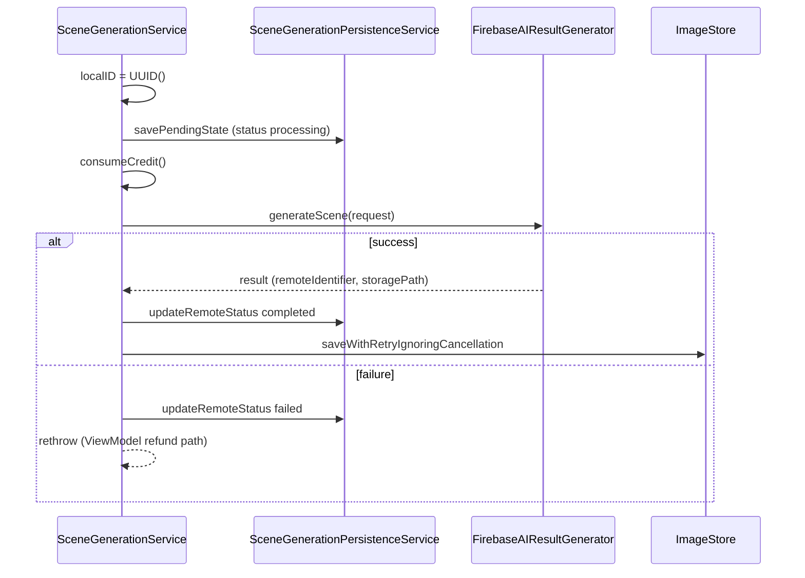
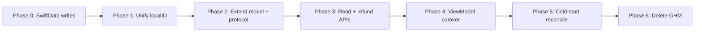

# Persistence: SwiftData & Generation Metadata

How Yondo persists **AI generation job metadata** with SwiftData. The store is becoming the **single durable source of truth** for generation attempts, replacing the in-memory `GenerationHistoryManager`.

**Today (transitional):** SwiftData receives writes from `SceneGenerationService`; refunds, delivery flags, and “credit committed” detection still go through `GenerationHistoryManager` in `SceneBuilderViewModel`. See [§10 — Ongoing refactoring](#10-ongoing-refactoring-generationhistorymanager--swiftdata).

Full images remain on disk via `ImageStore` (unchanged by this migration).

For the full generate pipeline (credits, Firebase, stages), see [generate-ai-scene-architecture.md](generate-ai-scene-architecture.md). For disk layout and thumbnails, see [image-pipeline.md](image-pipeline.md). For app boot and warm-up, see [app-launch.md](app-launch.md).

---

## Table of Contents

1. [Role in the App](#1-role-in-the-app)
2. [Three Persistence Layers](#2-three-persistence-layers)
3. [Data Model: `RemoteGeneration`](#3-data-model-remotegeneration)
4. [Service Layer](#4-service-layer)
5. [Write Path & Status Lifecycle](#5-write-path--status-lifecycle)
6. [Bootstrap & `ModelContainer`](#6-bootstrap--modelcontainer)
7. [Dependency Injection](#7-dependency-injection)
8. [Threading & Context Strategy](#8-threading--context-strategy)
9. [Identity: `localID` vs `GenerationToken`](#9-identity-localid-vs-generationtoken)
10. [Ongoing Refactoring: `GenerationHistoryManager` → SwiftData](#10-ongoing-refactoring-generationhistorymanager--swiftdata)
11. [Operations & Debugging](#11-operations--debugging)
12. [Source File Index](#12-source-file-index)
13. [Related Documentation](#13-related-documentation)

---

## 1. Role in the App

SwiftData answers one question: **“What happened to this generation attempt on the server side?”**

| Question | Answered by (today) | Target |
| --- | --- | --- |
| Show image in gallery | `ImageStore` | `ImageStore` (unchanged) |
| Refund if AI never delivered | `GenerationHistoryManager` | `RemoteGeneration` + persistence reads |
| Link attempt → Firebase / Storage | `RemoteGeneration` | Same |
| “Credit committed” for this attempt | `GenerationHistoryManager.addRecord` | Row exists with `status == processing` after deduct |
| Active generation toolbar / ghost tasks | `GenerationToken` in ViewModel | `localID` + optional `@Query` |

The design separates **UI flow** from **orchestration bookkeeping**:

- The user can dismiss the create flow while `SceneBuilderManager` keeps the ViewModel alive (`isActive`).
- SwiftData rows already survive process death; the refactor adds **reads** on launch and during refunds so behavior no longer depends on an in-memory singleton.

---

## 2. Persistence Layers (Today vs Target)

### Today — dual bookkeeping

```text
┌─────────────────────────────────────────────────────────────────┐
│ SceneGenerationService.generateScene                            │
└────────────┬────────────────────┬───────────────────────────────┘
             │                    │
             ▼                    ▼
┌────────────────────────┐  ┌─────────────────────────────────────┐
│ SceneGeneration        │  │ ImageStore                          │
│ Persistence (SwiftData)│  │ FileManager + index                 │
│ RemoteGeneration       │  │ Full image + thumbnail on disk        │
└────────────────────────┘  └─────────────────────────────────────┘
             │
             │  parallel (ViewModel — being removed)
             ▼
┌─────────────────────────────────────────────────────────────────┐
│ GenerationHistoryManager (@MainActor, in-memory)  ← DEPRECATING   │
│ GenerationToken → GenerationRecord (refund, delivered flags)      │
└─────────────────────────────────────────────────────────────────┘
```

### Target — SwiftData + disk only

```text
SceneBuilderViewModel / SceneGenerationService
        │
        ├── RemoteGeneration (SwiftData) — attempt lifecycle, refunds, server ids
        └── ImageStore — pixels + gallery index
```

- **`ImageStore`** — unchanged; still the gallery source of truth.
- **`GenerationHistoryManager`** — delete after cutover ([§10](#10-ongoing-refactoring-generationhistorymanager--swiftdata)).
- **`RemoteGeneration`** — owns commitment, delivery, refund, and reconciliation state.

---

## 3. Data Model: `RemoteGeneration`

**File:** `Yondo/Services/Persistence/RemoteGeneration.swift`

```swift
@Model
final class RemoteGeneration {
    @Attribute(.unique) var localID: UUID   // Orchestration key (not UI token)
    var userID: String                      // Firebase UID at start
    var firebaseID: String?                 // Callable / Firestore id when known
    var storagePath: String?                // Storage object path when known
    var status: String                      // "processing" | "completed" | "failed"
    var createdAt: Date
    var destinationName: String?            // Denormalized from SceneConfig
}
```

| Field | Purpose |
| --- | --- |
| `localID` | Unique per `generateScene` call; stable before any server id exists |
| `userID` | Owner at generation time (`AuthManager.ensureGlobalAuthentication`) |
| `status` | String enum by convention (not a Swift `enum` in the model) |
| `firebaseID`, `storagePath` | Filled on success from `SceneGenerationResult` |
| `destinationName` | Optional copy of `config.destination?.title` for debugging |

**Why `localID` is separate from `firebaseID`:** The client allocates `localID` immediately so the database row exists before the Cloud Function returns. The server id arrives later on success.

**Gallery bridge:** Comments in code note `localID` is intended to align with `GeneratedImage.id` over time; today the gallery is driven by `ImageStore` filenames/entries, not SwiftData queries.

---

## 4. Service Layer

### Protocol

**File:** `Yondo/Services/Persistence/SceneGenerationPersistence.swift`

```swift
@MainActor
protocol SceneGenerationPersistence {
    func savePendingState(localID: UUID, userID: String, config: SceneConfig)
    func updateRemoteStatus(
        localID: UUID,
        status: String,
        firebaseID: String?,
        storagePath: String?
    )
}
```

A protocol extension provides `updateRemoteStatus(localID:status:)` without remote fields.

### Implementation

`SceneGenerationPersistenceService`:

- Holds the shared `ModelContainer` from `YondoApp`.
- Uses `modelContainer.mainContext` for all reads/writes.
- **Insert:** `savePendingState` creates a `RemoteGeneration` and calls `try? modelContext.save()`.
- **Update:** `updateRemoteStatus` fetches by `#Predicate { $0.localID == localID }`, mutates the first match, then `try modelContext.save()`.
- **Errors:** Fetch/save failures are logged; they do not throw to callers—the generation pipeline continues or fails on its own terms.

The only production caller is `SceneGenerationService` (`SceneGenerationUseCase` implementation).

---

## 5. Write Path & Status Lifecycle



| Step | When | SwiftData action |
| --- | --- | --- |
| 1 | After auth, before credit deduct | `savePendingState` → insert, `status = "processing"` |
| 2 | After successful AI + download | `updateRemoteStatus(..., "completed", firebaseID, storagePath)` |
| 3 | Any thrown error in `generateScene` | `updateRemoteStatus(..., "failed")` |

**Ordering matters:** The row is written **before** `consumeCredit()`. If credit consumption fails, the row may still show `processing` until the catch block marks `failed`.

**Disk save is separate:** `ImageStore` runs after SwiftData is updated to `completed`. A disk failure does not revert the SwiftData row; the ViewModel can surface `saveFailedButDeliveredAlert` while the remote metadata stays `completed`.

---

## 6. Bootstrap & `ModelContainer`

**File:** `Yondo/AppEntry/YondoApp.swift`

| Setting | Value |
| --- | --- |
| Schema | `[RemoteGeneration.self]` |
| Storage | On-disk (`isStoredInMemoryOnly: false`) |
| Injection | `.modelContainer(sharedModelContainer)` on `WindowGroup` |
| Manager hook | `SceneBuilderManager.shared.setup(with:)` in `YondoApp.init()` |

Container creation runs in a `let sharedModelContainer` closure at app type load time (not deferred lazy). Failure to open the store calls `fatalError`—there is no in-app fallback store.

### Background warm-up

A `Task.detached` block opens a **secondary** `ModelContext` on the same container:

```swift
let warmupContext = ModelContext(container)
warmupContext.autosaveEnabled = false
_ = try warmupContext.fetch(FetchDescriptor<RemoteGeneration>(...))
```

Goals:

- Touch SQLite and validate schema off the main actor during launch.
- Avoid blocking first frame on store open.

The warm-up context is disposable; production writes use `mainContext` via `SceneGenerationPersistenceService`.

---

## 7. Dependency Injection

```text
YondoApp.sharedModelContainer
        │
        ▼
SceneBuilderManager.setup(with:)
        │
        ▼ (on startFlow())
SceneGenerationPersistenceService(modelContainer:)
        │
        ▼
SceneGenerationService(persistence: …)
        │
        ▼
SceneBuilderViewModel(useCase: …, modelContainer: …)
```

`SceneBuilderManager.startFlow()` fatals if `setup` was never called.

`SceneBuilderViewModel` currently accepts `modelContainer` in its initializer but does not store or query it—SwiftData access stays inside the use case stack. Phase 4 of [§10](#10-ongoing-refactoring-generationhistorymanager--swiftdata) will inject persistence or `@Query` through this hook.

---

## 8. Threading & Context Strategy

| Component | Isolation |
| --- | --- |
| `SceneGenerationPersistence` / `Service` | `@MainActor` |
| `SceneGenerationService` | Called from ViewModel’s `Task` on main actor |
| Warm-up fetch | `Task.detached` + separate `ModelContext` |

**Why `@MainActor` on the service:** All generation orchestration already runs on the main actor; using `mainContext` avoids cross-context merging and keeps fetch/update ordering predictable.

**Explicit `save()`:** Updates call `modelContext.save()` even though the main context may autosave by default—writes are infrequent (one insert + one or two updates per generation).

**Idempotency:** Updates target a unique `localID`. Retries or duplicate failure handlers only rewrite the same row; they do not create duplicates thanks to `@Attribute(.unique)`.

---

## 9. Identity: `localID` vs `GenerationToken`

Two UUIDs exist per “Generate” tap **during the transition**:

| ID | Created by | Lifetime | Used for (today) |
| --- | --- | --- | --- |
| `GenerationToken` | `SceneBuilderViewModel` | Session | Refunds, `hasCommittedRecord`, ghost-task guards, toolbar |
| `localID` | `SceneGenerationService` | SwiftData | Server linkage, status updates |

They are **not** linked in code today. That split is the main source of duplication the refactor removes.

**End state:** One id — `RemoteGeneration.localID` — created at the commitment point and passed through the use case, ViewModel, and UI. `GenerationToken` becomes unnecessary (or a thin typealias over `UUID` during migration). Ghost-task prevention compares `activeGenerationID` to `localID` instead of `activeGenerationToken`.

---

## 10. Ongoing Refactoring: `GenerationHistoryManager` → SwiftData

This migration is **in progress**. New work should extend SwiftData and `SceneGenerationPersistence`, not add features to `GenerationHistoryManager`.

### 10.1 Goals

| Goal | Why |
| --- | --- |
| **Single durable attempt record** | Refunds and “was credit taken?” must survive app kill and relaunch |
| **One UUID per generation** | Remove `GenerationToken` / `localID` drift and duplicate logging |
| **Read path on cold start** | Reconcile `processing` rows, optional resume UI, support tooling |
| **Delete `GenerationHistoryManager`** | Less state to keep in sync; persistence lives in `Services/Persistence/` |

**Non-goals:** Replacing `ImageStore`, storing full `UIImage` blobs in SwiftData, or moving credit balance off Keychain.

### 10.2 What is already landed

| Deliverable | Location |
| --- | --- |
| `RemoteGeneration` `@Model` | `Yondo/Services/Persistence/RemoteGeneration.swift` |
| Write-only persistence protocol + service | `SceneGenerationPersistence.swift` |
| Inserts/updates from orchestration | `SceneGenerationService.generateScene` |
| App-wide `ModelContainer` + warm-up | `YondoApp.swift` |
| Container wired into create flow | `SceneBuilderManager.setup` / `startFlow` |
| `modelContainer` passed into ViewModel | `SceneBuilderViewModel.init` (not yet used for queries) |
| `SwiftData` import on ViewModel | Preparatory for `@Query` or store injection |

Writes run **before** credit consumption and on success/failure; the in-memory manager still mirrors delivery/refund **after** `.creditConsumed`.

### 10.3 `GenerationHistoryManager` responsibilities to absorb

**File:** `Yondo/Services/IAP/GenerationHistoryManager.swift`  
**Call sites:** `SceneBuilderViewModel`, `SceneBuilderViewModel+ErrorHandling`

| API | Role today | SwiftData / service replacement |
| --- | --- | --- |
| `addRecord(token:config:selfie:)` | Marks credit committed at `.creditConsumed` | Row already inserted as `processing`; treat row presence + credit timestamp as committed (no second registry) |
| `hasCommittedRecord(for:)` | Cancel/refund path when task dies | `fetch(localID)` → row exists and `!wasRefunded` |
| `markImageGenerated` | `isDelivered` (holds `UIImage` in RAM) | Set `deliveredAt` or `status`; **do not** persist bitmap — UI keeps ephemeral `UIImage` |
| `markSaved` | Delivered via disk | Set `localFilename` / link to `GeneratedImage.id` |
| `markSaveError` | Disk failure metadata | Optional `saveErrorDescription` on model |
| `refundIfUndelivered` | Credit return if never delivered | `refundIfUndelivered(localID:)` on persistence service; set `wasRefunded = true` |
| `cleanupIfFinalized` | Drop in-memory entry | Archive/delete row or rely on status + periodic prune |

`GenerationRecord` fields map to proposed model extensions:

| `GenerationRecord` | `RemoteGeneration` (planned) |
| --- | --- |
| `wasRefunded` | `wasRefunded: Bool` |
| `isSaved` | `localFilename: String?` or `galleryImageID: UUID?` |
| `image != nil` | `deliveredAt: Date?` (image shown or saved) |
| `config` / `selfie` | Denormalized config fields + existing `destinationName`; selfie stays file/ephemeral (not SwiftData) |

### 10.4 Phased plan



| Phase | Status | Work |
| --- | --- | --- |
| **0 — Durable writes** | Done | `savePendingState` / `updateRemoteStatus` from `SceneGenerationService` |
| **1 — Unify identity** | Next | Allocate `localID` once (ViewModel or first line of use case); pass through `SceneGenerationStage` (e.g. `.creditConsumed(localID:)`); stop creating unrelated `GenerationToken()` |
| **2 — Enrich model** | Planned | Add `wasRefunded`, `deliveredAt`, `localFilename`, optional config snapshot; lightweight migration |
| **3 — Read + refund layer** | Planned | Extend `SceneGenerationPersistence`: `fetch`, `markDelivered`, `markSaved`, `refundIfUndelivered`; idempotent refund guard on `wasRefunded` |
| **4 — ViewModel cutover** | Planned | Replace `generationManager.*` calls; use `localID` for `activeGenerationToken` / toolbar; inject persistence or `@Query` via `modelContainer` |
| **5 — Cold-start reconcile** | Planned | On launch: `FetchDescriptor` where `status == "processing"`; refund or complete from server; optional “resume generation” UI |
| **6 — Removal** | Planned | Delete `GenerationHistoryManager.swift`, `GenerationRecord`; update `SyncHealingController` if it still takes `GenerationToken` |

### 10.5 Contract changes (planned)

**`SceneGenerationUseCase` / stages** — surface the attempt id early:

```swift
enum SceneGenerationStage {
    case creditConsumed(localID: UUID)  // replaces parallel token + addRecord
    // ...
}
```

**`SceneGenerationPersistence`** — grow from write-only to full attempt store:

```swift
@MainActor
protocol SceneGenerationPersistence {
    // existing
    func savePendingState(localID: UUID, userID: String, config: SceneConfig)
    func updateRemoteStatus(localID: UUID, status: String, firebaseID: String?, storagePath: String?)

    // planned
    func fetch(localID: UUID) -> RemoteGeneration?
    func markDelivered(localID: UUID)
    func markSaved(localID: UUID, filename: String)
    func refundIfUndelivered(localID: UUID, creditProvider: CreditProvider) async throws
    func processingAttempts(for userID: String) -> [RemoteGeneration]
}
```

**Refund rules** (unchanged semantics, new store):

- Refund only if credit was committed and image was **not** delivered (no `deliveredAt` / `localFilename` and not `completed` with gallery save).
- Do not refund server `INSUFFICIENT_CREDITS` (ViewModel policy stays).
- Idempotent: second `refundIfUndelivered` is a no-op when `wasRefunded == true`.

### 10.6 UI and concurrency notes

- **Ghost tasks:** Keep comparing “active” id in ViewModel; only the id type changes from `GenerationToken` to `UUID` (`localID`).
- **Toolbar “Processing…”:** Can derive from `@Query` filtering `status == "processing"` for current `userID`, or keep `@Published activeGenerationID` until Phase 5.
- **Detached refund tasks:** Today capture `generationManager` in `Task.detached`; after cutover, capture `SceneGenerationPersistence` + `localID` (still `@MainActor` service, same pattern).
- **`SyncHealingController`:** Still keyed by token today; migrate parameter to `localID: UUID` in Phase 4.

### 10.7 Files expected to change

| File | Change |
| --- | --- |
| `RemoteGeneration.swift` | New columns for refund/delivery |
| `SceneGenerationPersistence.swift` | Read/update/refund APIs |
| `SceneGenerationService.swift` | Emit `localID` in stages; optional refund hook |
| `SceneGenerationUseCase.swift` | Stage enum |
| `SceneBuilderViewModel.swift` | Remove `generationManager`; use persistence |
| `SceneBuilderViewModel+ErrorHandling.swift` | Refund via persistence |
| `SceneBuilderToolbar.swift` | `activeGenerationID: UUID?` |
| `SyncHealingController.swift` | Token → `localID` |
| `GenerationHistoryManager.swift` | **Delete** (Phase 6) |

### 10.8 Verification checklist

Before removing `GenerationHistoryManager`:

- [ ] Kill app during `processing` → relaunch → refund or complete without duplicate credit loss
- [ ] Cancel after `.creditConsumed` → refund once (detached task + error path)
- [ ] Success with disk save failure → `completed` in SwiftData, alert in UI, no refund
- [ ] Success path → no refund; `firebaseID` / `storagePath` populated
- [ ] Two overlapping generations → stale task does not mutate UI (ghost guard)
- [ ] Simulator: inspect store with debug fetch logging (existing `Log.debug` in persistence service)

---


## 11. Operations & Debugging

### Schema changes

When adding properties to `RemoteGeneration`, rely on SwiftData’s lightweight migration where possible. Avoid deleting the app’s store file on device unless you intend to wipe generation history.

### Verify writes

Enable debug logs in `SceneGenerationPersistenceService` (already present via `Log.debug`):

- Insert: look for save after `savePendingState`.
- Update: `found N record(s) for localID` — `0` means insert never ran or `localID` mismatch.

### Simulator reset

Delete the app or reset content and settings to clear SwiftData and Keychain test state together.

### Common misconceptions

| Misconception | Reality |
| --- | --- |
| Status starts as `"pending"` | Inserts use `"processing"` |
| SwiftData powers the gallery grid | `ImageStore` index + files do |
| Failed saves revert SwiftData | Row stays `completed`; disk error is separate |
| Warm-up context performs writes | Read-only fetch; `autosaveEnabled = false` |

---

## 12. Source File Index

| File | Role |
| --- | --- |
| `Yondo/Services/Persistence/RemoteGeneration.swift` | `@Model` entity |
| `Yondo/Services/Persistence/SceneGenerationPersistence.swift` | Protocol + `SceneGenerationPersistenceService` |
| `Yondo/Services/AI/SceneGenerationService.swift` | Orchestration writes |
| `Yondo/AppEntry/YondoApp.swift` | `ModelContainer`, warm-up, `.modelContainer` |
| `Yondo/Views/SceneBuilder/SceneBuilderManager.swift` | Wires persistence into use case |
| `Yondo/Services/IAP/GenerationHistoryManager.swift` | **Deprecated** — in-memory refund/history; see [§10](#10-ongoing-refactoring-generationhistorymanager--swiftdata) |
| `Yondo/Services/Images/ImageStore.swift` | On-disk images (not SwiftData) |

---

## 13. Related Documentation

| Topic | Document |
| --- | --- |
| End-to-end AI pipeline | [generate-ai-scene-architecture.md](generate-ai-scene-architecture.md) |
| Create flow & ViewModel retention | [create-scene-flow.md](create-scene-flow.md) |
| Credits, refunds, sync shields | [local-economy-and-sync-healing.md](local-economy-and-sync-healing.md) |
| Images & gallery | [image-pipeline.md](image-pipeline.md) |
| Launch & warm-up | [app-launch.md](app-launch.md) |
| Firebase identity & sync | [firebase-architecture.md](firebase-architecture.md) |
| System overview | [architecture.md](architecture.md#14-persistence--media) |
