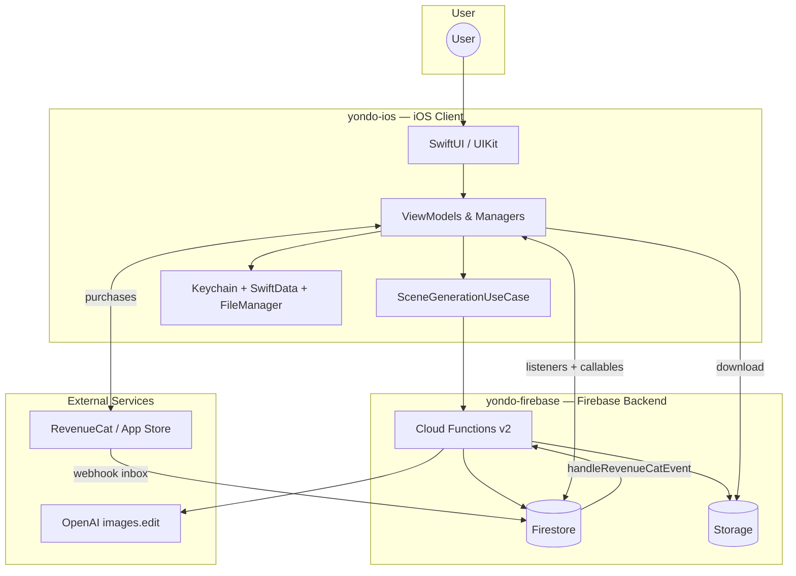
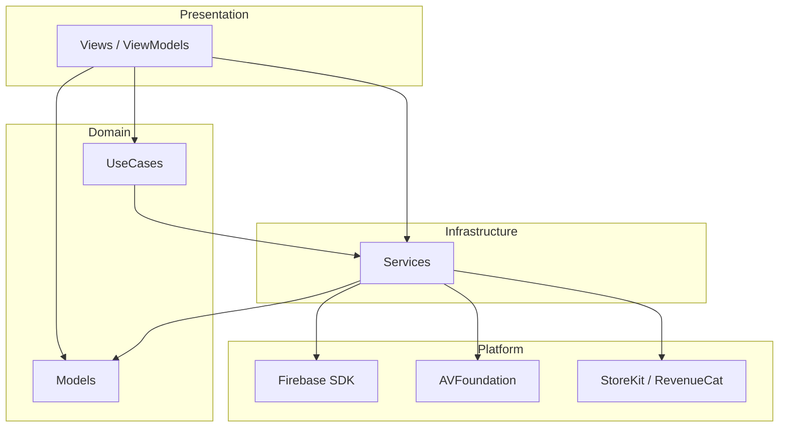
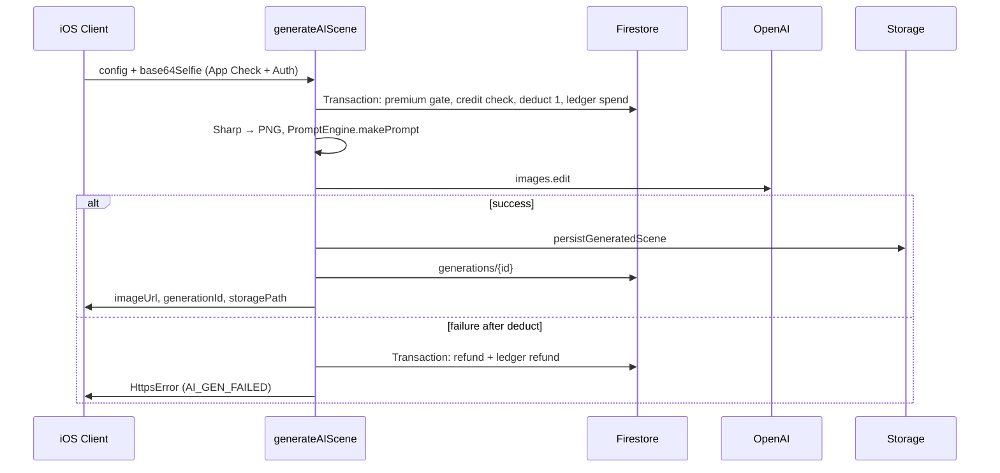
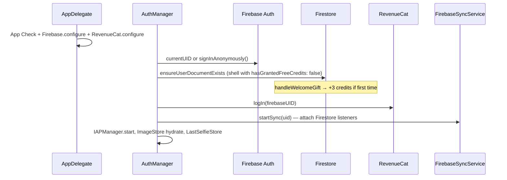
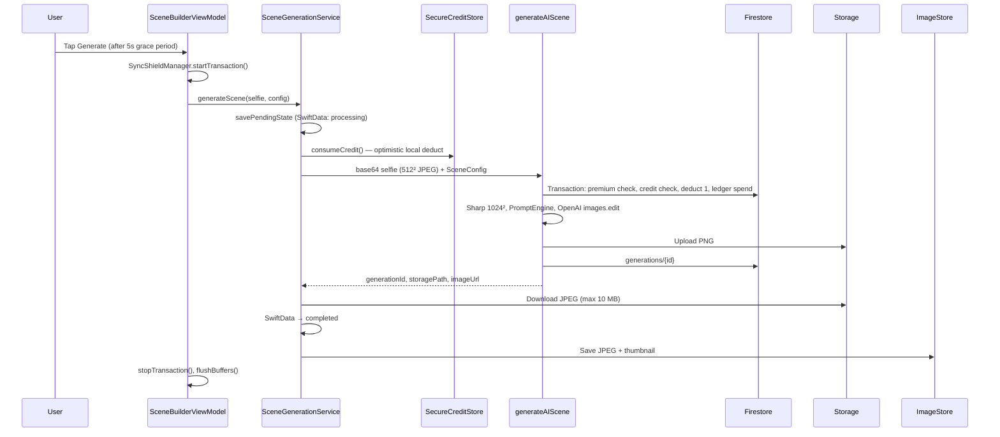
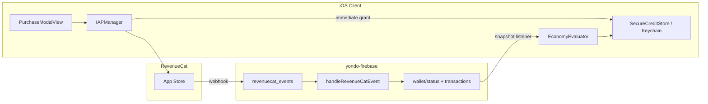
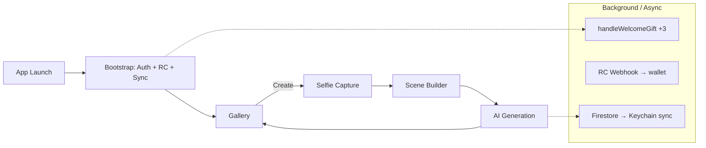

# Yondo — System Design & Integration Architecture

> **Audience:** Engineers and technical reviewers evaluating the architectural design of the `yondo-ios` client application and its integration boundaries with its private backend services.

---

## 1. Product Overview

**Yondo** is an iOS app that places users inside photorealistic, AI-rendered travel scenes. The core loop:

1. Capture a selfie
2. Configure destination, environment, mood, lighting, and camera style
3. Receive a cinematic composite in ~30 seconds

The product is delivered by **two repositories**:

| Repository | Role |
| --- | --- |
| **yondo-ios** | Native iOS client — UI, camera, local persistence, optimistic economy, Firebase SDK integration |
| **yondo-firebase** | Serverless backend — identity hooks, credit ledger, AI orchestration, RevenueCat webhooks |

Neither codebase is complete alone. The client owns UX and local state; the backend owns authoritative credits, premium gates, and AI generation. They communicate through **Firebase Auth**, **Firestore**, **Cloud Functions**, **Storage**, and **RevenueCat** (with webhooks landing in Firestore).

---

## 2. System Context



**Design philosophy:** The client optimizes for responsiveness (optimistic credits, sticky premium, off-screen generation). The server optimizes for integrity (deduct-before-AI, append-only ledger, automatic refunds, timestamp-shielded premium state).

---

## 3. Repository Map

### 3.1 yondo-ios

Single-target Swift app (~179 sources). Layering:

```
Views → Use Cases / ViewModels → Services → Platform SDKs
```

| Folder | Responsibility |
| --- | --- |
| `AppEntry/` | Lifecycle, root navigation, create-scene router |
| `Models/` | Pure value types (`SceneConfig`, `GeneratedImage`, …) |
| `UseCases/` | Business contracts (`SceneGenerationUseCase`) |
| `Services/` | AI, Auth, Sync, IAP, Camera, Images, Persistence |
| `Views/` | SwiftUI screens + UIKit bridges (gallery hero, camera, share) |
| `Utils/` | Extensions, logging, `NetworkMonitor` |
| `Debug/` | `#if DEBUG` tooling and mocks |

**Canonical client reference:** `yondo-ios/Docs/architecture.md`

### 3.2 yondo-firebase

Node 24 Cloud Functions under `functions/src/`:

| Module | Role |
| --- | --- |
| `index.ts` | Orchestrator — exports all Cloud Functions |
| `promptEngine.ts` | Builds scene prompts from `SceneConfig` |
| `viewpointService.ts` | Weighted random viewpoints per destination |
| `metadata.ts` / `catalog.ts` | Static destination catalog and prompt copy |
| `types.ts` | Shared TypeScript types (mirrors iOS `SceneConfig`) |
| `errors.ts` | `YondoErrorCodes` shared with the client |
| `utils/` | Sharp image prep, OpenAI request builder, Storage upload |

Prompt templates live **in code**, not in Firestore.

*Note: Canonical implementation details for server-side handlers are maintained within the private backend repository.*

---

## 4. Client Architecture

### 4.1 Technology Stack

| Domain | Technology |
| --- | --- |
| UI | SwiftUI + UIKit (camera preview, gallery hero, share sheet) |
| Concurrency | `async`/`await`, `Actor`, `@MainActor`, structured tasks |
| Backend SDK | Firebase Auth, Firestore, Functions, Storage, App Check, Analytics |
| Payments | RevenueCat + StoreKit 2 |
| Local persistence | Keychain (economy), SwiftData (generation metadata), FileManager (images) |
| Camera | AVFoundation via actor-isolated `CaptureService` |
| Minimum OS | iOS 26.2 |

### 4.2 Architectural Patterns

| Pattern | Application |
| --- | --- |
| **MVVM** | `SceneBuilderViewModel` drives create-flow screens; gallery uses `ImageStore` |
| **Use case layer** | `SceneGenerationUseCase` → `SceneGenerationService` orchestrates credits, AI, persistence |
| **Protocol-oriented services** | `AIImageGenerator`, `SyncService`, `CreditProvider`, `ImageStoring` — Firebase is swappable |
| **Facade** | `FirebaseSyncService` dispatches Firestore listeners to domain evaluators |
| **Actor isolation** | Disk I/O, camera, Keychain never block the main thread |
| **Singleton coordinators** | `AuthManager`, `IAPManager`, `ImageStore`, `SceneBuilderManager`, `SyncShieldManager` |
| **Manual DI** | No container — `.shared` singletons + constructor defaults + flow-time wiring |

**Not used:** TCA, VIPER, global Coordinator router, DI frameworks.

### 4.3 Layer Diagram



### 4.4 Local Storage Tiers

| Tier | Technology | Contents |
| --- | --- | --- |
| Economy | Keychain (`SecureCreditStore`) | Credits, premium flags, processed transaction IDs |
| Generation metadata | SwiftData (`RemoteGeneration`) | `localID`, `userID`, `status`, `firebaseID`, `storagePath` |
| Images | FileManager per-user dirs | Full JPEGs + downsampled thumbnails |

The gallery reads from `ImageStore` (disk index). SwiftData tracks in-flight and completed generation attempts for reconciliation and (planned) gallery queue UI.

### 4.5 Key Client Design Commitments

1. **Paid work survives navigation** — `SceneBuilderManager` retains the ViewModel while generation is active; dismiss does not cancel the Firebase callable.
2. **Optimistic economy** — Credits deduct locally before the network call; Firestore snapshots reconcile through shields and projected balances.
3. **Sticky premium (fail-open UX)** — Passive Firestore snapshots can turn premium ON but not OFF; downgrade only on forced refresh or sync healing.
4. **Protocol-first boundaries** — Views never import Firebase; all remote access sits in `Services/`.

---

## 5. Backend Architecture

### 5.1 Technology Stack

| Component | Technology |
| --- | --- |
| Runtime | Cloud Functions v2, Node 24 |
| Database | Cloud Firestore |
| Object storage | Firebase Storage (private generated images) |
| AI | OpenAI `images.edit` (`gpt-image-1-mini` default, `gpt-image-1.5` optional) |
| IAP reconciliation | RevenueCat webhooks → Firestore trigger |
| Image processing | Sharp (1024×1024 PNG prep) |
| Secrets | Google Cloud Secret Manager (`OPENAI_API_KEY`, `REVENUECAT_SECRET_API_KEY`) |

### 5.2 Cloud Functions

| Function | Trigger | Purpose |
| --- | --- | --- |
| `generateAIScene` | Callable (`onCall`) | Main generation pipeline; App Check enforced |
| `handleRevenueCatEvent` | `onDocumentCreated` → `revenuecat_events/{eventId}` | Apply credit packs and premium unlock/revoke |
| `handleWelcomeGift` | `onDocumentWritten` → `users/{userId}` | Grant 3 welcome credits when `hasGrantedFreeCredits: false` |
| `checkSubscriptionStatus` | Callable | Query RevenueCat; heal Firestore premium state |
| `syncUserLedger` | Callable (admin token) | Reconcile wallet balance against ledger sum |

**`generateAIScene` resource profile:** 4 GiB memory, 2 CPU, 300 s timeout, region `us-central1`.

### 5.3 Server-Side Generation Pipeline



**Critical server invariant:** Credits are deducted in a Firestore transaction **before** any OpenAI call. Failed generation after deduction triggers an automatic refund transaction.

**Premium gate:** Destinations `tokyo`, `dubai`, and `cappadocia` require `users.isPremium === true`.

---

## 6. Shared Data Model

The client and server share a split document model: **identity** at the user root, **economy** in a wallet subcollection, **generations** at the top level.

### 6.1 Firestore Collections

#### `users/{uid}` — Identity (client creates shell; server updates premium)

| Field | Writer | Purpose |
| --- | --- | --- |
| `isPremium` | Server (webhooks, healer) | Premium destinations unlocked |
| `hasGrantedFreeCredits` | Client primes `false`; server sets `true` | Triggers welcome gift |
| `lastRcPremiumTimestamp` | Server | High-water mark for premium webhook ordering |
| `createdAt` | Client | Account creation |

Credits are **not** stored on the root user document.

#### `users/{uid}/wallet/status` — Materialized balance (server-only writes)

| Field | Purpose |
| --- | --- |
| `credits` | Current balance |
| `hasPurchasedCredits` | Ever purchased credits |
| `lastGenerated` / `lastUpdated` | Timestamps |

#### `users/{uid}/wallet/transactions/{txId}` — Append-only ledger

| `type` | Meaning |
| --- | --- |
| `purchase` | RevenueCat credit pack (idempotent by `eventId`) |
| `spend` | One generation |
| `refund` | Failed generation after spend |
| `gift` | Welcome gift (`welcome_gift_grant`) |
| `correction` | Admin ledger reconciliation |

#### `generations/{generationId}` — Generation metadata (server creates; client reads/deletes own)

| Field | Purpose |
| --- | --- |
| `userId` | Owner |
| `imageUrl` | Storage download URL |
| `storagePath` | e.g. `users/{uid}/scenes/{timestamp}.png` |
| `createdAt` | Server timestamp |

#### `revenuecat_events/{eventId}` — Webhook inbox (no client access)

RevenueCat integration writes events here; `handleRevenueCatEvent` processes them.

### 6.2 Shared Contracts

**`SceneConfig`** — Codable on iOS, mirrored in `functions/src/types.ts`. Sent in the `generateAIScene` callable payload. Server-side `PromptEngine` builds the final prompt (client has legacy local prompt logic for dev only).

**`YondoErrorCodes`** — Shared between `functions/src/errors.ts` and iOS `FirebaseErrors.swift`:

| Code | Meaning |
| --- | --- |
| `AUTH_REQUIRED` | Missing or invalid auth |
| `INVALID_CONFIG` | Malformed request |
| `PREMIUM_REQUIRED` | Locked destination without premium |
| `INSUFFICIENT_CREDITS` | Wallet balance too low |
| `AI_GEN_FAILED` | OpenAI or post-processing failure |
| `UPLOAD_FAILED` | Storage persistence failure |

**Product IDs** (aligned across App Store, RevenueCat, and backend):

| Product ID | Credits / Effect |
| --- | --- |
| `com.andreimarincas.yondo.images.3` | 3 credits |
| `com.andreimarincas.yondo.images.10` | 10 credits |
| `com.andreimarincas.yondo.images.25` | 25 credits |
| `com.andreimarincas.yondo.premiumDestinations` | Entitlement `premium_destinations` |

---

## 7. Integration Points — How Client and Server Communicate

This section is the onboarding core: every cross-repo boundary in one place.

### 7.1 Transport Summary

| Integration | Direction | Mechanism | Region / Notes |
| --- | --- | --- | --- |
| Identity | Client → Firebase | Anonymous Auth | UID is canonical app identity |
| User shell | Client → Firestore | Write `users/{uid}` on first boot | Triggers `handleWelcomeGift` |
| Economy sync | Server → Client | Firestore snapshot listeners | `users/{uid}` + `wallet/status` |
| AI generation | Client → Server | Callable `generateAIScene` | `us-central1`, App Check, 310 s client timeout |
| Image download | Client → Storage | SDK download by `storagePath` | Max 10 MB |
| Premium heal | Client → Server | Callable `checkSubscriptionStatus` | Used in sync healing |
| Purchases | Client → RevenueCat | StoreKit via RevenueCat SDK | `logIn(firebaseUID)` at boot |
| Purchase truth | RevenueCat → Server | Webhook → `revenuecat_events` | Function updates wallet + `isPremium` |
| Premium verify | Client ↔ Server ↔ RC | Callable queries RevenueCat API | 404 returns `null` (don't lock out new users) |

### 7.2 Boot & Identity Flow

On every cold start, the client runs a ordered handshake before revealing the gallery:



**Cross-repo contract:** The client must create `users/{uid}` with `hasGrantedFreeCredits: false` to trigger the backend welcome gift. The backend sets `hasGrantedFreeCredits: true` and writes 3 credits atomically.

**Identity key:** Firebase UID is used everywhere — Firestore paths, RevenueCat `appUserID`, Keychain blob key, image directories.

### 7.3 Scene Generation Flow (End-to-End)

This is the primary product loop spanning both repos:



**Dual deduction model:** Both client and server deduct credits independently:

- **Client:** Optimistic Keychain deduct *before* the callable (instant UI).
- **Server:** Authoritative Firestore transaction *before* OpenAI (cost control).

Firestore listeners eventually reflect the server deduction. `SyncShieldManager` prevents the UI from showing a credit "bounce" during the gap.

**Preprocessing split:**

| Stage | Where | Detail |
| --- | --- | --- |
| Client preprocess | `FirebaseImagePreprocessor` | Center crop → 512×512 JPEG 0.8 → base64 |
| Server preprocess | `imageUtils.ts` (Sharp) | Decode → 1024×1024 PNG → OpenAI file |

**Free vs paid viewpoints:** Client sends `includeSecret: false` when user is on free credits; server enforces premium destination gates independently.

### 7.4 Economy & Purchase Flow

Purchases involve three systems: **RevenueCat** (payment), **Firestore** (authoritative ledger), **Keychain** (local UX truth).



**Two-loop reconciliation:**

| Loop | Trigger | Effect |
| --- | --- | --- |
| Action loop | User buys or generates | Keychain updates immediately |
| Truth loop | Webhook / Cloud Function | Firestore updates → listeners → evaluators → Keychain sync |

**Client guards against stale snapshots:**

- **Projected credits:** `max(serverCredits - activeTransactionLocks, 0)`
- **Anti-dip shield:** Block credit decreases for 90 s after purchase
- **Cache rejection:** Ignore `metadata.isFromCache` snapshots for authoritative UI
- **No refund on `INSUFFICIENT_CREDITS`:** Prevents ghost-credit loops when client and server disagree

**Server idempotency:** Credit pack webhooks use ledger doc id = `eventId`; duplicates are skipped. Premium uses timestamp shield (`lastRcPremiumTimestamp`) to prevent out-of-order grant/revoke races.

### 7.5 Premium & Sync Healing

When client local state and server disagree (e.g. user just purchased premium but webhook hasn't arrived), the client runs a **3-4-1 healing window**:

| Phase | Duration | Action |
| --- | --- | --- |
| 1 — Grace | 3 s | Wait for natural Firestore webhook |
| 2 — Heal | 4 s | Call `checkSubscriptionStatus` (server queries RevenueCat) |
| 3 — Buffer | 1 s | Final settle |
| 4 — Resolve | — | Resume generation or show hard lock |

**Sticky premium on client:** Passive Firestore snapshots may set premium ON immediately but ignore passive OFF. Forced downgrade only via manual refresh or healing with `allowDowngrade: true`.

**Server healer behavior (`checkSubscriptionStatus`):**

- RC says active → set `isPremium: true`, return `true`
- RC says inactive → return current Firestore value (webhook may have already updated)
- RC 404 → return `null` (new user — don't lock out)

This is a deliberate **fail-open** UX model: network instability should not revoke access the user paid for.

---

## 8. Security Model

| Concern | Client | Server |
| --- | --- | --- |
| Authentication | Firebase Anonymous Auth; ID token on every callable | `request.auth` required |
| App attestation | App Check (debug provider in dev) | Enforced on `generateAIScene`, `syncUserLedger` |
| Wallet writes | Client read-only on `wallet/*` | Admin SDK only in Cloud Functions |
| Generation writes | Client read/delete own `generations/*` | Created by functions only |
| Storage | Authenticated download of own paths | Private objects, no public read |
| Secrets | RevenueCat public key in xcconfig | OpenAI + RC secret keys in Secret Manager |
| Admin ops | N/A | `syncUserLedger` requires `request.auth.token.admin` |

---

## 9. Environments

| Alias | Firebase Project | Use |
| --- | --- | --- |
| `default` | `[REDACTED-DEV-ENV]` | Development |
| `prod` | `[REDACTED-PROD-ENV]` | Production / App Store |

**Client config:** `GoogleService-Info.plist` + `Secrets.xcconfig` (RevenueCat key) — not committed.

**Server config:** `functions/.env.<project-id>` for `AI_MODEL_NAME`; secrets via `firebase functions:secrets:set`.

Deploy pipeline runs lint → build → test automatically via `firebase.json` predeploy hooks.

---

## 10. User Journey (Full Stack)



1. **Launch** — SDK init, anonymous auth, user doc shell, welcome gift (if new), RevenueCat login, sync listeners, local gallery hydrate.
2. **Gallery** — Browse local generations; thumbnails from disk cache.
3. **Create flow** — Selfie (AVFoundation) → Builder (presets) → Scene view (loading/result).
4. **Generate** — Local credit deduct → callable → server deduct + OpenAI → Storage → client download → disk + SwiftData.
5. **Purchase** (anytime) — RevenueCat purchase → immediate Keychain grant → webhook → Firestore ledger → listener reconciliation.

Paid generation continues off-screen if the user dismisses the create flow mid-run.

---

## 11. Error Handling Across the Boundary

Cloud Functions return HTTPS errors with structured `details`:

```json
{
  "code": "INSUFFICIENT_CREDITS",
  "message": "...",
  "destinationName": "..."
}
```

iOS `FirebaseErrorParser` maps these to `SceneGenerationError` cases, which drive UI and refund policy:

| Server code | Client behavior | Refund local credit? |
| --- | --- | --- |
| `PREMIUM_REQUIRED` | Sync healing → paywall | Yes (unless healing) |
| `INSUFFICIENT_CREDITS` | Sync healing → purchase | **No** |
| `AI_GEN_FAILED` | "Engine busy" retry | Yes |
| Transport timeout/unavailable | Network error | Yes |

Server automatically refunds Firestore credits on AI failure after deduction. Client may also refund Keychain credits on non-insufficient errors.

---

## 12. Onboarding Guide

### Where to start reading

| Goal | Start here |
| --- | --- |
| Full client architecture | `yondo-ios/Docs/architecture.md` |
| Client ↔ server Firebase integration | `yondo-ios/Docs/firebase-architecture.md` |
| Generation pipeline | `yondo-ios/Docs/generate-ai-scene-architecture.md` |
| Credits & sync healing | `yondo-ios/Docs/local-economy-and-sync-healing.md` |
| IAP flow | `yondo-ios/Docs/iap-architecture.md` |
| Local setup (iOS) | `yondo-ios/README.md` |

### Mental model checklist

1. **Firebase UID is the spine** — Auth, Firestore paths, RevenueCat, Keychain, and image dirs all key off it.
2. **Credits exist in two places by design** — Keychain (UX) and Firestore wallet (authority). Shields reconcile them.
3. **The client never calls OpenAI** — All AI runs in `generateAIScene`; the client sends config + selfie, downloads result from Storage.
4. **Server deducts before AI; client deducts before network** — Both are intentional; sync shields hide the timing gap.
5. **Premium is sticky on client, timestamp-shielded on server** — Fail-open UX; forced reconciliation via healing callable.
6. **Prompt logic is server-side** — `SceneConfig` crosses the wire; `PromptEngine` on the backend assembles the prompt.
7. **Two repos, one product** — Changes to error codes, product IDs, or Firestore schema must stay in sync across both.

### Local development minimum

**iOS:**
```bash
cp Yondo/Resources/Secrets/Secrets.example.xcconfig Yondo/Resources/Secrets/Secrets.xcconfig
cp Yondo/Resources/GoogleService-Info-Example.plist Yondo/Resources/GoogleService-Info.plist
# Duplicate to actual configuration files (without "example"), fill in keys, then open Yondo.xcodeproj
```

Without valid Firebase config, the iOS app still runs local gallery hydration but network sync and AI generation fail at runtime.

*Note: Live network synchronization and server-side AI generation require staging keys connected to the development cloud console. Local app target compiles and runs out-of-the-box using decoupled design mocks and cached asset state preservation for interface evaluation.*

---

## 13. Architectural Invariants

These constraints span both codebases and should be preserved unless deliberately redesigned:

| Invariant | Rationale |
| --- | --- |
| Deduct credits before OpenAI (server) | Cost control |
| Deduct credits before callable (client) | Responsive UX |
| Wallet writes server-only | Prevent tampering |
| Append-only ledger with idempotent webhook IDs | Auditability + duplicate safety |
| Automatic server refund on AI failure | Fairness |
| No client refund on `INSUFFICIENT_CREDITS` | Prevent ghost-credit loops |
| App Check on generation callable | Abuse prevention |
| Private Storage objects | User privacy |
| Shared error codes | Consistent client error UX |
| Anonymous auth + RevenueCat UID alignment | Single identity without login friction |

---

## 14. Related Documentation Index

### yondo-ios (`Docs/`)

| Topic | Document |
| --- | --- |
| Architecture (canonical) | `architecture.md` |
| App launch & cold start | `app-launch.md` |
| Create scene flow | `create-scene-flow.md` |
| AI generation pipeline | `generate-ai-scene-architecture.md` |
| Firebase client integration | `firebase-architecture.md` |
| IAP system | `iap-architecture.md` |
| Local economy & sync healing | `local-economy-and-sync-healing.md` |
| SwiftData persistence | `persistence-swiftdata.md` |
| Image pipeline | `image-pipeline.md` |
| Camera | `camera-pipeline.md` |
| UI/UX design system | `ui-ux-design.md` |

### yondo-firebase

> *Note: Detailed implementation documentation, Firestore security rules files (`firestore.rules`), and Node.js source configurations are maintained within a private repository to protect cloud security posture and proprietary prompt architectures. Core cross-boundary integration patterns remain fully documented in Section 7 above.*

---

*This document synthesizes the architectural design and integration patterns of the yondo-ios client. For implementation details beyond onboarding scope, follow the linked deep-dives in the `Docs/` directory.*
