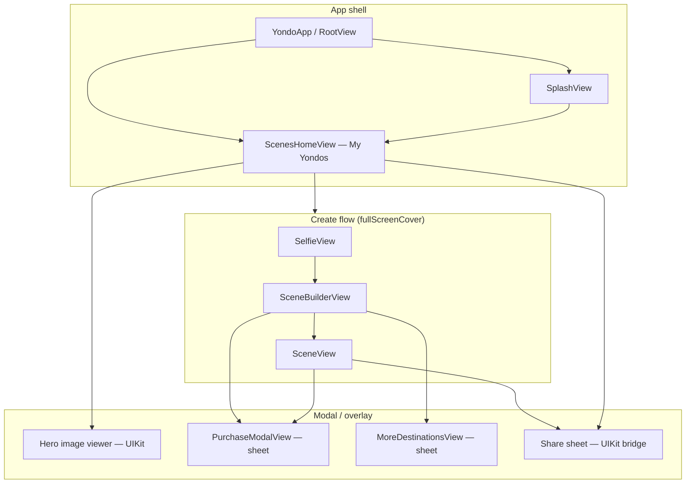

# Yondo — UI/UX Design System

This document describes Yondo’s visual language, interaction patterns, component inventory, and user journeys as implemented in the iOS app. It is derived from the live codebase (`Yondo/Views/`, `Yondo/Utils/`, `Yondo/AppEntry/`) and complements flow-specific docs linked at the end.

**Product promise:** *Take a selfie. Pick a destination. Arrive.* The UI supports a single primary loop—capture, configure, generate, collect—with cinematic presentation and minimal chrome.

---

## Table of contents

1. [Design principles](#1-design-principles)
2. [Information architecture](#2-information-architecture)
3. [Visual language: Liquid Glass](#3-visual-language-liquid-glass)
4. [Color system](#4-color-system)
5. [Typography](#5-typography)
6. [Spacing & layout](#6-spacing--layout)
7. [Motion & animation](#7-motion--animation)
8. [Haptic feedback](#8-haptic-feedback)
9. [Component library](#9-component-library)
10. [Screens & user flows](#10-screens--user-flows)
11. [Navigation & presentation](#11-navigation--presentation)
12. [Assets & iconography](#12-assets--iconography)
13. [SwiftUI vs UIKit](#13-swiftui-vs-uikit)
14. [Accessibility & inclusive design](#14-accessibility--inclusive-design)
15. [Platform & deployment](#15-platform--deployment)
16. [Related documentation](#16-related-documentation)

---

## 1. Design principles

| Principle | How it shows up in Yondo |
|-----------|--------------------------|
| **Cinematic focus** | Full-bleed imagery (camera, generation result, hero viewer). Chrome fades or glass-blurs around content, not over it. |
| **One home, one journey** | No tab bar. `ScenesHomeView` is the persistent shell; creation is a full-screen cover. |
| **Optimistic, tactile UI** | Springs on transitions; haptics on capture, success, errors, gallery hero, and purchases. |
| **Brand-coded blues** | Navy-to-cyan palette replaces generic system blue; orange reserved for destructive actions. |
| **Light & dark parity** | `@Environment(\.colorScheme)` drives text opacity, glass tints, and gradient stops—not separate light/dark layouts. |
| **Paid work survives dismissal** | Generation can continue after the user closes the create flow; UI does not block on invisible work (see [create-scene-flow.md](create-scene-flow.md)). |

There is **no separate Figma token package** in the repo. Tokens live in `Color+Extensions.swift`, `Animation.swift`, layout constants on components, and asset catalogs.

---

## 2. Information architecture



### Surfaces not in v1

- Dedicated **onboarding** tutorial
- **Settings** / profile screen
- **TabView**-based sections

Authentication runs during splash/bootstrap; there is no separate sign-in screen in the primary UX path.

---

## 3. Visual language: Liquid Glass

Yondo’s signature look is **Liquid Glass**: translucent surfaces using SwiftUI’s `.glassEffect()`, system `.buttonStyle(.glass)`, and UIKit navigation bar transparency configured in `YondoApp.configureGlobalStyles()`.

### Characteristics

- **Frosted trays** — Bottom action areas (`LiquidGlassTray`) with brand-tinted glass (light: `yondoBrand` wash; dark: `yondoDeep` wash).
- **Press feedback** — Scale (~0.97), brightness, saturation, and contrast shifts on press (tray and glass buttons).
- **Blur fades** — `LiquidGlassBlurFade` softens scroll edges against content.
- **Inner depth** — `View+LiquidDesign.liquidInnerShadow` and layered gradients on primary CTAs (`YondoPrimaryButtonStyle`).
- **Refraction accents** — `RefractionShimmerView`, `ShimmeringText` during AI generation loading.

### Core implementation files

| Component | Path |
|-----------|------|
| `LiquidGlassTray` | `Yondo/Views/LiquidGlassTray.swift` |
| `LiquidGlassButtonStyle` | `Yondo/Views/LiquidGlassButtonStyle.swift` |
| `LiquidGlassSecondaryButton` | `Yondo/Views/LiquidGlassSecondaryButton.swift` |
| `GlassSecondaryButton` | `Yondo/Views/GlassSecondaryButton.swift` |
| `LiquidGlassBlurFade` | `Yondo/Views/LiquidGlassBlurFade.swift` |
| `HomeGlassHeader` | `Yondo/Views/Gallery/HomeGlassHeader.swift` |
| `View+LiquidDesign` | `Yondo/Views/View+LiquidDesign.swift` |
| `liquidBlur` modifier | `Yondo/Utils/Extensions/View+Extensions.swift` |
| `YondoDivider` | `Yondo/Views/YondoDivider.swift` |
| `SelectionEmphasisModifier` | `Yondo/Views/SelectionEmphasisModifier.swift` |

### Layout constants (tray)

```swift
// LiquidGlassTrayLayoutConstants
trayHeight: 91
trayPadding: 20
trayCornerRadius: 32
```

---

## 4. Color system

### Brand palette (code-defined)

**Source:** `Yondo/Utils/Extensions/Color+Extensions.swift`

| Token | Hex | Role |
|-------|-----|------|
| `yondoDeep` | `#08428C` | Deep navy; dark gradients, depth washes |
| `yondoBrand` | `#0798F2` | Primary brand blue; selected states, segmented control tint |
| `yondoAccent` | `#16DCF2` | Electric cyan; highlights, loading shimmer, error accents |
| `yondoGlow` | `#2EF2F2` | Ultra-light cyan; pressed primary button captions (dark mode) |
| `yondoMidnight` | `#031D3D` | Rich navy replacing pure black in brand contexts |
| `yondoWhite` | `#F2F9FF` | Blue-tinted white for highlights and dark-mode secondary text |
| `yondoInteractive` | `#00A3FF` | Vibrant action blue; toolbar tints (light mode) |
| `yondoSuccess` | `#2BFD9E` | Success green; builder toolbar “ready” indicator |
| `yondoOrange` | `#E67E22` | Destructive accent (e.g. delete toolbar tint) |
| `yondoOrangeDeep` | `#D35400` | Richer orange for light-mode destructive contexts |

### Semantic text colors

| Function | Light mode | Dark mode |
|----------|------------|-----------|
| `yondoSecondaryText(for:)` | `yondoMidnight` @ 60% | `yondoWhite` @ 40% |
| `yondoContainerSecondaryText(for:)` | `yondoMidnight` @ 80% | `yondoWhite` @ 60% |

Used for labels on main backgrounds vs. inside tinted containers (e.g. mood picker cards).

### Asset catalog

**Path:** `Yondo/Assets/Assets.xcassets/`

| Asset | Purpose |
|-------|---------|
| `sceneAccent.colorset` | Light `#3399FF`, dark `#3A7BD5` (referenced in comments; primary palette is code-based) |
| `AccentColor.colorset` | System accent slot (minimal configuration) |
| `LaunchIcon.imageset` | Splash breathing logo (`PulseIcon`) |
| `destinations/`, `environment/`, `mood/` | Thumbnail imagery for scene builder cards |

### Usage patterns

- **Primary CTAs** — `yondoBrand` → `yondoDeep` gradients (`YondoPrimaryButtonStyle`).
- **Generation loading** — `yondoAccent` shimmer and cloud motifs (`SceneView`, `ShimmeringText`).
- **Camera** — Full black background; white shutter control (`SelfieView`).
- **Hero mode** — Gallery forces dark toolbar treatment (`forceDarkMode`, `toolbarIsDark` on `ScenesHomeView`).
- **Destructive** — `yondoOrange` on delete actions in gallery toolbar.

---

## 5. Typography

### Typeface

**SF Pro Rounded** everywhere user-facing text matters:

```swift
.font(.system(.headline, design: .rounded).weight(.bold))
```

UIKit global controls use rounded variants via `UIFont.rounded()` in `Yondo/Utils/Extensions/UIFont+Extension.swift` (segmented control in `YondoApp.configureSegmentedControlAppearance()`).

### Toolbar scale

**Source:** `Yondo/Views/UIView+YondoToolbarStyle.swift`

| `ToolbarButtonType` | Size | Weight | Typical use |
|---------------------|------|--------|-------------|
| `.dismiss` | 16.5 pt | Bold | Close (`xmark`) |
| `.standard` | 17 pt | Semibold | Share, trash |
| `.standardBold` | 16 pt | Bold | Emphasized actions |
| `.standardSmall` | 16.5 pt | Semibold | Paywall “Close” |
| `.label` | 15 pt | Bold | Text toolbar actions |
| `.prominent` | 30 pt | Bold | Large toolbar labels |

Apply with `.yondoToolbarStyle(.standard)` on toolbar buttons.

### Representative text styles

| Context | Style | Example file |
|---------|-------|--------------|
| Gallery title | `.largeTitle`, rounded, bold, `tracking(-1.0)` | `HomeGlassHeader.swift` |
| Empty state title | `.title2`, rounded, bold | `EmptyGalleryView.swift` |
| Primary CTA | `.headline`, rounded, bold | `YondoPrimaryButtonStyle.swift` |
| Mood card label | `.caption`, rounded, medium | `MoodCard.swift` |
| Generation status | `.callout` / `.subheadline`, rounded | `SceneView.swift` |
| Paywall body | `.body` / `.subheadline`, rounded | `PurchaseModalView+*.swift` |

There is **no centralized type scale file**; sizes are chosen per screen for hierarchy.

---

## 6. Spacing & layout

### Recurring measurements

| Constant | Value | Where |
|----------|-------|-------|
| Primary button corner radius | 22 | `YondoPrimaryButtonStyle` |
| Liquid glass button radius | 24 | `LiquidGlassButtonStyle` |
| Mood card image | 70×70, corner 12 | `MoodCard` |
| Mood card outer corner | 16 | `MoodCard` |
| Gallery nav bar height | 44 | `ScenesHomeView+Layout` |
| Gallery header padding | 16 | `ScenesHomeView+Layout` |
| Skeleton grid spacing | 4 | `ScenesHomeView+Skeleton` |
| Empty gallery top spacer | 50 | `EmptyGalleryView` |

### Safe area

`RootView` injects `safeAreaInsets` via a custom environment key (`SafeAreaInsetsKey` in `YondoApp.swift`) so `HomeGlassHeader` can position “My Yondos” below the Dynamic Island/notch without hard-coded offsets.

### Grid

- **LazyVGrid** of generated scenes with staggered cold-start loading (VIP batch → full library).
- **Create new** cell uses dedicated glass/add styles (`CreateNewGridItem`, `YondoGridAddNewButtonStyle`).

---

## 7. Motion & animation

### Named tokens

**Source:** `Yondo/Utils/Extensions/Animation.swift`

| Token | Parameters | Use |
|-------|------------|-----|
| `.liquid` | spring 0.55 / 0.72 | Sheets, large modal expansions |
| `.pop` | spring 0.3 / 0.6 | Button presses, small toggles |
| `.gentle` | spring 0.45 / 1.0 | Subtle fades |
| `.yondoSnappy` | spring 0.25 / 0.7 | Quick mechanical reactions |
| `.yondoSmooth` | spring 0.35 / 0.9 | Layout transitions, image fades |

Inline animations also use `.snappy`, `.interactiveSpring`, and `.easeInOut` where appropriate.

### Screen-specific motion

| Screen / feature | Behavior |
|------------------|----------|
| **Splash** | `PulseIcon` Core Animation breathe; cross-fade to `YondoSpinner` after 1.5 s patience (`SplashView`, `AuthManager`) |
| **Splash removal** | Asymmetric opacity + scale (`RootView`) |
| **Empty gallery** | Staggered spring entrance: icon → text → CTA (`EmptyGalleryView`) |
| **Scene generation** | Opacity + scale between loading / result / error; `ShimmeringText` cross-fade |
| **Gallery hero** | ~0.65 s flight animation; spring grid dim; thumbnail press delay ~0.22 s |
| **Paywall** | `glassEffectID` morph between spinner, restore, success; spring on credit count |
| **Liquid glass press** | Scale 0.97 + brightness/saturation on tray |

### Launch performance

During the cold-start **snap window** (0.5 s), animations may be disabled to avoid jank while the grid hydrates. See [app-launch.md](app-launch.md).

---

## 8. Haptic feedback

**Source:** `Yondo/Services/Camera/HapticManager.swift`

Singleton wrapping `UIImpactFeedbackGenerator`, `UISelectionFeedbackGenerator`, and `UINotificationFeedbackGenerator`. Prewarmed in background after bootstrap (`AuthManager`).

| Event | Haptic |
|-------|--------|
| Shutter tap / capture pipeline | `mediumImpact`, `rigid`, `select` |
| Generation success | `success()` |
| Generation / save failure | `failure()` |
| Toolbar actions, regenerate, paywall tap | `lightImpact()` |
| Gallery hero open / empty CTA | `mediumImpact()` |
| Purchase success / restore | `success()` |
| Hero dismiss thresholds | Documented in [gallery-hero-swiftui-uikit-bridge.md](gallery-hero-swiftui-uikit-bridge.md) |

Haptics reinforce tactile quality but **do not replace** accessibility labels (see §14).

---

## 9. Component library

### Buttons & button styles

| Style | File | Appearance / use |
|-------|------|------------------|
| `YondoPrimaryButtonStyle` | `YondoPrimaryButtonStyle.swift` | Gradient “Create Yondo” CTA |
| `LiquidGlassButtonStyle` | `LiquidGlassButtonStyle.swift` | Glass tray generate action |
| `YondoGlassButtonStyle` | `Gallery/YondoGlassButtonStyle.swift` | Empty gallery CTA |
| `YondoGridAddNewButtonStyle` | `Gallery/YondoGridAddNewButtonStyle.swift` | Grid “add” tile |
| `YondoThumbnailButtonStyle` | `Gallery/YondoThumbnailButtonStyle.swift` | Thumbnail press (hero handoff) |
| `DestinationButtonStyle` | `SceneBuilder/DestinationCard.swift` | Destination selection |
| `MoreDestinationButtonStyle` | `MoreDestinations/MoreDestinationCard.swift` | Extended destination sheet |
| `PurchaseButtonStyle` | `Purchase/PurchaseButton.swift` | IAP product rows |
| `SecondaryButtonStyle` | `SecondaryActionButton.swift` | Secondary text actions |
| `CameraShutterButtonStyle` | `Selfie/SelfieView.swift` | Camera shutter ring |

### Cards & selectors

| Component | File |
|-----------|------|
| `DestinationCard` | `SceneBuilder/DestinationCard.swift` |
| `EnvironmentCard` | `SceneBuilder/EnvironmentCard.swift` |
| `MoodCard` | `SceneBuilder/MoodCard.swift` |
| `ShowMoreDestinationsCard` | `SceneBuilder/ShowMoreDestinationsCard.swift` |
| `MoreDestinationCard` | `MoreDestinations/MoreDestinationCard.swift` |
| `CreateNewGridItem` | `Gallery/CreateNewGridItem.swift` |
| `GridItemContainer` | `Gallery/GridItemContainer.swift` |

**Selection pattern:** Selected mood/environment uses `yondoBrand` fill with white label; unselected uses `yondoContainerSecondaryText`.

### Toolbars

| Toolbar | File |
|---------|------|
| Gallery | `Gallery/ScenesHomeView+Toolbar.swift` |
| Scene builder | `SceneBuilder/SceneBuilderToolbar.swift` |
| Scene view (result) | `SceneView/SceneViewToolbar.swift` |

### Feedback & loading

| Component | File |
|-----------|------|
| `YondoSpinner` | `YondoSpinner.swift` (UIKit bridge, sizes small → extraLarge) |
| `WormSpinner` | `WormSpinner.swift` |
| `PulseIcon` | `PulseIcon.swift` (splash) |
| `ShimmeringText` | `SceneView/ShimmeringText.swift` |
| `AsyncThumbnailView` | `Gallery/AsyncThumbnailView.swift` |
| `ConfettiPiece` / `ParticleBurstView` | `ConfettiPiece.swift` |

### Sheets & alerts

| Surface | Presentation |
|---------|----------------|
| Create scene flow | `fullScreenCover` from `ScenesHomeView` |
| Credits / paywall | `.sheet` → `PurchaseModalView` |
| More destinations | `.sheet` from builder |
| Share | `.shareSheet(provider:)` → UIKit host |
| Delete scene | `.alert` on gallery |
| Regenerate | `.alert` on `SceneView` |
| Selfie tips | `SelfiePopoverView` popover |

---

## 10. Screens & user flows

### 10.1 Launch & splash

| Element | Behavior |
|---------|----------|
| `RootView` | Mounts `ScenesHomeView` permanently; overlays `SplashView` until `authManager.isInitialized` |
| `SplashView` | `PulseIcon` (90×90), optional `YondoSpinner` after slow handshake |
| Minimum splash | 0.75 s floor; 0.35 s cross-dissolve on reveal |

→ [app-launch.md](app-launch.md)

### 10.2 Gallery home (`ScenesHomeView`)

**Purpose:** Collection of generated “Yondos”; primary entry to create and view.

| State | UI |
|-------|-----|
| **Loading / cold start** | Skeleton grid → staggered real thumbnails |
| **Empty** | `EmptyGalleryView` — hierarchical `photo.stack.fill`, gradient icon, “Create Yondo” glass CTA |
| **Populated** | `LazyVGrid`, `HomeGlassHeader` (“My Yondos”), toolbar (create, debug in DEBUG) |
| **Hero** | Full-screen UIKit overlay: pinch-zoom, swipe between images, flight from grid cell |

Toolbar actions: create (`plus`), share, delete (with confirmation). Hero mode adjusts toolbar contrast for image-backed chrome.

→ [gallery-hero-swiftui-uikit-bridge.md](gallery-hero-swiftui-uikit-bridge.md)

### 10.3 Create flow

Presented as **`fullScreenCover`** with internal `NavigationStack(path: CreateSceneStep)`:

```text
SelfieView  →  SceneBuilderView  →  SceneView
(capture)      (configure)           (generate + result)
```

| Step | Screen | UX highlights |
|------|--------|---------------|
| 1 | `SelfieView` | Black full-screen camera; letterbox overlay; white shutter; review/retake |
| 2 | `SceneBuilderView` | Destination carousel, environment/mood/lighting/camera pickers; glass bottom tray with generate; credit indicator |
| 3 | `SceneView` | Loading with shimmering status text; result with zoom; error + retry; paywall on insufficient credits |

`SceneBuilderManager` retains the shared `SceneBuilderViewModel` if generation is active when the user dismisses the cover.

→ [create-scene-flow.md](create-scene-flow.md), [camera-pipeline.md](camera-pipeline.md), [generate-ai-scene-architecture.md](generate-ai-scene-architecture.md)

### 10.4 Paywall (`PurchaseModalView`)

| State | UI |
|-------|-----|
| Loading | Blocked scroll; spinner in content |
| Loaded | Credit packages via `PurchaseButton`; restore row with glass morph |
| Success | Checkmark morph; animated credit count |
| Error | Branded wifi/connection icons with `yondoAccent` emphasis |

Uses `NavigationStack`, bottom bar glass placeholder, `.sharedBackgroundVisibility(.hidden)` for full-width glass toolbar.

→ [iap-architecture.md](iap-architecture.md)

### 10.5 Share

Staged detent presentation masks `UIActivityViewController` main-thread hitch.

→ [share-sheet-swiftui-uikit-bridge.md](share-sheet-swiftui-uikit-bridge.md)

---

## 11. Navigation & presentation

| Pattern | Implementation |
|---------|----------------|
| App root | `WindowGroup` → `RootView` (no tabs) |
| Primary stack | `NavigationStack` in `ScenesHomeView`, `CreateSceneFlowView`, `PurchaseModalView`, `MoreDestinationsView` |
| Typed create routes | `CreateSceneStep`: `.builder(image:)`, `.scene(config, selfie:)` |
| Modal create | `fullScreenCover` + `@Environment(\.dismiss)` |
| Hero | Overlay state on home (`selectedEntry`, `isVisualHeroMode`), not stack push |
| Back gesture | `SwipeBackControl` toggles interactive pop where needed |
| Pop detection | `NavigationPopObserver` for `onNavigationPop` |

**Coordinators** appear at UIKit bridge boundaries (`UIViewRepresentable`), not as an app-wide coordinator layer.

---

## 12. Assets & iconography

### Content thumbnails (bitmap)

Mapped from model `rawValue` → asset name in `SceneConfig` and related enums:

- **Destinations:** `eiffelTower`, `grandCanyon`, `maldives`, `newYork`, `tokyo`, `dubai`, `santorini`, `machuPicchu`, `sydney`, `cappadocia`
- **Environments:** `beach`, `city`, `luxuryInterior`, `nature`, `studio`
- **Moods:** `cinematic`, `relaxed`, `confident`, `mysterious`, `playful`

### SF Symbols (chrome & actions)

| Symbol | Use |
|--------|-----|
| `plus`, `plus.circle.fill` | Create new Yondo |
| `xmark` | Dismiss |
| `chevron.left`, `chevron.down` | Back, expand destinations |
| `square.and.arrow.up` | Share |
| `trash` | Delete |
| `arrow.clockwise` | Retry generation |
| `circle.fill` | Progress |
| `checkmark.circle.fill` | Purchase / restore success |
| `wifi.slash`, `wifi.exclamationmark`, `mappin.and.ellipse` | Paywall errors |
| `photo.stack.fill` | Empty gallery |
| `ladybug.fill` | Debug toolbar (DEBUG only) |

**Pattern:** SF Symbols for system chrome; **bitmap assets for creative content** (destinations, moods, environments).

### App icon

`Yondo/Assets/AppIcon.icon/` — Icon Composer–style app icon asset.

---

## 13. SwiftUI vs UIKit

| Layer | SwiftUI | UIKit |
|-------|---------|-------|
| Layout & navigation | ✓ Primary | Bridges only |
| State & bindings | ✓ | Callbacks from coordinators |
| Liquid Glass / most buttons | ✓ | — |
| Camera preview | `CameraPreview` representable | `AVCaptureVideoPreviewLayer` |
| Splash logo animation | Wrapper | `PulseIcon` Core Animation |
| Spinners | Wrapper | `YondoSpinner`, `WormSpinner` |
| Gallery hero | Chrome, transitions | `UIKitGalleryContainer`, `InteractiveImageView`, `UIZoomableImageView` |
| Share sheet | Modifier | `ShareSheetHost`, `UIActivityViewController` |
| Pinch-zoom result | `ZoomableImageView` | UIKit zoom engine |
| Global chrome | — | `UISegmentedControl`, `UINavigationBar` appearance |

**Principle:** SwiftUI owns structure and state; UIKit owns performance-critical gestures, camera, and system sheet construction.

---

## 14. Accessibility & inclusive design

### Current state

The codebase does **not** currently use SwiftUI accessibility modifiers (`accessibilityLabel`, `accessibilityHint`, `accessibilityAddTraits`) or explicit Dynamic Type scaling policies.

Partial mitigations:

- `minimumScaleFactor` on some labels (e.g. `MoodCard` “Mysterious”)
- Semantic system colors in places (`.secondary`, `.primary`)
- High-contrast hero toolbar when viewing photos

### Recommended improvements (not yet implemented)

1. VoiceOver labels on shutter, generate, and gallery cells (destination + date).
2. Dynamic Type–aware toolbar and card text (or capped scaling with layout tests).
3. `accessibilityReduceMotion` branches for hero flight and empty-state springs.
4. Sufficient contrast audit for `yondoSecondaryText` on glass backgrounds.

---

## 15. Platform & deployment

| Topic | Detail |
|-------|--------|
| Documented minimum | iOS 17 (`README.md`, `architecture.md`) |
| Xcode deployment target | iOS 26.2 (`project.pbxproj`) — enables `.glassEffect()`, `.buttonStyle(.glass)`, `glassEffectID` |
| Appearance | System light/dark; hero may force dark chrome |
| Language | Swift 5.10, SwiftUI-first |

When targeting older OS versions, glass APIs would need conditional compilation or fallbacks—not present in the current tree.

---

## 16. Related documentation

| Topic | Document |
|-------|----------|
| Module map & UI overview | [architecture.md](architecture.md#3-layered-architecture) |
| App launch & splash timing | [app-launch.md](app-launch.md) |
| Create scene navigation | [create-scene-flow.md](create-scene-flow.md) |
| Camera UI lifecycle | [camera-pipeline.md](camera-pipeline.md) |
| AI generation UI states | [generate-ai-scene-architecture.md](generate-ai-scene-architecture.md) |
| Gallery hero (UIKit bridge) | [gallery-hero-swiftui-uikit-bridge.md](gallery-hero-swiftui-uikit-bridge.md) |
| Share sheet bridge | [share-sheet-swiftui-uikit-bridge.md](share-sheet-swiftui-uikit-bridge.md) |
| Thumbnails & grid performance | [image-pipeline.md](image-pipeline.md) |
| IAP / paywall logic | [iap-architecture.md](iap-architecture.md) |
| Firebase & sync (credits display) | [firebase-architecture.md](firebase-architecture.md) |
| Local economy & sync healing | [local-economy-and-sync-healing.md](local-economy-and-sync-healing.md) |
| Product overview | [README.md](../README.md) |

---

## Appendix: File index (`Yondo/Views/`)

```
Views/
├── Gallery/          ScenesHomeView, EmptyGalleryView, Hero/, thumbnails
├── Selfie/           SelfieView, CameraPreview, LetterboxOverlay
├── SceneBuilder/     SceneBuilderView, cards, toolbar, ViewModel
├── SceneView/        SceneView, ShimmeringText, ZoomableImageView
├── Purchase/         PurchaseModalView (+ extensions)
├── MoreDestinations/ MoreDestinationsView, cards
├── Share/            ShareSheetModifier, ShareSheetHost
└── (root)            Liquid Glass primitives, button styles, spinners
```

*Last aligned with codebase structure — May 2026.*
