# Yondo — Complete UI State & Asset Catalog

This document serves as a centralized visual index for all 14 core user interface screens, lifecycle states, and transactional edge cases implemented across the Yondo iOS application architecture.

Since this file is located inside the `Docs/` directory, all assets use the uniform relative path: `images/gallery/`.

---

## 1. Gallery & Application Lifecycle States
*Technical Reference:* See [`Docs/image-pipeline.md`](image-pipeline.md) for the complete collection layout lifecycle.

  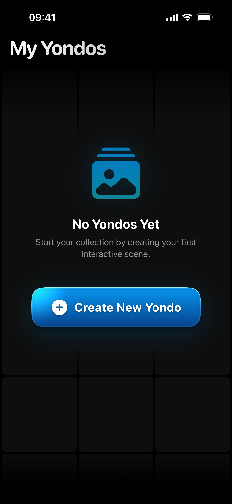
  
  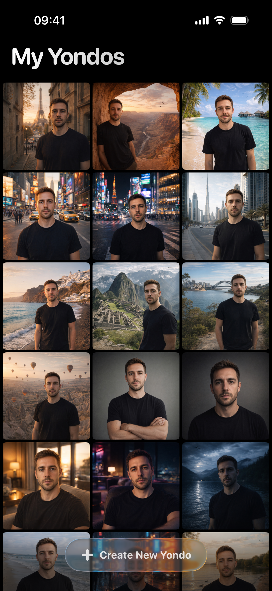

---

## 2. Live Capture & Camera Pipeline
*Technical Reference:* See [`Docs/camera-pipeline.md`](camera-pipeline.md) for the AVFoundation state-machine specification.

  
  

---

## 3. AI Generation & Composition Flow
*Technical Reference:* See [`Docs/create-scene-flow.md`](create-scene-flow.md) for generation sequence architectures.

### Scene Configuration

  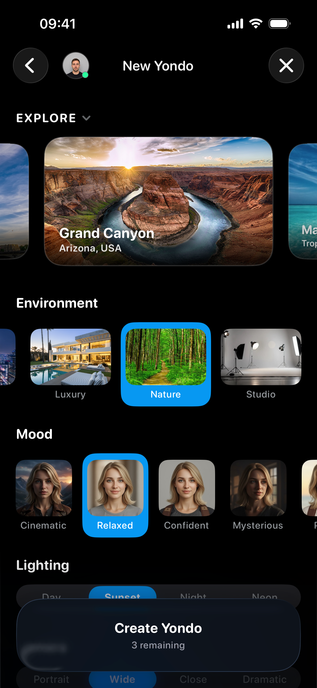

### Carousel Overflow & Expanded Selection

  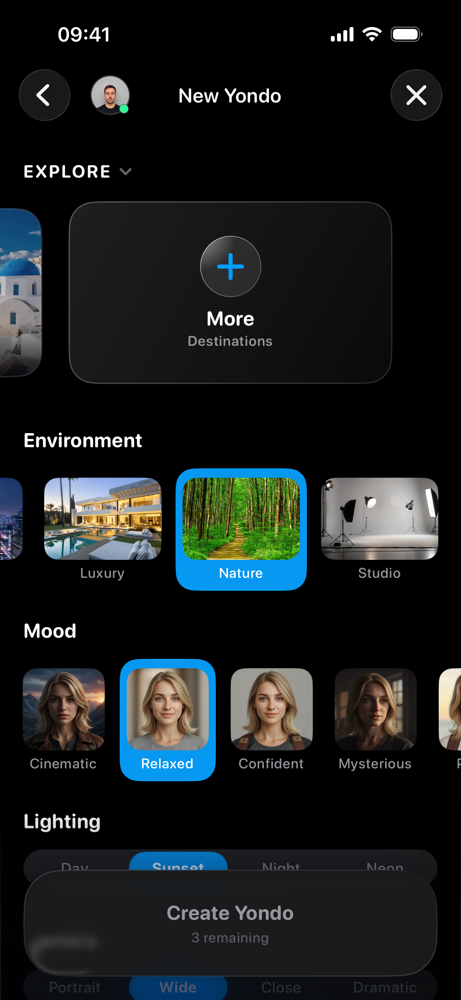
  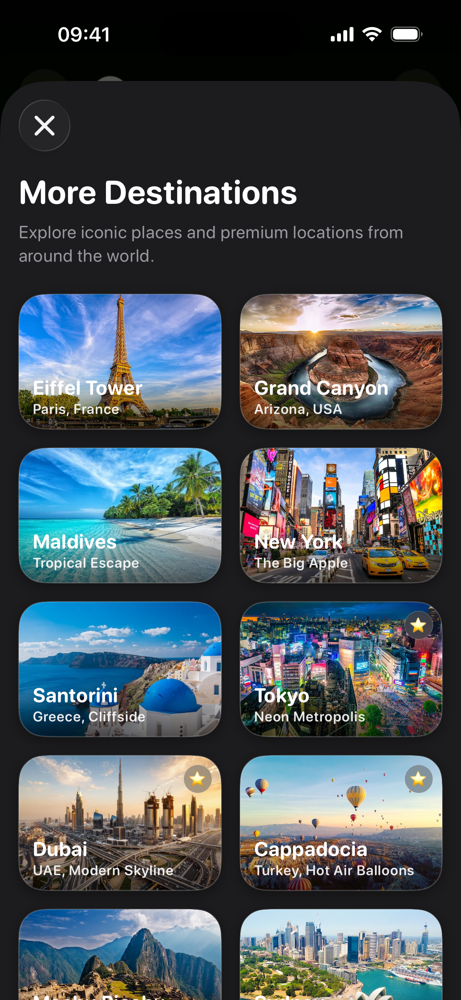

### Pipeline Execution & Render Delivery

  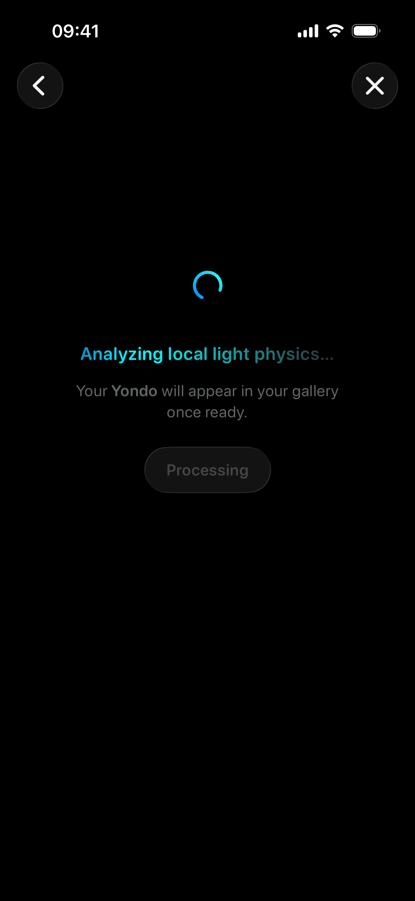
  

---

## 4. Interactive Hero Transitions & Context Detail Viewer
*Technical Reference:* See [`Docs/gallery-hero-swiftui-uikit-bridge.md`](gallery-hero-swiftui-uikit-bridge.md) for gesture coordination logic.

  
  

---

## 5. Transactional Gating & Sync Interstitials
*Technical Reference:* See [`Docs/iap-architecture.md`](iap-architecture.md) for state-machine rules.

### Transaction Gating Shields

  
  

### Synchronization & Resolution Flow

  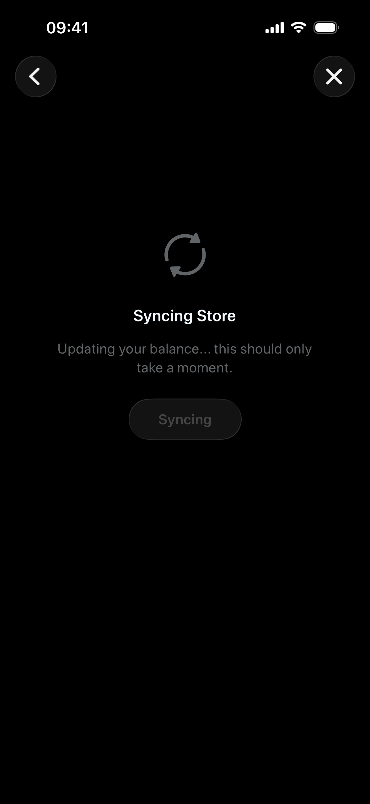
  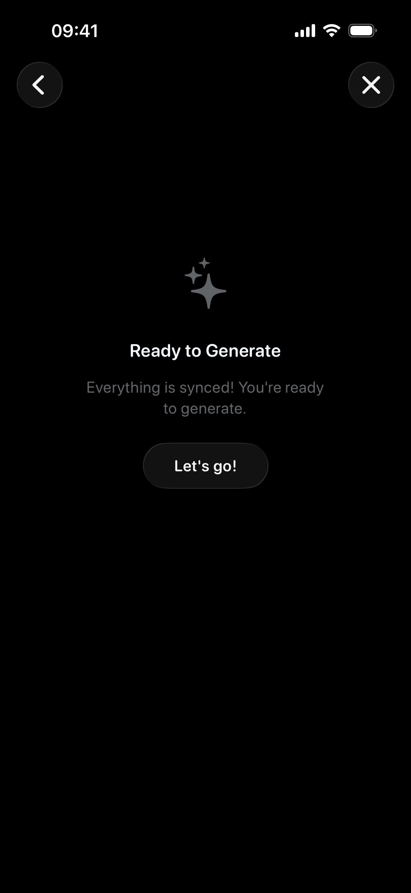

---

## 6. Storefront Presentation & Validation Fallbacks
*Technical Reference:* See [`Docs/iap-architecture.md`](iap-architecture.md) for StoreKit product loading pipelines.

### Active Paywall & Network Fallbacks

  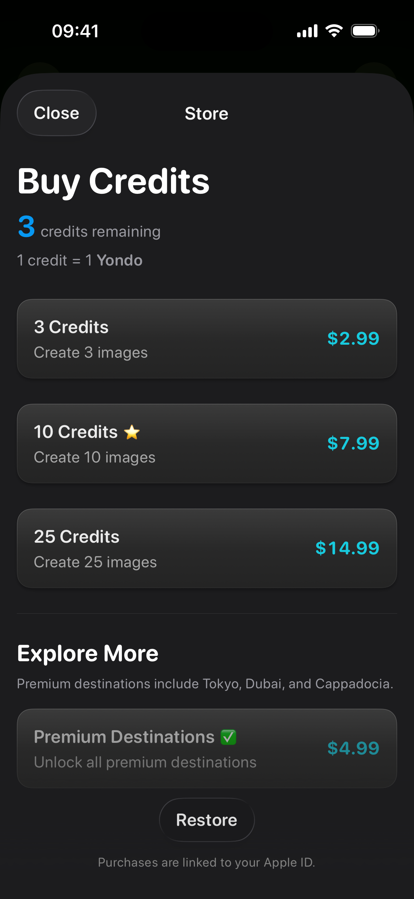
  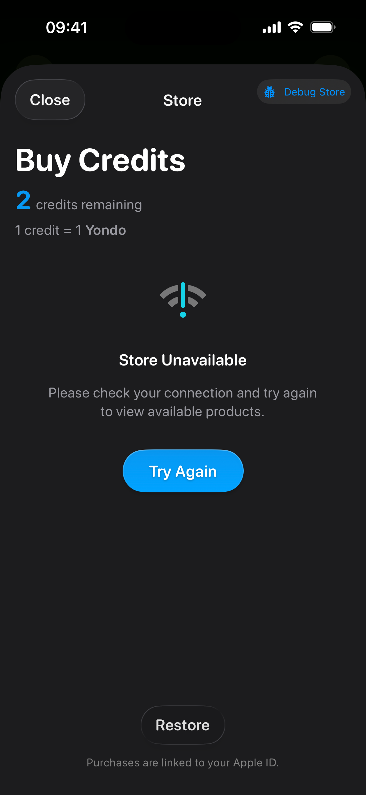

---

## 7. Scene Lifecycle & Rendering Fault Tolerance
*Technical Reference:* See rendering pipeline lifecycle state tracking and downstream network interceptors.

### Asset Canvas Connectivity Failure

  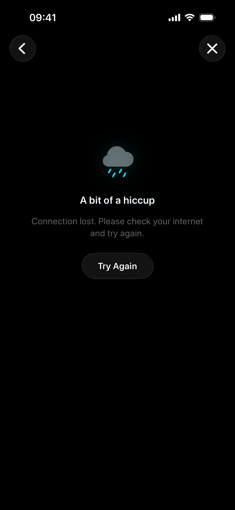

---