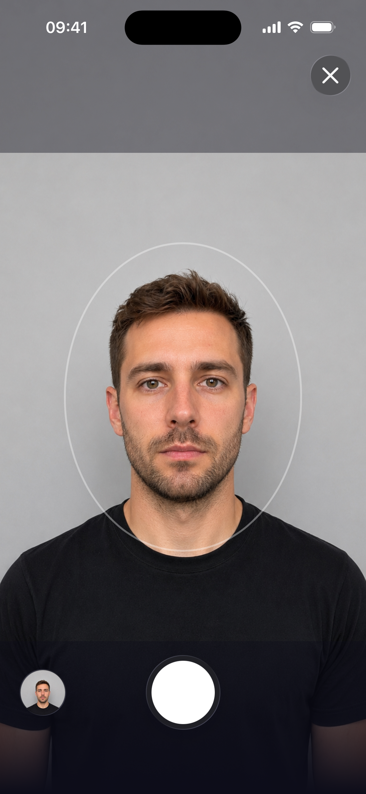
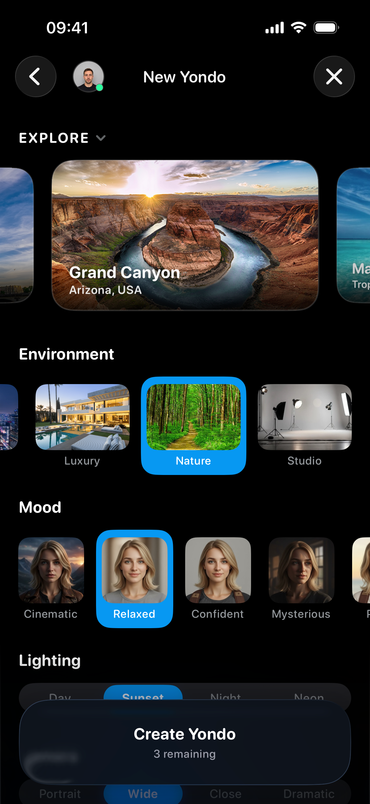
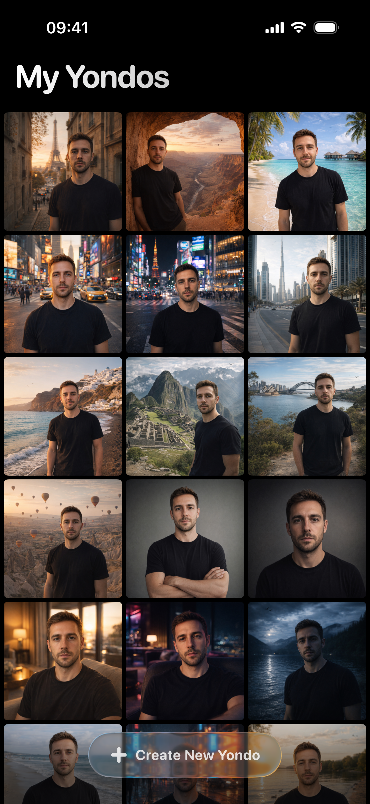
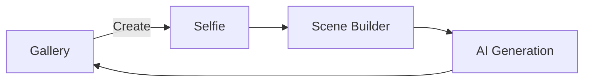

# Yondo

> Take a selfie. Pick a destination. Arrive.

Yondo is an iOS app that places you inside photorealistic, AI-rendered scenes — from the Eiffel Tower at golden hour to a Cappadocian sky filled with hot air balloons. Capture a selfie, configure destination, environment, mood, lighting, and camera angle, then receive a cinematic composite in roughly 30 seconds.

Built as a single-target Swift application with **MVVM + use cases + protocol-oriented services**, structured concurrency, a hybrid **SwiftUI + UIKit** presentation layer, and **Firebase + RevenueCat** backends.

---

## App Experience

<p align="center">
  
  
  
  
</p>

🎨 **[Explore the Complete UI State & Asset Catalog ↗](Docs/visual-ui-catalog.md)**

---

## Features

- **Selfie capture** — AVFoundation camera pipeline with actor-isolated session management
- **Scene builder** — Data-driven destination, environment, mood, lighting, and camera presets
- **AI generation** — OpenAI image API proxied through Firebase Cloud Functions (`generateAIScene`)
- **Gallery** — Thumbnail grid with a custom UIKit hero transition (pinch, drag, and velocity dismiss)
- **Credits & subscriptions** — RevenueCat + StoreKit 2 with optimistic local economy and sync healing
- **Real-time sync** — Firestore listeners coordinated with generation shields to prevent balance flicker

---

## Requirements

| Requirement | Version |
| --- | --- |
| Xcode | 26+ (matches iOS 26 SDK) |
| iOS deployment target | 26.2 |
| Swift | 5 |
| Apple Developer account | Required for device testing and IAP |

Third-party dependencies resolve via **Swift Package Manager** inside the Xcode project (no local `Package.swift`):

| Package | Used for |
| --- | --- |
| [firebase-ios-sdk](https://github.com/firebase/firebase-ios-sdk) (12.10.0) | Auth, Firestore, Functions, Storage, Analytics, App Check |
| [purchases-ios](https://github.com/RevenueCat/purchases-ios) (5.66.0) | Subscriptions and credit packs |

---

## Getting Started

Production secrets are excluded from version control. The Xcode project includes pre-build checks that warn when configuration files are missing.

### 1. Clone and open

```bash
git clone https://github.com/andreimarincas/yondo-ios.git
cd yondo-ios
open Yondo.xcodeproj
```

### 2. Configure RevenueCat

```bash
cp Yondo/Resources/Secrets/Secrets.example.xcconfig Yondo/Resources/Secrets/Secrets.xcconfig
```

Edit `Secrets.xcconfig` and set your RevenueCat public API key:

```
REVENUECAT_API_KEY = appl_your_key_here
```

The key is injected into the app via `Info.plist` at build time.

### 3. Configure Firebase

```bash
cp Yondo/Resources/GoogleService-Info-Example.plist Yondo/Resources/GoogleService-Info.plist
```

Replace the placeholder values with your Firebase project configuration. The app expects Firebase Auth, Firestore, Cloud Functions, Storage, and App Check to be enabled on the backend.

Without a valid plist, local gallery hydration still runs but network sync and AI generation will fail at runtime.

### 4. Build and run

Select the **Yondo** scheme, choose a simulator or device, and press **⌘R**.

---

## User Flow



1. **Gallery** — Browse generated scenes; open the create flow from the toolbar or empty state
2. **Selfie** — Capture or review a photo via the AVFoundation camera pipeline
3. **Scene Builder** — Pick destination, environment, mood, lighting, and camera style
4. **Generation** — Credits deduct optimistically; result downloads from Firebase Storage and lands in the gallery

Paid generation continues off-screen if the user dismisses the flow mid-run. See [create-scene-flow.md](Docs/create-scene-flow.md) for navigation and ViewModel retention details.

---

## Architecture

Yondo enforces strict dependency direction: **Views → Use Cases / ViewModels → Services → Platform SDKs**. Every significant backend sits behind a protocol (`AIImageGenerator`, `SyncService`, `CreditProvider`, `ImageStoring`, …), so infrastructure can be swapped without touching SwiftUI code.

```
Yondo/
├── AppEntry/       App lifecycle, root navigation, create-scene router
├── Models/         Pure value types (SceneConfig, GeneratedImage, …)
├── UseCases/       Business contracts (SceneGenerationUseCase)
├── Services/       AI, Auth, Sync, IAP, Camera, Images, Persistence, Share
├── Views/          SwiftUI screens + UIKit bridges (gallery hero, camera, share)
├── Utils/          Extensions, logging, NetworkMonitor
└── Debug/          #if DEBUG tooling and mocks
```

**Start here:** [Docs/architecture.md](Docs/architecture.md) — canonical reference for layering, flows, sync, economy, persistence, and UI systems.

### Design commitments

- **Protocol-first** — Firebase, Keychain, and AI backends are replaceable at service boundaries
- **Actor-isolated I/O** — Disk, camera, and Keychain work never blocks the main thread
- **Optimistic economy** — Credits deduct locally first; Firestore snapshots reconcile through shields and projected balances
- **Lifecycle guardians** — `SceneBuilderManager` retains active generation work across navigation dismiss

---

## Core Architecture

Yondo follows layered MVVM with a use case layer between ViewModels and Services, so Views never import Firebase or RevenueCat directly. Concurrency is handled with Swift Actors for I/O isolation (`CaptureService`, `KeychainStore`, `ImageFileService`) and `@MainActor` singletons for observable UI coordination (`AuthManager`, `IAPManager`, `ImageStore`). `SceneBuilderManager` ensures paid AI work survives navigation dismissal by conditionally retaining the ViewModel while `isActive`.

> **Deep Dive:** [Docs/architecture.md](Docs/architecture.md)

---

## Firebase Networking & Backend Layer

The client does not call external AI APIs directly. A preprocessed selfie (512×512 JPEG, base64-encoded) and a serialized `SceneConfig` are dispatched to the `generateAIScene` Cloud Function in `us-central1`, which handles prompt assembly, the OpenAI call, and cost control. The function returns a `generationId` and `storagePath`; the client then downloads the final image via the Firebase Storage SDK (10 MB cap). A secondary callable, `checkSubscriptionStatus`, is used during sync healing to verify RevenueCat entitlements server-side.

Firestore state uses a split-document model: identity fields (`isPremium`, `hasGrantedFreeCredits`) live at `users/{uid}` and are processed by `IdentityEvaluator`, while the credit ledger lives in `users/{uid}/wallet/status` and is processed by `EconomyEvaluator`. `IdentityEvaluator` implements Sticky Success — passive premium downgrades are silently ignored to prevent flicker from slow webhooks; only a forced sync can revoke access. `EconomyEvaluator` computes a projected balance (`max(serverCredits − activeLocks, 0)`) to prevent the UI from jumping up while an in-flight generation has not yet been recorded by the backend.

> **Deep Dive:** [Docs/firebase-architecture.md](Docs/firebase-architecture.md)

---

## Client-Server Integration

The app operates on a dual-deduction model: the client optimistically deducts from its local Keychain wallet the moment generation begins, while the Cloud Function performs an authoritative deduction against the Firestore ledger. `SyncShieldManager` bridges the gap between the two, buffering or rejecting incoming snapshots that would otherwise show a false-low balance during the IAP webhook window. Generation failures trigger backend refunds; premium unlock logic defaults to fail-open on the client during transient network issues to avoid locking users out incorrectly.

> **Deep Dive:** [Docs/system-design.md](Docs/system-design.md)

---

## AI Generation Pipeline & Orchestration

Generation is gated behind `SceneGenerationUseCase` so the presentation layer never touches Firebase directly. `SceneGenerationService` orchestrates the full sequence — authenticate, write a pending SwiftData row, deduct a credit locally, invoke the Firebase generator, download from Storage, update SwiftData, save to disk — emitting typed `SceneGenerationStage` callbacks along the way for progressive UI updates. A 5-second grace period after navigating to the scene screen lets the user cancel before a credit is committed.

Multiple generations can run in parallel. Each attempt gets its own Swift `Task`, SwiftData row, and credit deduction. Only the most recent attempt (tracked via `activeGenerationToken`) drives the create-flow UI. Superseded jobs continue as background tasks — they write their results to SwiftData and `ImageStore` on completion and will surface as in-progress gallery tiles once the queue UI lands.

> **Deep Dive:** [Docs/generate-ai-scene-architecture.md](Docs/generate-ai-scene-architecture.md)

---

## Create Scene Flow

Three screens — `SelfieView`, `SceneBuilderView`, `SceneView` — are connected by a `NavigationStack` bound to a `CreateSceneStep` enum. A single `SceneBuilderViewModel` is shared across all three and wired at flow start by `SceneBuilderManager`, a `@MainActor` singleton that also guards ViewModel lifetime. When the user dismisses the cover during active generation, `endFlowIfIdle()` retains the ViewModel until the background task completes; `forceEndFlow()` cancels work unconditionally for logout and session teardown.

> **Deep Dive:** [Docs/create-scene-flow.md](Docs/create-scene-flow.md)

---

## Image & Gallery Thumbnail Pipeline

Full-resolution JPEGs live in `Documents/GeneratedImages/{userId}/`; pre-generated 512px thumbnails live in `Caches/`. All disk I/O is serialized through `ImageFileService` (Swift `actor`). Thumbnail reads in the grid's hot path are synchronous, going through a `ConcurrentImageCache` backed by `NSCache` and `OSAllocatedUnfairLock` — no `await`, no placeholder flash during fast scrolling.

Thumbnails are generated with ImageIO sub-sampling (`CGImageSourceCreateThumbnailAtIndex`), which reads only the downsampled pixels without loading the full bitmap into RAM. On cold start, a tiered prewarm loads the first 18 entries concurrently (the VIP batch), yields 50ms for the initial UI paint, then loads the scroll buffer 4 at a time to avoid I/O saturation. Per-cell loading in `AsyncThumbnailView` falls through cache → disk → ImageIO regeneration, and the task is cancelled automatically when the cell scrolls out of view.

> **Deep Dive:** [Docs/image-pipeline.md](Docs/image-pipeline.md)

---

## Gallery Hero Viewer: SwiftUI / UIKit Bridge

Tapping a grid cell opens a full-screen hero built in UIKit and bridged via `UIViewRepresentable`. UIKit owns the gesture arena because pinch-to-zoom, pinch-to-dismiss, pan-to-dismiss, and horizontal paging all compete for the same touches — coordinating them with SwiftUI gesture composition at 120fps is unreliable. SwiftUI retains responsibility for chrome: toolbar, backdrop opacity, scroll lock, and safe-area measurement.

Each page stacks two layers: a `flyerImageView` for hero morphing and interactive dismiss transforms, and a `UIZoomableImageView` (UIScrollView subclass) that becomes visible only after the flight animation settles. This split prevents double-transform artifacts when a dismiss animation would otherwise fight an active pinch-zoom. Image resolution upgrades progressively through `FullSizeImageProvider`: the grid cell's existing `UIImage` appears on frame 1, followed by a disk thumbnail, then a full-resolution decode. Upgrades during flight are applied instantly to avoid shimmer; upgrades after the hero settles are cross-faded (0.2s).

The paging container enforces a 3-slot memory window: only the current and adjacent pages hold full-resolution GPU buffers; pages beyond that are immediately downgraded to cached thumbnails. A fixed `initialID` on the `UIViewRepresentable` prevents SwiftUI from destroying and recreating the UIKit host during horizontal swipes, which would cause all pages to reinitialize.

> **Deep Dive:** [Docs/gallery-hero-swiftui-uikit-bridge.md](Docs/gallery-hero-swiftui-uikit-bridge.md)

---

## In-App Purchase (IAP) & Local Economy System

Purchases flow through `IAPManager` (production uses RevenueCat) into a `PurchaseProcessor` actor and then into `SecureCreditStore`, a per-user Keychain-backed wallet. Credit mutations are optimistic: memory updates immediately, a chained save queue persists to Keychain asynchronously, and a relative rollback reverts only the affected call's delta on failure. The UI never waits for Firestore webhooks to show new credits.

Every Apple or RevenueCat transaction ID is recorded in `processedTransactionIDs`, so duplicate deliveries — live purchase, background listener, restore, delegate callback — grant goods exactly once. If a purchase throws despite Apple charging successfully, a post-error scrub checks `Transaction.currentEntitlements` or recent RevenueCat non-subscriptions for a matching recent transaction and processes it silently (ghost recovery). After a successful purchase, a 3-second Sync Safety Lock and a 90-second anti-dip window protect the new balance from being overwritten by a delayed webhook.

> **Deep Dive:** [Docs/iap-architecture.md](Docs/iap-architecture.md)

---

## Transaction Ingestion & Durability Pipeline

Three actor isolation domains serialize processing: `IAPManager` (`@MainActor`) for UI state, `PurchaseProcessor` (`actor`) for transaction ingestion, and `KeychainStore` (`actor`) for disk writes. StoreKit's `transaction.finish()` is withheld until the Keychain write succeeds — if the app dies mid-flight, the unfinished transaction is redelivered on next launch. Failed writes roll back only the affected operation's memory delta, leaving any concurrent mutations intact.

> **Deep Dive:** [Docs/iap-transaction-processing.md](Docs/iap-transaction-processing.md)

---

## Evolution of the Local-First Economy

Yondo's economy started as a pure device-local StoreKit wallet and evolved into a dual-loop model once server-side AI billing required an authoritative ledger. RevenueCat now handles checkout; Firebase holds the long-term balance; but the local Keychain wallet remains the immediate UI source of truth. The `CreditProvider` protocol boundary made this migration additive — RevenueCat replaced StoreKit as the payment lane without any changes to scene generation or the paywall.

> **Deep Dive:** [Docs/iap-to-local-economy-evolution.md](Docs/iap-to-local-economy-evolution.md)

---

## State Reconciliation & Sync Healing

When Firestore snapshots arrive while a generation is in flight, `EconomyEvaluator` projects the balance as `max(serverCredits − activeTransactionLocks, 0)`, preventing the UI from jumping to a higher number before the backend has recorded the local deduction. During the 90-second post-purchase window, snapshots that would lower the projected balance are buffered or rejected — the anti-dip shield handles the common case where a stale webhook arrives after a buy-then-generate sequence.

When the backend rejects a generation despite local state appearing valid, `SyncHealingController` opens a resolution window rather than surfacing a hard error immediately: 3 seconds for natural webhook propagation, up to 4 seconds for a forced Firestore or RevenueCat refresh, then a 1-second buffer before evaluating the final state. Notably, server `INSUFFICIENT_CREDITS` responses never trigger a local credit refund — doing so would create an infinite ghost-credit loop.

> **Deep Dive:** [Docs/local-economy-and-sync-healing.md](Docs/local-economy-and-sync-healing.md)

---

## Persistence & Generation Metadata

Every generation attempt is tracked in a SwiftData `RemoteGeneration` row, written before credit consumption so the record exists regardless of downstream failures. On success the row is updated with `firebaseID` and `storagePath`; on failure it is marked `failed`. This persistent log is actively replacing the in-memory `GenerationHistoryManager` — once complete, cold-start reconciliation will automatically refund credits for any row stuck in `processing` after an app kill.

> **Deep Dive:** [Docs/persistence-swiftdata.md](Docs/persistence-swiftdata.md)

---

## Camera Pipeline

`CaptureService` (Swift `actor`) manages the AVFoundation session, with session start/stop dispatched through a dedicated serial queue to avoid main-thread blocking. Live frames flow through a pull-based `AsyncStream<CIImage>` rather than nested delegate callbacks; GPU rendering is deferred until the user taps shutter, keeping the video callback fast and preventing dropped frames. Capture is two-phase: a lightweight freeze from the video stream appears in ~50ms for immediate feedback, while `AVCapturePhotoOutput` processes the full-resolution JPEG asynchronously. The preview layer is never torn down between captures, avoiding a ~200ms AVFoundation rebind penalty on retake.

> **Deep Dive:** [Docs/camera-pipeline.md](Docs/camera-pipeline.md)

---

## Share Sheet Integration (SwiftUI / UIKit Bridge)

`UIActivityViewController` initializes on the main thread and causes sheet-height jitter if SwiftUI re-evaluates `body` mid-animation. Image payloads are therefore delivered through a Combine `PassthroughSubject` stream directly to the UIKit coordinator, bypassing `@Published` state entirely — SwiftUI only observes lifecycle flags, not payload content. The sheet opens at a 150pt "preparing" detent with a spinner; once the activity controller is constructed and cross-faded in, the `ShareSheetModifier` expands to `.medium`.

> **Deep Dive:** [Docs/share-sheet-swiftui-uikit-bridge.md](Docs/share-sheet-swiftui-uikit-bridge.md)

---

## App Launch & Boot-up Sequence

`AuthManager.bootstrap()` runs the handshake in phases: resolve Firebase UID (cached or anonymous sign-in), create a Firestore user shell, link RevenueCat, attach sync listeners, then hydrate `IAPManager`, `LastSelfieStore`, and `ImageStore`. A 0.75-second minimum splash prevents flash-of-unstyled-content; a 1.5-second patience timer fades in a spinner if the handshake is slow. If auth fails, local silos still hydrate from disk so the app boots into an offline-capable state.

The gallery uses a physical swap — the real grid lays out off-screen while a skeleton shows, then replaces it instantly once the VIP thumbnail batch is ready. A 2-second watchdog forces the reveal if thumbnails stall. Late identity shifts run a parallel `TaskGroup` across five silos (Firestore, RevenueCat, `ImageStore`, `SecureCreditStore`, `LastSelfieStore`) before publishing the new `sessionID`.

> **Deep Dive:** [Docs/app-launch.md](Docs/app-launch.md)

---

## UI/UX Design System & Visual Language

The visual language is "Liquid Glass" — translucent surfaces, frosted action trays, and blur fades using SwiftUI's `.glassEffect()` and custom depth modifiers. A brand-coded palette (`yondoBrand`, `yondoDeep`, `yondoAccent`) replaces system blue, and SF Pro Rounded is applied globally via UIKit appearance proxies. Interactive moments are paired with a tiered `HapticManager` and a suite of custom spring animations (`.liquid`, `.pop`, `.yondoSnappy`) that make the interface feel mechanical and responsive.

> **Deep Dive:** [Docs/ui-ux-design.md](Docs/ui-ux-design.md)

---

## Documentation

| Topic | Document |
| --- | --- |
| Architecture | [architecture.md](Docs/architecture.md) |
| App launch & cold start | [app-launch.md](Docs/app-launch.md) |
| Create scene flow | [create-scene-flow.md](Docs/create-scene-flow.md) |
| AI generation pipeline | [generate-ai-scene-architecture.md](Docs/generate-ai-scene-architecture.md) |
| Firebase (Auth, Functions, Storage, sync) | [firebase-architecture.md](Docs/firebase-architecture.md) |
| IAP system | [iap-architecture.md](Docs/iap-architecture.md) |
| IAP transaction processing | [iap-transaction-processing.md](Docs/iap-transaction-processing.md) |
| IAP → local economy evolution | [iap-to-local-economy-evolution.md](Docs/iap-to-local-economy-evolution.md) |
| Local economy & sync healing | [local-economy-and-sync-healing.md](Docs/local-economy-and-sync-healing.md) |
| SwiftData persistence | [persistence-swiftdata.md](Docs/persistence-swiftdata.md) |
| Image pipeline & thumbnails | [image-pipeline.md](Docs/image-pipeline.md) |
| Camera capture | [camera-pipeline.md](Docs/camera-pipeline.md) |
| Gallery hero (SwiftUI ↔ UIKit) | [gallery-hero-swiftui-uikit-bridge.md](Docs/gallery-hero-swiftui-uikit-bridge.md) |
| Share sheet (SwiftUI ↔ UIKit) | [share-sheet-swiftui-uikit-bridge.md](Docs/share-sheet-swiftui-uikit-bridge.md) |
| System design | [system-design.md](Docs/system-design.md) |
| UI/UX design system | [ui-ux-design.md](Docs/ui-ux-design.md) |

---

## Testing

| Target | Status |
| --- | --- |
| `YondoTests/` | Mock infrastructure only — no XCTest cases yet |
| `YondoUITests/` | Scaffold launch/performance tests |

The protocol boundaries are designed for unit testing — mock `SceneGenerationUseCase`, `SyncService`, and `CreditProvider` to test ViewModels and orchestration in isolation. Debug scenarios (slow webhooks, ghost credits, store errors) are available via `DebugManager` in `#if DEBUG` builds.

---

## Author

**Andrei Mărincaș** · Cluj-Napoca, Romania
